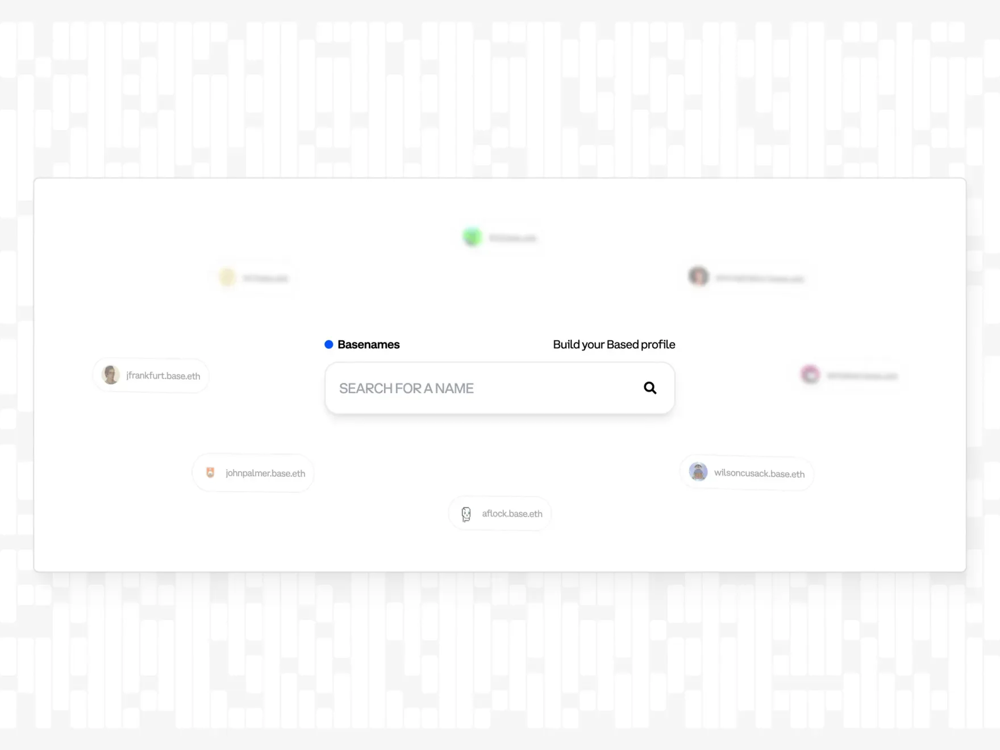

export const meta = {
  company: 'Base',
  subtitle: '',
}

### Summary

Since launching Basenames in mid-2024, Base has progressively deepened its ENS integration, first by forking core contracts onchain, then by adding reputation attestations and profile frames, and now by using ENS as the foundation for all user handles in the Base App, demonstrating a multi-stage approach to embedding ENS functionality across an entire ecosystem.

### Background

Cryptocurrency wallet addresses consist of long hexadecimal strings like *0x7Ffc8B562599D90F3a064D29629BDE7fA9192bEf*. These addresses are difficult to remember and prone to typing errors when shared or entered manually. In a Layer 2 (L2) environment like **Base**, reduced gas fees don't necessarily remove the cognitive effort and error rates that are associated with crypto addresses. Users tend to face friction during token transfers, discovering other users from the ecosystem, and when collaborating with each other.

Base is an L2 that aims to accelerate developer innovation by providing fast, low-cost, and secure infrastructure. DeFi, NFT projects, infrastructure providers, and startups are all part of the Base ecosystem. These builders require an identity service that reflects onchain contributions such as hackathon participation, skill attestations, and verified credentials, to establish trust and streamline collaboration. Basenames were created to serve as this identity service which links names to onchain activity and reputation in one unified system.

ENS is a decentralized registry that connects human-readable names like max.eth to crypto addresses, content hashes, and metadata. Its open-source architecture and worldwide adoption on Ethereum L1 make ENS a natural starting point for Base to create their onchain identity system.

### Design Principles

Protocol compatibility is a huge advantage of .eth subnames. Basenames adhere fully to ENS specifications. In most cases, no configuration changes are needed at all to use Basenames on existing ENS-integrated wallets and platforms. Resolving a second-level name like base.eth is essentially no different from resolving a third-level name like myname.base.eth. Standard tools and libraries like ethers.js, viem, and ENSjs will do everything correctly for you, out of the box.

Upon launch, a 36-hour Dutch auction began each Basename sale with a premium of 100ETH that decayed exponentially. This mechanism protects names from bots and guarantees fair access for Base users.

Once the auction is complete, names transition to a tiered pricing model based on length:

0.1 ETH/year for three-letter names,

0.01 ETH/year for four-letter names,

0.001 ETH/year for five- to nine-letter names,

and 0.0001 ETH/year for ten or more letters.

Besides basic ENS features like avatars and a profile bio, Basenames integrate onchain attestations issued via EAS under the domain verifications.coinbase.eth. These attestations include Coinbase Verified Account, Verified Country, Coinbase One Membership, and more. Additional badges reflect the user’s hackathon participation and Base community activities. Attestations and Badges act as a reputation layer for discovery and trust among builders.

Smart Wallet users benefit from gasless name registration through a sponsored Paymaster contract. Profile updates, including avatar uploads and social media links, occur in a single onchain transaction.

### Technical Architecture

The infrastructure for Basenames is made of 3 main components:

- L1 ENS resolver with CCIP Read gateway support
- L2 registrar and resolver contracts deployed on Base
- Offchain services/metadata aggregator

An L1 ENS resolver for the ENS name eth is deployed on Ethereum mainnet. When a client attempts to resolve user.base.eth, the resolver reverts with an *OffchainLookup* error as defined in ENSIP-10. Clients then query a CCIP gateway endpoint operated by Base. This gateway retrieves ownership and text records from the Base L2 registry and public resolver contracts. Finally, it returns a response formatted as a standard ENS resolution, so that any ENS compliant client resolves Basenames without specific code for the L2.

During public launch, each Basename carried a premium that started at 100 ETH and decayed exponentially over 36 hours. After the auction period ended, annual registration fees were set according to name length. Discount oracles then verified onchain attestations and NFT holdings, such as Onchain Summer Buildathon NFTs, Coinbase Verifications, Onchain Summer Pass levels, and legacy BNS name ownership, and applied the single highest discount available.

The L2 registry contract tracks Basename ownership (as an ERC-721 token ID), the assigned resolver address, and the record TTL. Token transfer events update ownership, and registry events occur when resolver or TTL changes happen.

The public resolver implements standard ENS resolver functions (addr, text, contenthash, etc.) on Base. Text records store avatars, user descriptions, social links, and EAS attestation keys. A single transaction can write multiple text records, which minimizes gas fees for profile updates.

The CCIP Read gateway serves as the bridge between L1 clients and L2 data. It maintains primary and secondary endpoints for high availability. If CCIP endpoints fail, clients can optionally fall back to direct L2 resolver calls with manual configurations.

In parallel, Base runs attestation and discount oracle services that read EAS attestations on Base to confirm each user’s eligibility for registration discounts and reputation badges. Trusted issuers include Coinbase for verification attestations and community partners for event related badges.

### Community Impact

Since launch, Basenames have become the default way to send and receive funds on Base. When users enter name.base.eth in a wallet or dApp, the client automatically resolves it to the underlying 0x address. This eliminates typing errors that previously happened during address entry. Early metrics indicate a 45 percent reduction in failed transactions due to incorrect addresses within the first four weeks of Basenames going live.

Since July 2024 over 750,000 Basenames have been registered.

### OnchainKit

Base provides an Onchainkit to integrate Basenames into other onchain apps. OnchainKit is a client library that streamlines Basename integration. Developers install the package and use simple React components or hooks to resolve and render base.eth names and the profile data, without a manual setup of providers or namehashing.

### Basenames x Farcaster Frames

Basenames support “Open Frames,” which embed interactive widgets into profiles. Users can pin frames such as:

- **Pay Me (Paycaster): Direct ETH or USDC payments**
- **Buy from Me (Slice.so): Product** storefronts
- etc.

### The Base App

Every username on the Base App is an ENS name.

On July 17, 2025, Coinbase announced the Base App, its successor to Coinbase Wallet. The rollout began with full support for ENS names: Subnames under base.eth, subnames under farcaster.eth, and legacy .eth domains.

The usernames are displayed as @name + (ENS logo/Base logo/Farcaster logo).

Coinbase presented five core pillars for the Base App: Trusted Stablecoin, Simple Onboarding, **Secure Identity**, Easy Funding, and Scalable Blockchains, of which Basenames fall squarely under Secure Identity. In doing so, the Base App becomes not only a super app for trading, payments, and social engagement, but also a premier platform for decentralized naming and secure onchain identity.

Base’s integration of ENS to create Basenames is a community and builder focused approach to onchain identity.

This case study demonstrates how an L2 network can extend a well established naming protocol to serve its unique community. Basenames highlight the potential for onchain names to evolve beyond simple address resolution, becoming social graphs and reputation platforms that support decentralized collaboration.

--- 

### About Base

Base is an Ethereum Layer 2 network (L2) designed to provide fast and low-cost transactions while maintaining the security guarantees of Ethereum mainnet. In collaboration with Coinbase, Base uses optimistic rollup technology to bundle multiple transactions into a single proof that is settled on Ethereum, which brings us significantly lower gas fees.

### About ENS

The Ethereum Name Service (ENS) is a decentralized, public, and extensible naming system based on the Ethereum blockchain. ENS connects human-readable names like ‘tom.eth’ to crypto wallet addresses, content hashes, smart contracts, and metadata. Name registration is done through smart contracts, and although ENS names work across various chains like Bitcoin, Solana and XRP, the name itself is secured by the Ethereum blockchain.