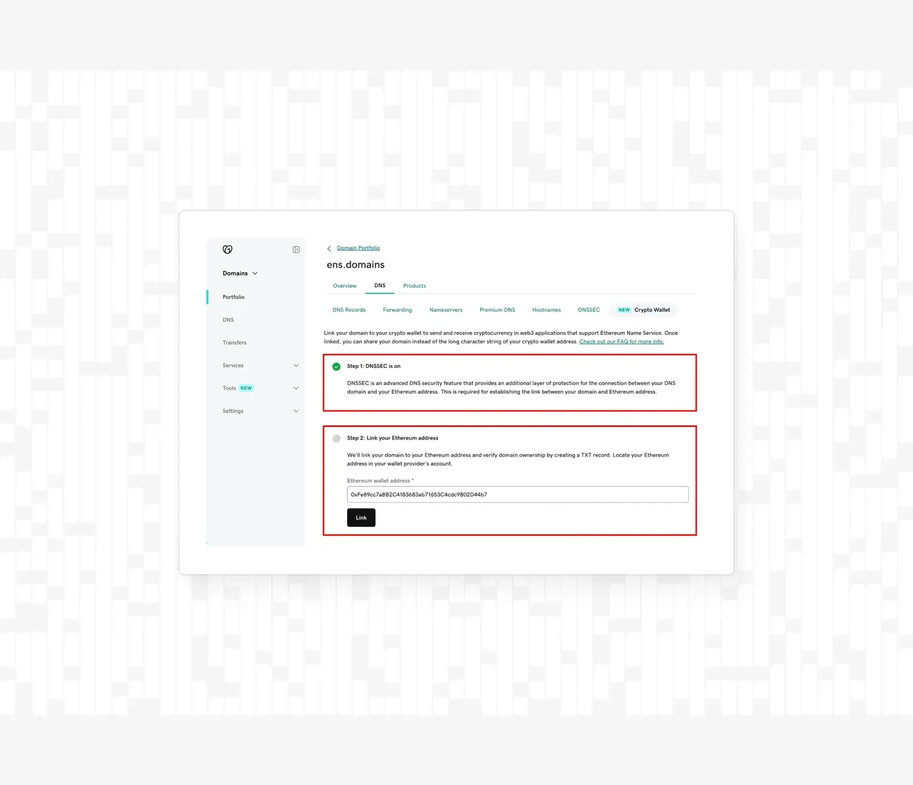
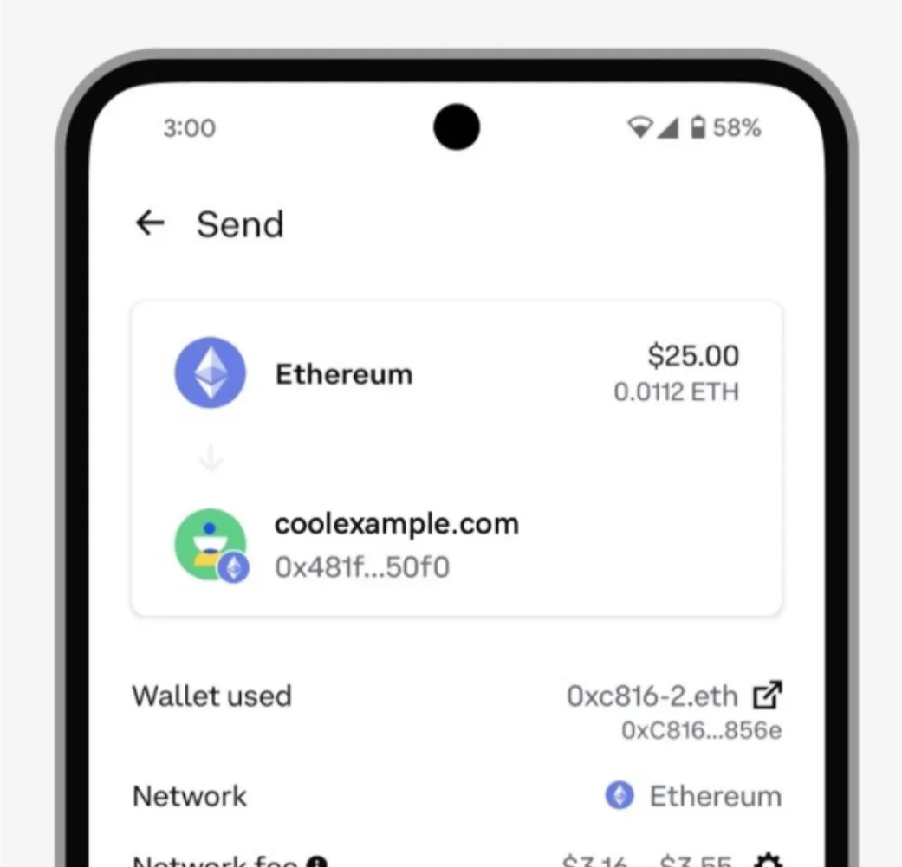
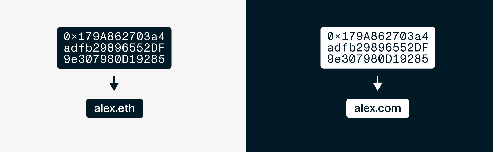

export const meta = {
  company: 'GoDaddy',
  subtitle: 'ENS expands the traditional domain space and adds crypto friendly functionalities to DNS domains',
}

GoDaddy has partnered with ENS (Ethereum Name Service) to make DNS domains like **.com, .org, .ai,** and **.xyz** function as crypto wallet addresses.

With ENS’s Gasless DNSSEC upgrade (ENSIP-17), GoDaddy offers a one-click “Crypto Wallet” record that transforms a customer’s existing DNS domain into a fully functional **ENS name**.

This integration combines legacy DNS infrastructure and decentralized naming, onboarding millions of users to Web3 with minimal friction.

ENS has expanded the domain ecosystem by adding crypto-friendly functionalities to traditional DNS domains (com, .io, .finance, and more) while supporting both forward and reverse resolution with DNSSEC delegation to the ENS Public Resolver.

GoDaddy’s integration is based on ENS’s DNS namespace support to allow customers to send and receive cryptocurrency directly to their DNS domains, instead of using complex hexadecimal addresses (0xabc…123).

<figure>
  
  <figcaption>
    [coolexample.com](http://coolexample.com), integrated with ENS
  </figcaption>
</figure>

Crypto wallet addresses are inherently complex and difficult to share. ENS solved this back in 2017 by turning these complicated addresses into human‐readable names with the .eth suffix.

Not only does ENS introduce decentralized blockchain names like lucas.eth, it also expands the global domain space with its crypto-friendly functionalities. During the rise of various Web3 naming services, legacy DNS domains remained siloed and excluded from this development. ENS’s gasless DNSSEC upgrade presents an opportunity for the traditional domain space to join this evolution. Domains retain full DNS functionality (hosting, email) while gaining onchain resolution.

<figure>
  
  <figcaption>
    Ethereum address translated into alex.eth or [alex.com](http://alex.com) 
  </figcaption>
</figure>

It is important to clarify that when a user imports a traditional DNS domain such as [coolexample.com](http://coolexample.com/) with ENS via DNSSEC, they are not granted a corresponding .eth name. DNSSEC integration simply extends the existing domain functionalities of your DNS domain with blockchain resolution capabilities. The DNS domain itself continues to function under its original top-level domain (e.g., .com, .org, .ai).

The same domain name is used both on the legacy DNS system and within the ENS namespace. There is no separate **.eth** record created, nor is the user required to register or manage an additional **.eth** name.

After enabling DNSSEC and linking the domain, **coolexample.com** resolves not only to its traditional web or email endpoints, but also directly to an Ethereum address. This dual functionality coexists seamlessly without altering the domain’s primary DNS identity.

Because the integration uses DNSSEC proofs to delegate resolution to the ENS Public Resolver, there is no conflict or duplication with any **.eth** name. The domain retains its original namespace and gains onchain wallet and identity features as a first-class citizen in the ENS ecosystem.

By preserving the original domain and simply layering on ENS’s blockchain resolution, GoDaddy’s approach allows organizations and individuals to leverage their existing brand identity while participating fully in crypto.

Godaddy's integration with ENS is built on three pieces of core infrastructure:

### DNSSEC (GoDaddy)

At the heart of it lies the DNS Security Extension (DNSSEC). 

DNSSEC creates a cryptographic chain-of-trust for all DNS records. GoDaddy automates both the generation and rollover of DNSSEC key pairs and the data remains signed and verifiable without creating manual operational burdens on the end user.

### Resolver (ENS)
When DNSSEC is enabled, the domain’s TXT records that contain the mapping from the DNS name to its Ethereum address are stored onchain within the ENS registry. The ENS resolver is then responsible for fetching and interpreting the onchain records. This makes both forward (name→address) and reverse (address→name) resolution possible.

### Gasless DNSSEC (ENSIP-17)

In February 2024, ENS introduced ENSIP-17: Gasless DNS Resolution.
This means the ENS resolver can read offchain DNSSEC proofs at lookup time and without requiring a gas fee.

---

### About GoDaddy

GoDaddy is the world’s largest domain registrar, powering over 84 million domains with reliable hosting, email and DNS services. Known for its user-friendly tools and top infrastructure, GoDaddy now leads the industry again by bringing blockchain naming to its customers and seamlessly merging traditional domains with Ethereum Name Service (ENS).

### About ENS

The Ethereum Name Service (ENS) is a decentralized, public, and extensible naming system based on the Ethereum blockchain. ENS connects human-readable names like 'nick.eth' to cryptocurrency addresses, content hashes, smart contracts, and metadata. Name registration is done through smart contracts, and although ENS names work across various different chains like Bitcoin and Solana, name ownership is secured by the Ethereum blockchain.