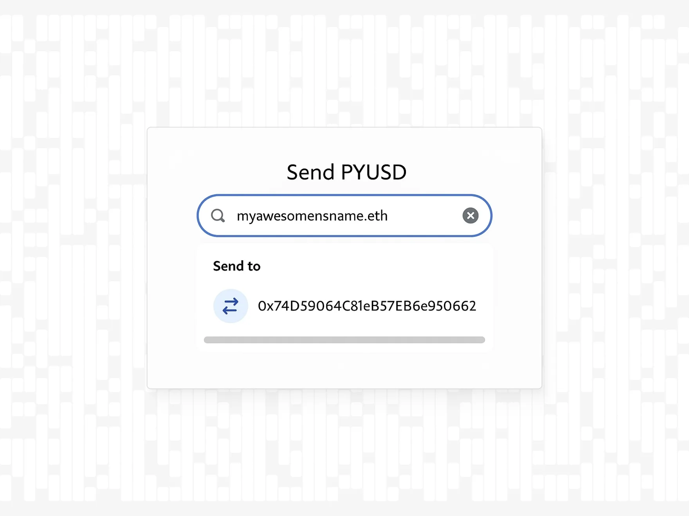
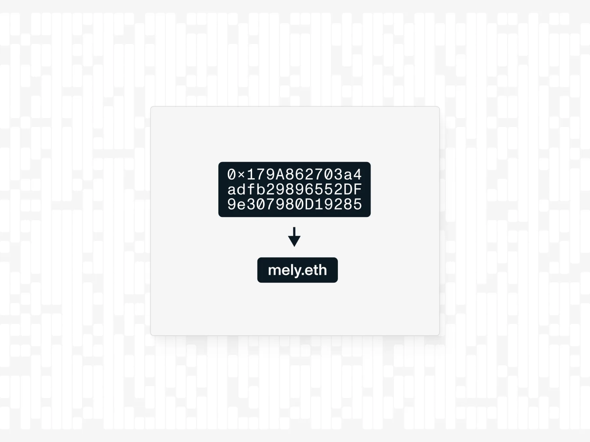
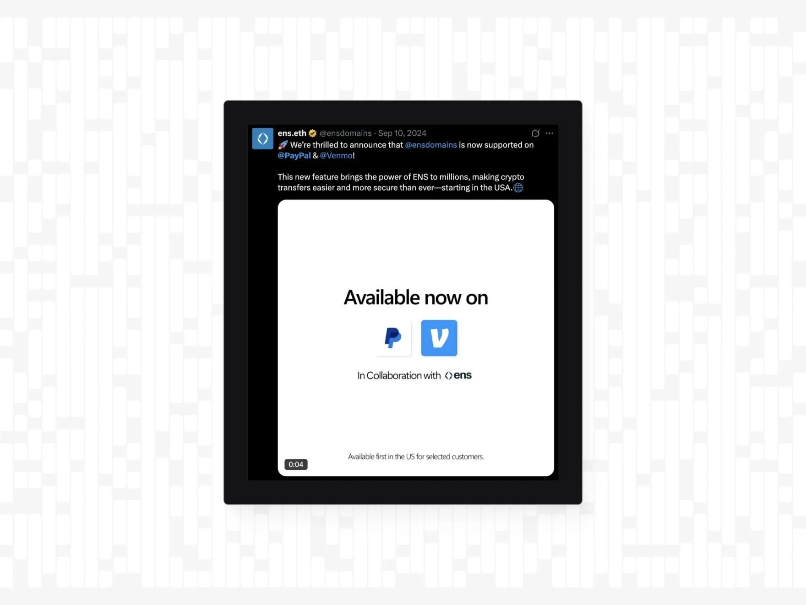
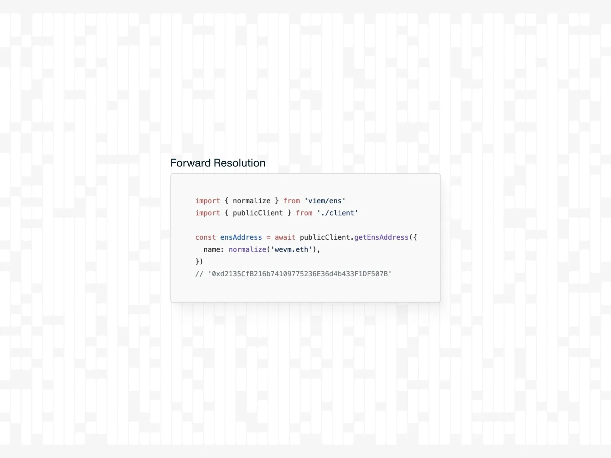
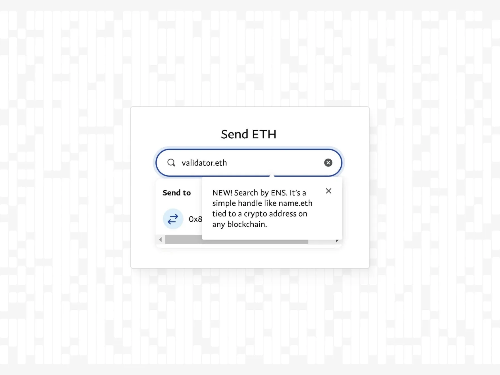
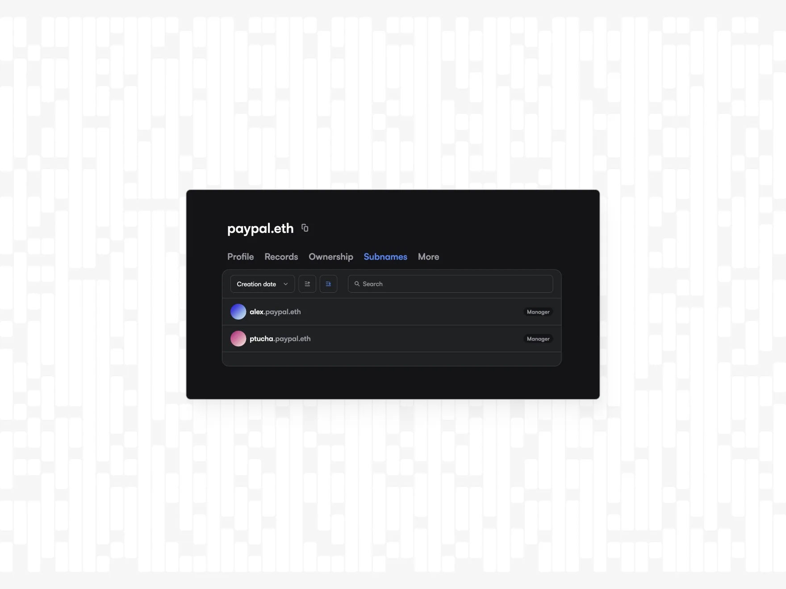

export const meta = {
  company: 'PayPal',
}

### Summary

In September 2024, PayPal and Venmo [announced their integration with the Ethereum Name Service (ENS)](https://developer.paypal.com/community/blog/ens-names-easy-pyusd-payments/). This integration makes it possible for users to send and receive cryptocurrencies, including PayPal USD (PYUSD), with simple “.eth” domain names instead of raw 0x123abc… addresses.

By embedding ENS resolution directly into both PayPal’s web and mobile applications, the team reduced crypto-address errors and improved transaction times and overall user confidence when engaging with onchain assets.

### Intro

Cryptocurrency traditionally requires users to enter long alphanumeric wallet addresses, for example, 0xab5801a7d398351b8be11c439e05c5b3259aec9b, to send or receive onchain assets.

These addresses are difficult to memorize, prone to human error, and often result in misdirected payments.

PayPal launched its cryptocurrency offerings in 2020, which means users could buy, hold, and sell a limited suite of onchain assets in the app. In August 2023, PayPal introduced its own stablecoin, PayPal USD (PYUSD), backed 1:1 to the US dollar.

Despite these advances, the friction associated with manually copy and pasting 0x wallet addresses persists as a major barrier to mainstream adoption.

Ethereum Name Service (ENS) is a fully decentralized naming protocol built on the Ethereum blockchain that translates the complex crypto wallet addresses into simple, easy-to-remember domain names (e.g., james.eth).

Since its launch in 2017 ENS has introduced support for various chains like Bitcoin, Solana, XRP, and many more. By resolving “.eth” domains to wallet addresses, ENS functions similarly to DNS for web servers. Introducing ENS in a consumer payment platform removes the need to manually enter or verify the mostly unfamiliar hexadecimal addresses. This integration of ENS into PayPal and Venmo provides a user flow that protects the user against address-related errors and increases confidence in cryptocurrency transfers.

Ultimately, ENS adds an intuitive app experience for crypto beginners and experts alike.

### Reasoning

A key objective of PayPal’s crypto strategy has been to onboard mainstream users into cryptocurrency services. The easiest way to do this is by removing the need to copy or paste complex wallet addresses, which is a known pain point that often discourages new users from using cryptocurrencies.

As the first traditional fintech apps that integrated ENS, PayPal and Venmo differentiated themselves from competitors and solidified their roles as payment platform leaders.

PYUSD is an ERC-20 stablecoin and PYUSD transfers can be easily done via ENS domain names on Ethereum or Solana. This made PYUSD accessible and easy to use for over 2 million  existing ENS users, and further, PYUSD as an attractive payment option. 

### Architecture

- PayPal’s “Send Crypto” and Venmo’s “Transfer Crypto” features were updated to accept ENS names in addition to raw wallet addresses. When a user types an input ending in “.eth” the client application triggers an ENS lookup routine rather than waiting for a hexadecimal string.
- ENS resolution: To make it possible for PayPal and Venmo users to send and receive crypto to an ENS name requires forward resolution:

### UX

#### Address Book
PayPal and Venmo introduced a new address book feature that coexists with traditional email, phone, or PayPal usernames. When a user transacts with an ENS name, the platform prompts them “Save this ENS name to your Address Book”.

Saved ENS names appear alongside the user’s existing PayPal contacts and sorts them by transaction frequency.

First-time users who navigate to the “Send Crypto” flow are shown a short note outlining what ENS is and why they can use it to send PYUSD.

After typing in an active .eth name, the UI displays both the “.eth” domain name and the resolved “0x…” address. This confirmation allows users to compare visually and be confident they are sending to the intended recipient.

Using an ENS name on PayPal or Venmo doesn’t change anything about name ownership. The user’s ENS name remains a decentralized onchain asset independent of their PayPal or Venmo account.

### Owning brand name

A huge indicator of PayPal’s long-term commitment to blockchain innovation is its proactive acquisition of ENS names that reflect the core brand and product identities. By securing paypal.eth and pyusd.eth, PayPal signaled to the broader industry that it intends to operate not merely as a passive participant but as a leader in onchain applications.

To underscore this strategic direction, the PayPal team created a dedicated subdomain, alex.paypal.eth, for their Chief Executive Officer. Extending ENS ownership to an executive subname signals confidence in PayPal's onchain presence and the ENS protocol as a new standard of naming and identity. 

### What’s next?

Over the years, ENS has established itself as important infrastructure for crypto apps. Naturally, this integration serves as the golden standard for any other financial or non-financial platform seeking to enter the blockchain industry, by building a strong foundation and active user-base for themselves. 

As ENS expands onto Layer 2 networks and introduces ENSv2, PayPal’s architecture is already prepared to incorporate these updates seamlessly.

PYUSD is determined to expand into different markets around the world, and thanks to the universal, permissionless character of the ENS protocol, .eth domain names will work anywhere and everywhere PayPal and Venmo decide to go.

---

### About PayPal

Founded in 1998, PayPal is a leading global online payments platform for individuals and businesses. With more than 400 million active accounts in over 200 markets, PayPal supports a wide range of payment methods including credit and debit cards, bank transfers, and digital wallets serving multiple currencies. In 2020, PayPal entered the cryptocurrency space, allowing users to buy, hold, and sell select digital assets. In 2023, PayPal launched its own US dollar–backed stablecoin, PayPal USD (PYUSD), further strengthening its commitment to bridging traditional finance and blockchain technologies. 

### About Venmo

Launched in 2009 and acquired by PayPal in 2013, Venmo has become one of the most widely used peer-to-peer payment apps in the United States. Known for its social feed and user-friendly interface, Venmo allows individuals to send money to friends, split bills, and pay for goods and services using linked bank accounts or credit cards. More than 80 million people use Venmo to transfer funds quickly and share payment activity with their social network. In 2021, Venmo introduced cryptocurrency buying, selling, and holding directly within its app. Venmo’s support for the stablecoin PayPal USD (PYUSD) demonstrates ongoing efforts to simplify digital payments and reduce friction for users engaging with both fiat and crypto assets.

### About ENS

The Ethereum Name Service (ENS) is a decentralized, public, and extensible naming system based on the Ethereum blockchain. ENS connects human-readable names like 'nick.eth' to cryptocurrency addresses, content hashes, smart contracts, and metadata. Name registration is done through smart contracts, and although ENS names work across various different chains like Bitcoin and Solana, name ownership is secured by the Ethereum blockchain. 
