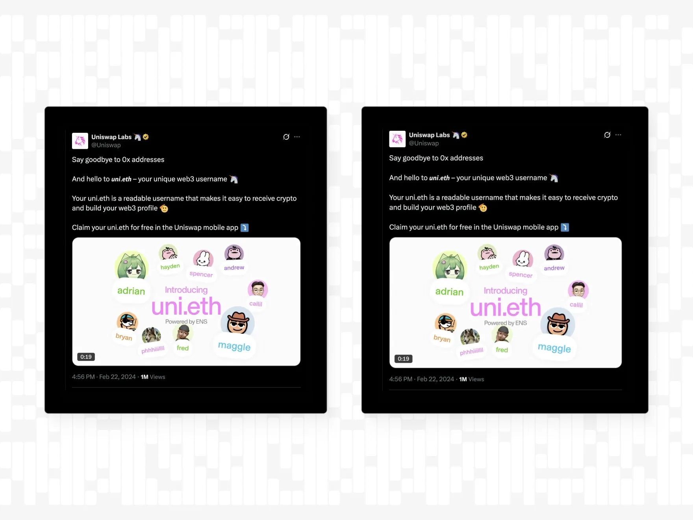
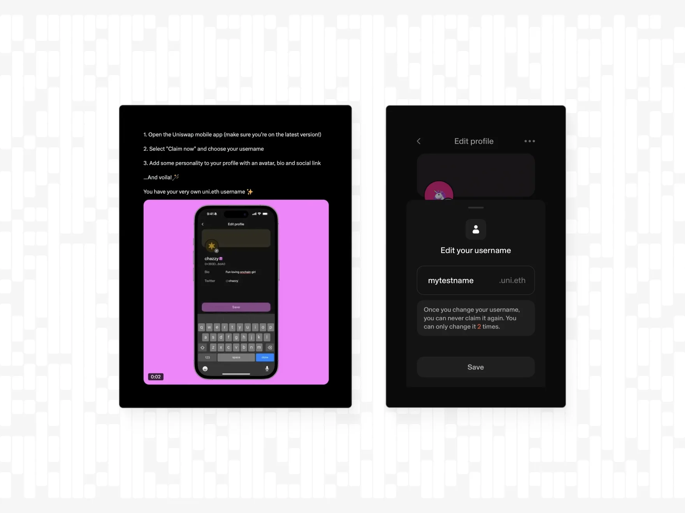
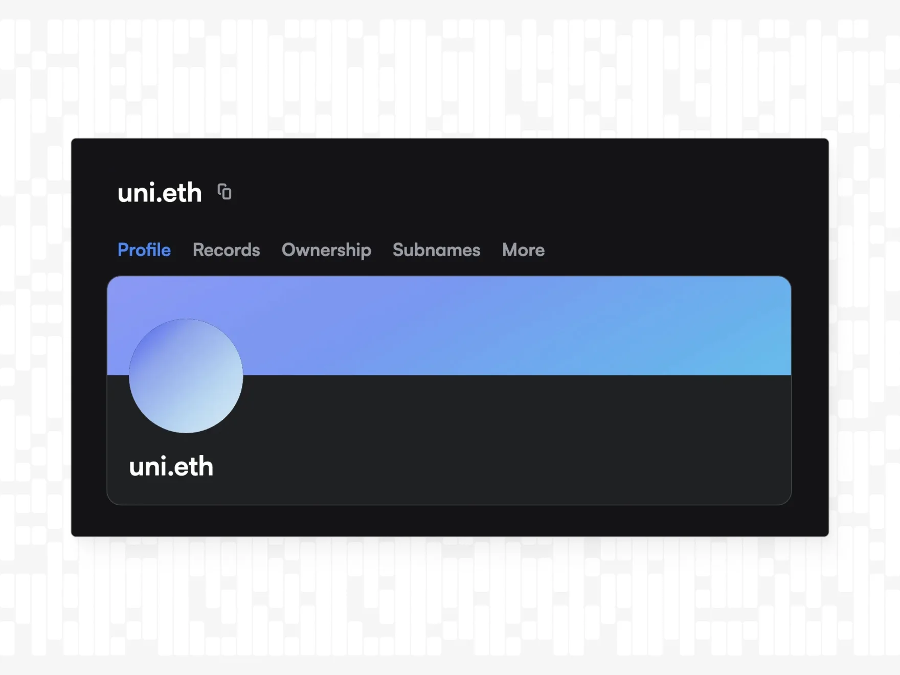
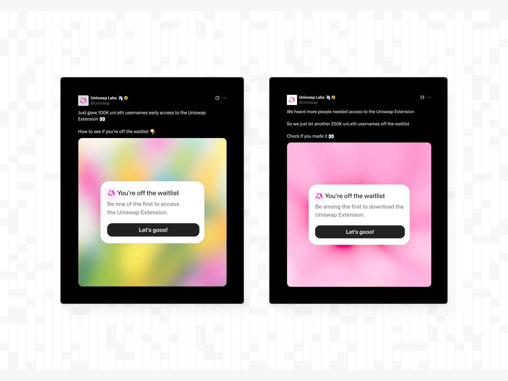
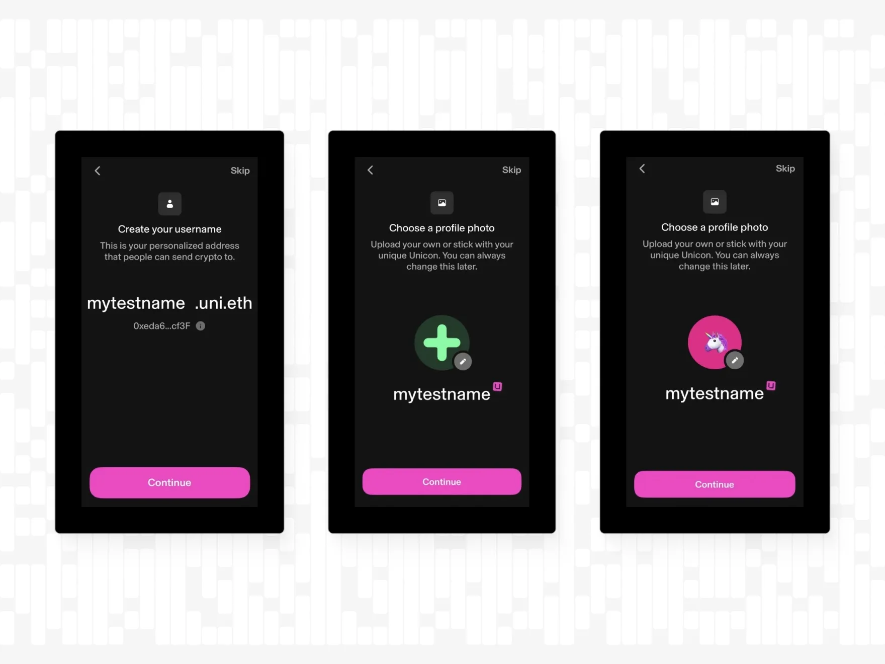
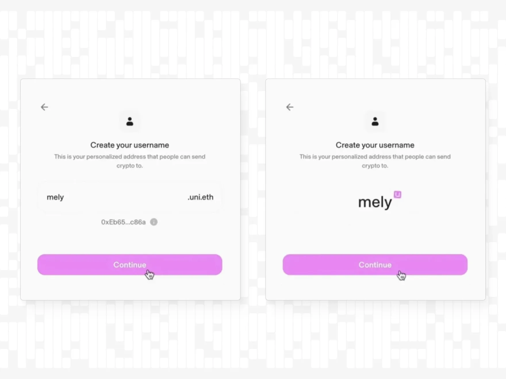
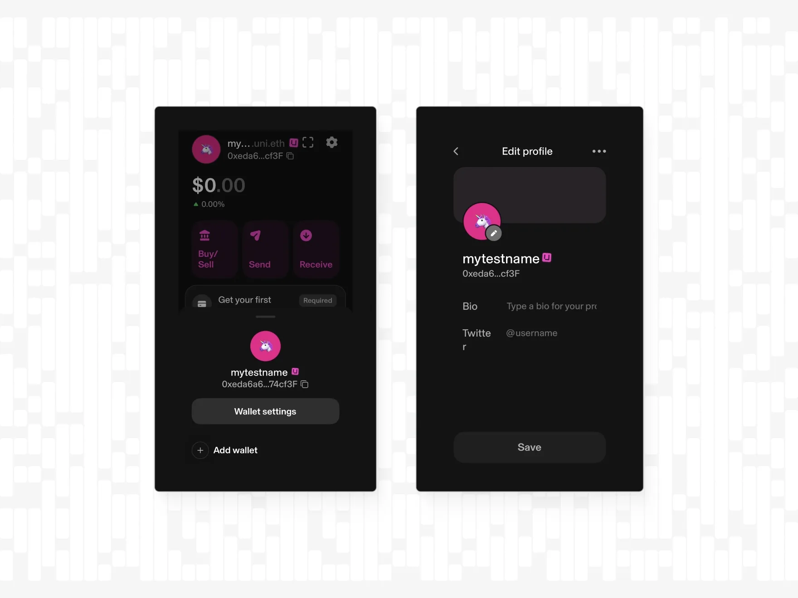

export const meta = {
  company: 'Uniswap',
  subtitle: 'Gasless ENS Subdomains are used to turn 0x addresses into usernames on Uniswap extension and on the Uniswap mobile app',
}

### Summary

Here you will learn how Uniswap leveraged the Ethereum Name Service (ENS) to introduce Uniswap Usernames.

Until February 22, 2024, Uniswap accounts were identified by  hexadecimal wallet addresses (like 0xeda6a6fFE2a92A88D7E9FBb60170E784a174cf3F) to send and receive cryptocurrency. Long hexadecimal addresses are more prone to user error, can be spoofed, and keep new users from easily sending and receiving crypto. 

The Uniswap mobile app and browser extension uses ENS to provide users with human-readable names, replacing long 0x addresses.

Over approximately 6 months of combined prototyping and implementation, a small in-house engineering team designed an offchain resolver model that allows users to claim up to 5 unique subnames under “uni.eth" for free. By November 2024, more than one million uni.eth usernames had been claimed. 

This initiative improved the user experience by reducing address errors and demonstrated a replicable approach for decentralized identity adoption with ENS.

### Intro
Uniswap is a leading decentralized exchange on Ethereum and recognized that traditional hexadecimal wallet addresses create friction for new and existing users. To address this, the Uniswap team introduced usernames built on ENS’s infrastructure. These usernames are human-readable identifiers that function as subdomains of the parent domain “uni.eth”.

The goal was to simplify the process of sending and receiving cryptocurrency by replacing raw addresses with extensible, user-friendly names. 

The integration launched on February 22, 2024, and was initially available through the Uniswap mobile application. Subsequent access via the browser extension followed in July 2024. 

### Why Uniswap Used ENS

ENS provides a decentralized naming system that maps names like james.eth to crypto wallet addresses. Subnames can be created under any ENS name owner’s control. By using its existing name “uni.eth”, Uniswap users can now claim subnames like “james.uni.eth”. This approach requires only offchain operations for creating and managing usernames which prevents users from incurring gas fees.

The uni.eth integration served 4 main purposes:

1. Improving UX: Replacing 0x wallet addresses with names
2. Brand related names: The association of every username with the Uniswap brand thanks to the user.uni.eth structure
3. Global Namespace: Building a global namespace on top of uni.eth that is expandable and can be upgraded with additional features. 
4. Interoperable Naming: ENS names are multichain and interoperable.

Uniswap’s decision to focus on offchain resolution aligns with their goal of minimizing overall user friction. Onchain minting of uni.eth subnames was considered but ultimately deferred due to increased complexity and gas costs. Uniswap usernames are not transferrable or reclaimable and each user is limited to naming up to 5 wallets with 2 allowed changes to prevent username squatting. 

### Architecture & Implementation

- ENS Parent Domain (uni.eth)
    - Managed by Uniswap Labs, this domain serves as the root for all Uniswap subnames.
- Offchain Resolver Contract
    - A custom offchain resolver handles subname issuance, name updates, and name-to-address connections without requiring onchain transactions or gas fees.
- Backend
    - ENS protocol
- Front End (mobile and browser)
    - In-app flow, within the Uniswap mobile app and browser extenstion to allow users to claim and customize their uni.eth usernames

### Timeline

February 2024 - Mobile launch

June 2024 - Over 600,000 Usernames registered

July 6, 2024 - Uniswap granted 100,000 early adopters of Uniswap names access to a waitlisted browser extension

July 9, 2024 - Additional 250,000 whitelisted usernames

November 2024 - 1M registered Uniswap names

These phased releases allowed for performance optimization and generated major community momentum. By November 2024, total username claims surpassed the one million mark, highlighting the viral network effects of ENS’s interoperability.

<video src="/assets/case-studies/uniswap-1m-usernames.mp4" controls />

### User Flow

User onboarding happens entirely within the Uniswap mobile app or web extension. Upon downloading the app or browser extension, it prompts the user to select a unique name and optionally customize their Uniswap profile. This cohesive integration masks the complexity of ENS interactions behind a polished, mobile-native UI, and supports immediate adoption without external tooling.

Uniswap mobile app

Uniswap Web Extension: Account creation flow, Step 1 and Step 2

### UI

Uniswap decided to display uni.eth subnames as the bare handle (e.g. "lucas" instead of "lucas.uni.eth") accompanied by a subtle “U” badge. Stripping off the “.uni.eth” suffix creates a cleaner, more familiar interface that mirrors social media conventions and reduces visual clutter on small screens. The magenta “U” badge still signals the uniqueness of the name and brand affiliation to uni.eth without overwhelming the username itself.

However, omitting the full subdomain runs the slight risk of confusing the ENS subname with a .eth name. Since Uniswap leverages ENS for their usernames, these names can be portable and used within other wallets as well. Within other ecosystems, names will continue to show up with the uni.eth suffix.

At the same time, displaying the bare handle by removing the uni.eth suffix provides a chain agnostic name UI that is aligned with the multichain functionalities of the ENS protocol.

### Uniswap Usernames 101

- **Offchain resolvers for a gas-free experience**
    
    Offchain resolution removes the barrier of transaction fees and makes decentralized naming appealing to mainstream users. 
    
- **Free Names:**
    
    Uniswap made the decision to make their usernames available for free. Claiming or changing a Uniswap Username comes with no registration costs. 
    
- **Limiting name claims per user and per wallet**
    
    Enforce a reasonable limit like 5 named wallets per user and 2 name changes per wallet to balance user flexibility with squatting protection.
    
- **Design for social media-style UI**
    
    Display bare handles with a small branded badge rather than the full subdomain of uni.eth. Prevent overloading the name, especially on mobile screens but still add a clear visual cue for the uniqueness of the name to prevent confusion.
    
- **Provide profile customization**
    
    Allow users to create an identity to their ENS subname by adding avatars, bios, and social links (in this case X). This is how you create community engagement.
    
- **Staggered launch and Marketing effect**
    
    Release new functionalities (such as browser extension access) gradually to name owners before giving access to the general public. 
    
- **Maintain docs and support channels**
    
    Use existing ENS documentation and direct communication with the team at ENS Labs during integration for the best  experience.
    

Moving forward, there are several ways to expand uni.eth profiles with additional features such as verifiable badges and attestations, L2 onchain migration, and additional crosschain support.

For platforms seeking to simplify their overall onchain experience, Uniswap’s uni.eth case offers a clear blueprint:

1. Claim a branded ENS domain, such as uni.eth
2. Deploy a lightweight, in-app subname registry
3. Deliver seamless UI for name issuance and profile management

By using the ENS protocol as the decentralized naming infrastructure, projects can achieve immediate gains in usability, brand relatability and interoperability and support the mission of a more accessible, user-friendly web. Apps with global communities should offer their users universal usernames and uphold the ENS standard.

---

### About Uniswap

Uniswap is a decentralized exchange protocol that powers the largest onchain marketplace, with billions of dollars in weekly volume across Ethereum and 12+ additional chains. Since its launch in 2018, the app has grown into a household name of DeFi and consistently innovates on efficiency, user-friendliness, and security.

### About ENS

The Ethereum Name Service (ENS) is a decentralized, public, and extensible naming system based on the Ethereum blockchain. ENS connects human-readable names like 'nick.eth' to cryptocurrency addresses, content hashes, smart contracts, and metadata. Name registration is done through smart contracts, and although ENS names work across various different chains like Bitcoin and Solana, name ownership is secured by the Ethereum blockchain.
