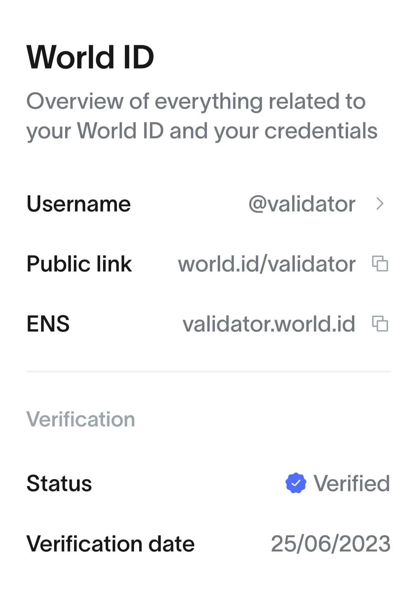
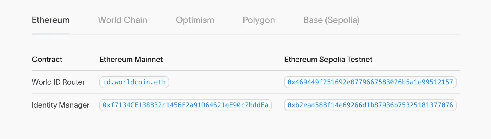
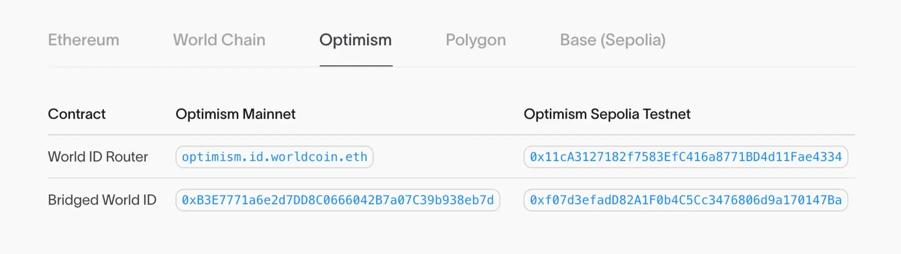

export const meta = {
  company: 'World ID',
  subtitle: '',
}

### Introduction

World App is an effort to verify one’s humanness by creating “proof of personhood” verifications that can be used on multiple platforms and apps. It verifies that an account belongs to a unique human and lets other applications use the verification without revealing who the person is. The verification currently happens with an [Orb](https://world.org/orb) and the attestation is held in a self-custody wallet in the [World App](https://world.org/world-app). 

World ID is made of different components and was first brought to developers in two main ways: [IDKit](https://docs.world.org/world-id/reference/idkit) and ‘[Sign in with WorldID](https://docs.world.org/world-id/reference/sign-in)’. World App is the first wallet for its ecosystem of mini apps. It is a smart-contract wallet built on Safe and integrated with ENS, so people can send assets to names rather than hexadecimal wallet addresses. 

World ID shows how identity becomes more useful when it is built on open standards. The ENS protocol gives every user an easy-to-remember name that works as a wallet address and a username. With World App, you receive not only a name but also proof that the name belongs to a real human. Together, they create a verified identity system that can travel with the user and lowers integration risk for developers. 

As an established standard for decentralized identity, ENS names, similar to World’s credentials, are interoperable and work on different chains and apps. This shared vision of cross-chain compatibility is what brings World App and ENS together. In this stack, ENS plays the role of naming World accounts.

### Domain: world.id

What looks like a familiar handle in the World app, like @validator, is in fact a subname of the domain world.id under the hood, and therefore a resolvable ENS name. Therefore, the full username is validator.world.id, as seen in the account settings. The .id TLD offers a short, chain-agnostic, identity-related domain that works in favor of global communities like World. 

World.id is a traditional DNS domain imported to ENS via DNSSEC, which turns the domain itself into a wallet address and thereby an onchain username. DNSSEC adds cryptographic signatures to DNS records so clients can verify the authenticity of a domain’s ownership and data. ICANN's [explainer](https://www.icann.org/resources/pages/dnssec-2012-02-25-en) on DNSSEC goes further into detail.

From that parent domain, world.id, the World App issues subnames like name.world.id to every single user. 

### Naming Smart Contracts

World brings the same practice to its smart contracts, maintaining a public address book that lists each deployment alongside a corresponding ENS name. This address book includes multiple networks: On Ethereum mainnet the router resolves at **id.worldcoin.eth**, on Optimism it is **optimism.id.worldcoin.eth**, and on Polygon it’s **polygon.id.worldcoin.eth.**

Developers can resolve a name instead of hard-coding a hex address, which cuts configuration mistakes and improves clarity in audits and dashboards. It also strengthens network consistency, since one naming convention works everywhere, which means your app logic won’t fork just because you are on a different chain. 

Naming smart contracts primarily shortens incident response and rollout times. Router upgrades can be done behind the same ENS name, while wallets, explorers, and mini-apps continue to resolve the standard endpoint. Over time, this approach creates better observability, too, as analytics tied to names are easier for engineers and non-engineers to parse.

Moreover, this approach aligns with the Ethereum Foundation’s push to use interoperable L2.eth subnames to represent chain-specific endpoints and reduce hard-coded addresses. World App’s ENS-based contract naming shares the same goal of chain-aware identifiers, where clients resolve a canonical name like optimism.id.worldcoin.eth instead of working with various address lists. 

World’s contract naming is built for developers across multiple networks and becomes useful in mini-apps in the World ecosystem, dApps that verify personhood, wallets, and, of course, infra teams that need reliable, multichain contract references. If a product calls for verification on multiple chains or a dashboard needs to work across environments, naming endpoints with ENS subnames keeps code paths uniform and reduces operational overhead.

### Conclusion

Many of the most valuable onchain experiences depend on uniqueness of the user and accountability. Grants and airdrops are logical when one person equals one claim, governance needs real voters instead of bot farms, creator payouts and referral programs depend on fair attribution, and consumer apps like messaging apps and marketplaces, improve substantially when you can tell apart authentic content from bots. Most importantly, the verification of real users does not replace pseudonymity. Instead it lets users own proof of being a human without the need to reveal their identity.

You can see how this plays out in practice. On Base, connecting a base.eth subname to a verified Coinbase account, where KYC information such as a passport can unlock access to specific DeFi pools and investing opportunities that require eligibility checks. In the same way, a world.id subname can carry World proofs into other ecosystems and be used in funding rounds, allowlists, DAO votes, and other apps that gate certain actions to verified users.

ENS gives you a human-readable identifier that wallets and dApps already understand and can be combined with proofs that users control. Your name remains yours across chains and the verification travels with your name into DeFi, social apps, and payments. If you are building identity-based infrastructure, start with ENS-based usernames and build your community from there, with customizations such as proofs and verifications. The result is a safer, more composable user experience that scales on multiple networks.

Check out https://docs.ens.domains/ to learn how.