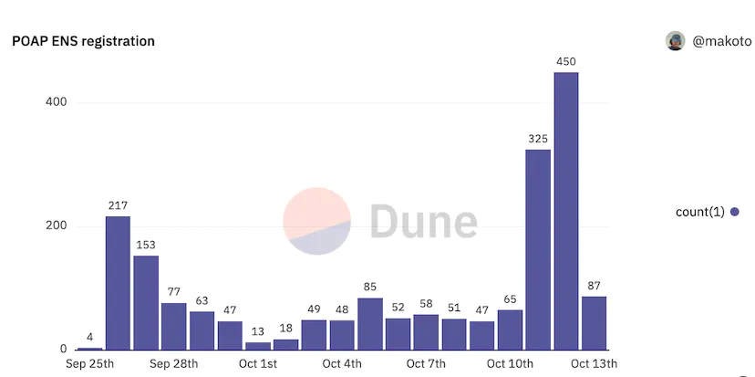
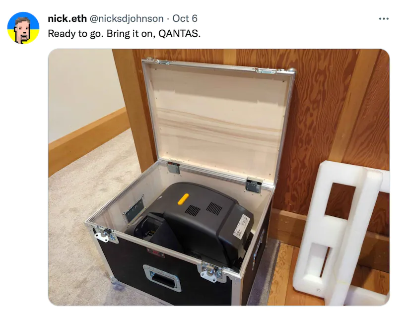
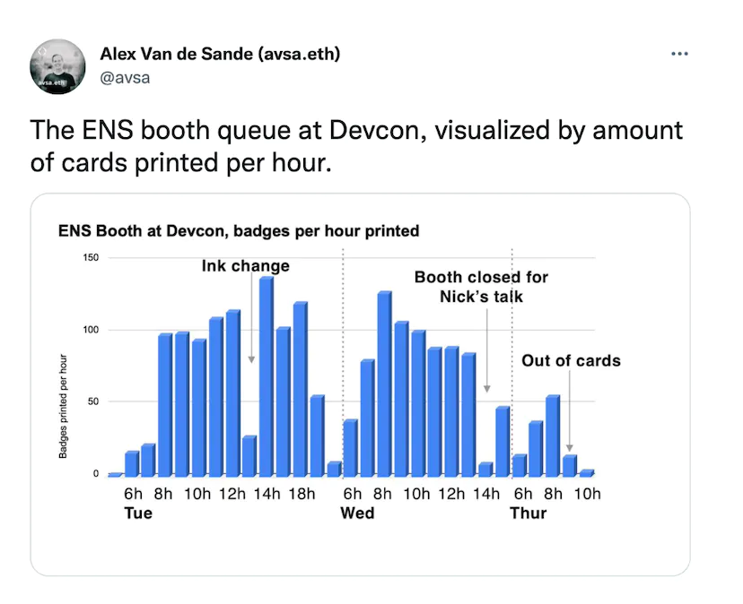
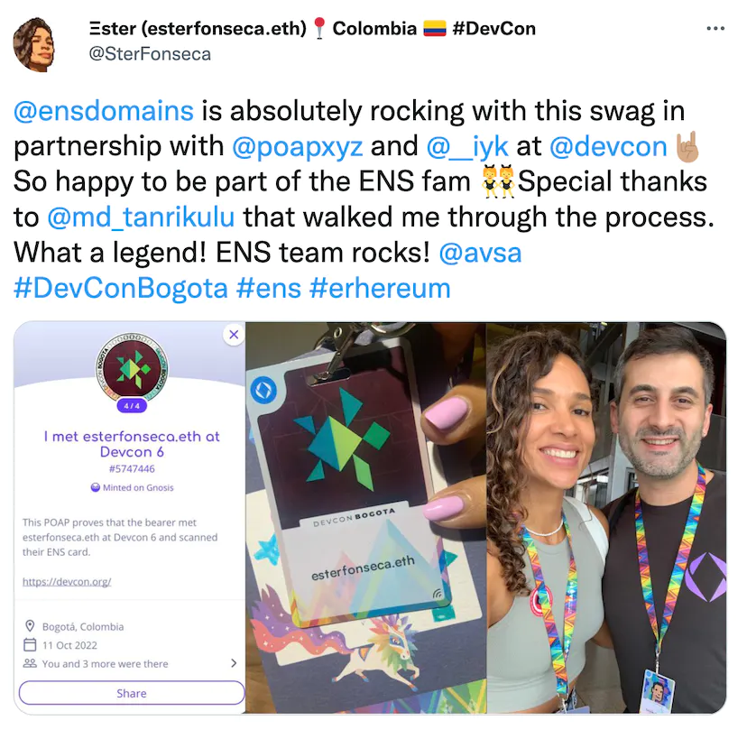
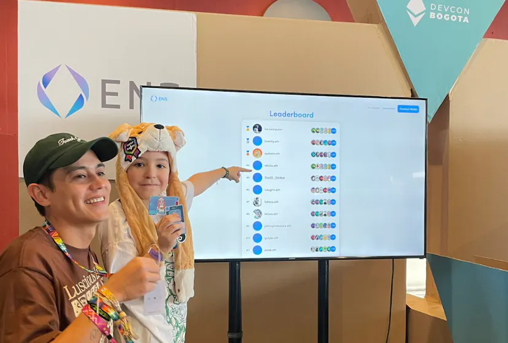
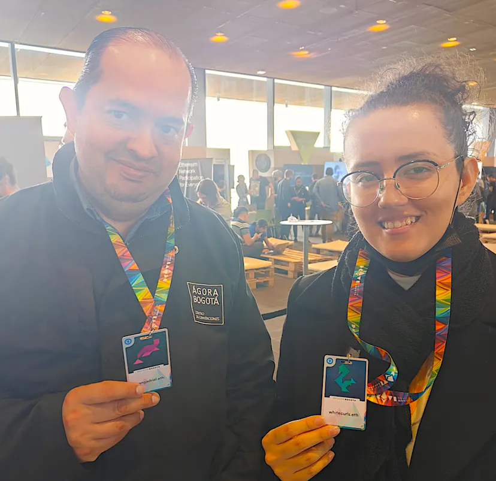
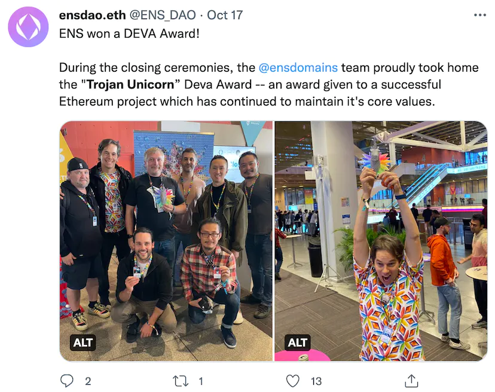

If you attended this year's Devcon, you may have noticed the long queue coming out of the ENS booth.

The queue lasted for 3 days and the wait time was over one hour at the busiest time. That was our ENS swag station where we gave away POAP cards to over 2000 Devcon participants in partnership with POAP and IYK. Many people have heard of POAP, Proof Of Attendance Protocol, and the badge NFT you can collect at events. The POAP team extended the idea to make it as a personal token where anyone can give away the "I met xxx" POAP if they have a special NFC card provided by IYK. Once you touch the card with your mobile phone, it will automatically pop up the POAP claim code. The concept already existed and you can purchase the POAP card at IYK site. The swag was to personalize the IYK card with your own ENS name and avatar record set on ENS.

## The road to Devcon

When we announced the swag back in late September, we asked people to pre-register their names at http://swag.ens.domains/ by signing a signature that sends the redeemed QR code via email. We requested people to sign a signature via the address which has a primary name set to prevent people from claiming other people's cards (such as vitalik.eth). We also asked people to pre-register because we expected that many people wouldn't bring wallets to sign for security reasons.

In the end, over 5941 people registered for the card (of which over 800 people registered during the event).

We were aware that we don't have enough cards for everyone, hence we printed the cards on the spot for people who pre-registered 24hrs in advance on day one, then allowed anyone who registered on days two and three. We had one special machine brought by nick.eth.

That beast had a printing speed of 180 cards per hour, so the actual printing rate was pretty close to the capacity. In the end, 1,912 cards were printed (we had a total supply of 2,000 but had some defects and duplicate prints).

## The game is ON

Once printed, the participants started swapping each other's cards and a total of 18,743 POAPs were collected by 2,197 people.

For those people who didn't have an avatar set on ENS, we partnered with artist Zsolt Kosa, and created a series of generative art.

Historically, only 10% of ENS users set avatar text records. However, we had nearly half (47%) of the participants put avatars. Nearly half of the ENS card holders set their avatar after we announced so the swag card was a strong incentive for people to set the record.

The latest addition to the swag page was the leaderboard built by luc.computer throughout the EthBogota hackathon showing who collected the most POAP. Despite offering any prize, people loved the leaderboard!

The young gentleman proudly standing in front of the leaderboard with his dad is ethilio.eth. He is 7 years old, came in without an ENS name, and ended up meeting 340 attendees. 

You can see the interactive leaderboard here. luc.computer had an early lead but brantly.eth and eydrent.eth came very close to the point that they overtook him at some point. luc.computer and ethilio.eth had a "Batman and Robin" style partnership and were running around the venue together to retain the crown in the end.

There is another fun story to share. Towards the end of the swag booth, I was chatting with a pair of the conference facility staff and noticed that they also have their swag cards.

I asked them if they have been into crypto (hence have them) and their answer was no. Apparently, they came to our booth on the first day concerned that our queue may cause a security hazard but later came back asking for the card.

I have been to various Ethereum events since 2016 and have seen many crypto related event swags but it was always too difficult to onboard even people who are into crypto, let alone newbies on the spot. In the year 2022, we now have many mobile wallets to choose from and installing and setting up accounts seem doable. Converting fiat to crypto is still not the easiest hence we onboarded some people (26 people in precise) by gifting ENS names through ENS fairly bots created by our ENS DAO member gregskril.eth. At the end of Devcon, we received the "Trojan Unicorn Award" for bringing web3 and blockchain to the mainstream, without losing our core values. Unlike many speculative NFTs, ENS annual registration ($5/year) is cheap enough to gift and we think it's the best first NFT for anyone new to crypto and Web3.

This was our first swag store attempt and we have already received many requests to deploy it in other events. Please let us know if there are ways to improve

## Grab the data

Grab the data
This experiment also generated tons of interesting insights to write this post. There are some other interesting insights which I created on the following dashboard.

- Dune Dashboard = L1 onchain activity of the swag card registrant

- Flourish Story = for POAP claim network graph and the leaderboard

The data and scripts I used are open-sourced at https://github.com/makoto/ens-card-data . If you are a data whiz, please dive into the data and show us more interesting insights!
