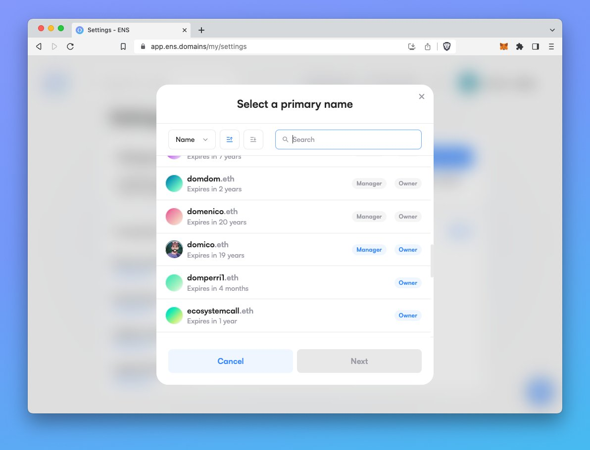
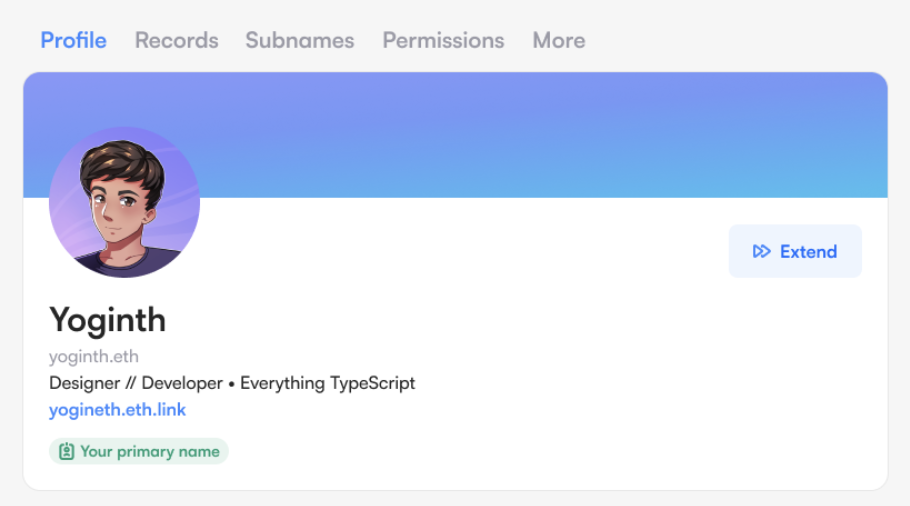
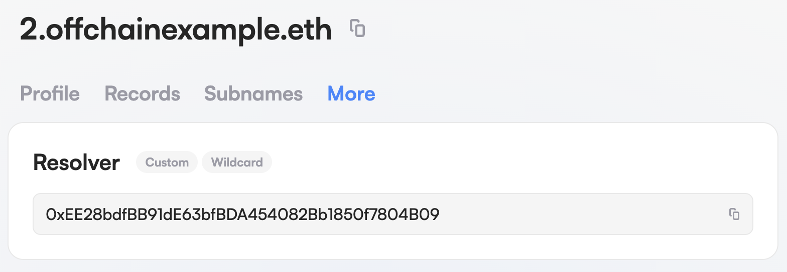

GM! We trust you're making the most of the summer season. Here at ENS we've been doing the same, taking a breather after the successful rollout of v3. This month our focus has primarily been UX pattern modifications and bug fixes. We consider it crucial to address these issues in V3 before progressing to the development of more advanced features. This approach is largely influenced by [The Joel Test](https://www.joelonsoftware.com/2000/08/09/the-joel-test-12-steps-to-better-code/).

## Comprehensive overhaul of primary name flow

We're excited to introduce our revamped primary name setting flow. Accessible from the settings page, the Manager App will now display a broader range of names. Unlike the previous version, which only listed names with an ETH record matching your wallet address — the updated flow now includes all potentially valid names, regardless of their ETH record or resolver status. This means you can now manage or own a name without an ETH record or a resolver. The system now efficiently identifies the most gas-effective method to set your primary name, eliminating the need for multiple app flows.

You can read more about it in our UX Lead Domico.eth's [Twitter thread](https://twitter.com/domicoeth/status/1671267907345747969).

**Key benefits for users include:**

- Expanded list of potentially valid names: No longer limited to names with an ETH record matching your wallet address.
- Streamlined process: Setting a primary name now requires a single flow, regardless of the name's ETH record or resolver status.
- Optimized transactions: The app maps out all necessary steps, checks the name, resolver, and registry, and skips any unnecessary steps, reducing gas costs.
- Ability to unset primary name: Users can now remove their primary name directly within the app, with clear explanations of the implications.
- Community-driven improvements: These enhancements were made in response to valuable user feedback, continuing to demonstrate our commitment to creating impactful solutions based on user needs.

## Additional manager app improvements

- Add primary name tag to profile, to make it clearer to the user when they are looking at their primary name.

- App will now show if resolver is coming from a wildcard lookup

- Suppressed the 'latest resolver' warning for unwrapped names
- Use multicall during registration more intelligently, improving gas efficiency
- Update app to support WalletConnect v2

## Bug fixes

- Manager app now works in mobile (iOS) Metamask, Trust Wallet and Coinbase in-app browsers
- Added registration fee buffer to protect against ETH price fluctuations
- Set gas fee to 0 during gas estimation for transactions, this allows us to get more detailed error messages
- Fixed issue where users on Firefox would be directed to the chrome store to download Metamask (upstream fix)
- Made external nav links open in a new tab/window
- Edit records modal now displays correctly on iPhone 8 (and other similarly sized screens)
- Fixed support for Safe transactions
- Allow abi records to be deleted from the advanced editor
- Changing network no longer disconnects the app
- Fixed some issues with the premium price chart inputs
- Small iPhone and iPad layout tweaks
- Stopped showing 'Edit Profile' button when the resolver is set to 0x00 and the ability to change the resolver has been burned

## Ongoing

Work on ensjs version 3 is also ongoing. It has been refactored to use [viem](https://viem.sh/) which has allowed us to simplify the codebase. You can checkout the progress [here](https://github.com/ensdomains/ensjs-v3/pull/136).
