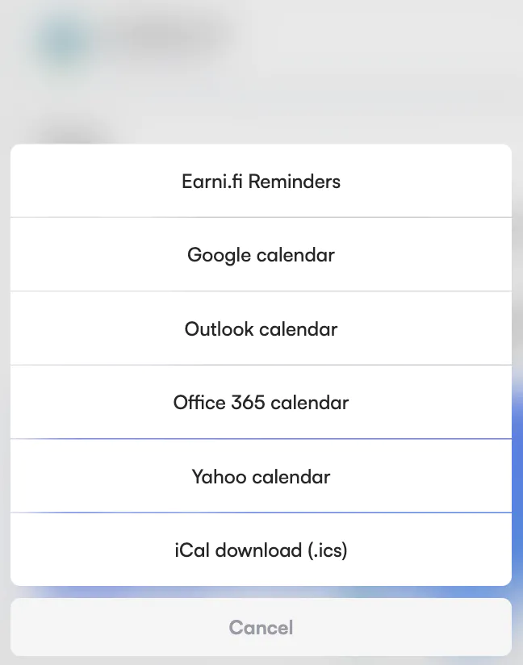

This is the first in a series of monthly updates so do check back every month. This first post is a jumbo edition, encompassing the past two months of work.

## Version 3 Release

Visit the app [here](https://ens.app).

Why is the current version of the app known as v3? Before the previous version, there was a lesser-known v1 version of the manager app.
[Check it out!](https://ensmanager.surge.sh) It only works with names registered before 2019. If you didn't register a name before then, try using `arachnid.eth` or `jefflau.eth`.

For the dev team, the release also marked the soft launch of our [ENS utility library (ENSjs) rewrite](https://github.com/ensdomains/ensjs-v3) and our design system [Thorin](https://thorin.ens.domains).

## Email reminders with Earnifi

We've partnered with [earni.fi](https://earni.fi) to bring you expiry reminders via email. These reminders will work for any name you are interested in, and you will get a reminder one month, one week, and one day before expiry. Simply navigate to the 'more' tab on any name and click 'Remind me' as shown below. You'll be asked to provide the email address you would like the reminders to be sent to, and once you click the confirmation email in your inbox you'll be all set.

As part of this update, we replaced dropdowns on mobile with 'Action Sheets' to provide a better user experience.

## Wrapping and unwrapping names

We may have got a bit over excited about the NameWrapper, after release it started to become clear that many users did not feel the need to wrap their names and some people wanted to be able to unwrap them. This is likely because support for wrapped names hasn't been added to many services in the broader ecosystem, and so users are likely to see errors on other platforms at the moment when trying to view their wrapped names. We still believe that in the future almost every name will be wrapped, but reaching that goal is also about education and community outreach.

In the manager app we are treating it more as an advanced feature for now. You'll find the ability to wrap and unwrap a name in the 'More' tab, as well as info on the state of the name as it relates to wrapping.

## Transaction in progress indicator

If you have a transaction in progress, you will now see a progress indicator (the blue dot) in key areas in the app.

## Legacy Favourites

We intend to release a new and improved version of favourites in the coming weeks, however initially we did not provide a way for users to continue to view favourites that they had already added via v2. If you have legacy favourites, a link to them will show up in the navigation bar, and you can also navigate to them directly [here](https://app.ens.domains/legacyfavourites).

## Improved profile warning flow for various resolver states

Partly in response to community feedback, we decided to fast track improvements to the various warnings we show when opening up the profile editor depending on what resolver has been set:

- Migrate/Resolver out of sync: We've completely rethought this flow. Previously, it forced you to either migrate your records to the new resolver or use the records on the new resolver after editing the profile. Now it asks you if you want to change your resolver (which you can ignore), then checks if the records between resolvers are out of sync. If they're in sync, you'll have the option to reset or keep your profile. If they're out of sync, you'll get options to reset, migrate, or use the profile that exists on the new resolver. We've also added a warning for people resetting their profile.

- Resolver out of date: We've adjusted the flow to ask before editing the profile and to let the user ignore it if they wish. We've also added a warning for people resetting their profile.

- No resolver: We've updated the copy

- Registry out of date: We've updated the copy

These changes also allow people to use the profile editor for custom resolvers (before they had to use the record editor). Additionally we've added the option to ignore resolver upgrades in each flow.

## Better handling of issues with The Graph

The ENS Manager app heavily relies on a third-party service called 'The Graph' for a lot of the data it displays. It is essentially a caching layer without which the app would be unusably slow. From time to time the service will be slow or unresponsive, which makes the manager app slow or unresponsive, which previously would have made the user feel like the app is down. Now we can handle this by showing a warning message and displaying data that doesn't rely on the graph.

## In-app support via Intercom

You can now reach our support team directly through the app. Look for the icon in the bottom right corner. A bot will initially try to help you but if it can't you will always have the option to talk to a human.

## Security improvements, a tale of two foxes (MetaMask, Firefox)

As a team we are taking steps to improve our security practices, and one of the outcomes of this initiative was implementing something known as a [content security policy](https://developer.mozilla.org/en-US/docs/Web/HTTP/CSP) (CSP) for the manager app. This allows us to keep our users safe from entire categories of attacks by instructing the browser to disallow certain actions that could be used by an attacker to steal a user's funds for example. It is something every dapp should consider implementing. Unfortunately, this causes problems on certain platforms, as the way some extensions work is very similar to how an attacker might try to steal your info, so only install browser extensions that you trust!

An open issue in Firefox that hasn't been fixed for [years](https://bugzilla.mozilla.org/show_bug.cgi?id=1267027) is the core of the debate. This issue means that Firefox blocks MetaMask and other wallets from interacting with the manager app when a CSP is in place. We now have a workaround for MetaMask, but there may be issues with other wallets. If you're having trouble, you can let us know directly in the app via Intercom.

## Smaller Improvements

- Reduced the byte size of avatar text uploads for gas savings.
- Prevented cross-browser pre-rendering, which caused issues with MetaMask on first load.
- The app will now only migrate profiles when wrapping a name if the current resolver is not NameWrapper-aware.
- Organized useQuery cache keys using a queryKey factory.
- Improved gas estimates via the tenderly API.
- Increased the load speed of the registration page.
- Added a 'Recreate name' button so a parent can recreate a subname after it expires.
- Updated v2 to be NameWrapper-aware.
- Implemented protection against stale data during the input stage of the transaction flow.
- Removed target="_blank" for the owner/parent link
- Added custom 404 and error pages.
- Added banners for switching between v3 and v2 during the soft launch.
- Ensured v2 links direct to the correct place in v3.
- Prevented clicking outside of the transaction dialog during profile editing.
- Hosted the v2 app on legacy.ens.domains.
- Updated the avatar upload endpoint for better security.

## Bug Fixes

- Fixed a bug where adding a custom record with ' or " on Desktop would crash the app.
- Resolved an issue where MetaMask wouldn't load correctly if the browser decided to pre-render the page.
- Fixed a validation failure in the Dogfood component due to a caching issue with reverse address lookup.
- Removed the 'name' record that was showing up as a default in the records editor.
- Fixed an issue where confetti would display twice after registering a name with MoonPay.
- Resolved an issue where the 'Extend name' button would hang after the page had been inactive for 2 minutes.
- Fixed an error that occurred when searching for a root node address.
- Fixed display issues with the feedback window on mobile.
- Adjusted the names list to display even if a name fails normalization.
- Fixed an issue where the 'Extend names' button would display a loading spinner each time the length was adjusted.
- Resolved a problem where searching for an address would return as invalid.
- Fixed alignment issues with the imported domain text.
- Added missing translation keys.
- Fixed an issue where an IPNS link in the content hash field would be marked as invalid in the editor window.
- Resolved an issue where a registered name would flash the register page when clicking "view name".
- Fixed WalletConnect issues.
- Corrected text alignment in the domain registrar dropdown.
- Fixed styling issues with the MoonPay dialog.
- Resolved a problem where subnames couldn't be edited if names had an expiry far in the future.
- Corrected the incorrect order when sorting names by expiry on the names list.
- Fixed an issue where the IPFS input asked for a content hash (it should ask for a content id (CID)) but expected a full IPFS gateway URL.
- Corrected an incorrect error message when setting an expiry for burning PCC.
- Adjusted the term 'Expiry' to always refer to the start of the grace period.
- Fixed issues with emoji normalization.
- Resolved an issue where the BNB address record couldn't be removed.
- Fixed an issue where the profile dropdown width was incorrect.
- Fixed an issue where the parent of ETH was shown as none.
- Resolved an issue where the Android PWA stopped working.
- Fixed an issue where searching with punycode would cause the app to crash.
- Adjusted the 'Extend' button to show when no extendable/selectable items are in the names list.
- Fixed a problem where names with hyphens were not displayed correctly in the transaction history.
- Improved the smoothness of avatar multi-touch.
- Fixed an issue where you couldn't go back in a transaction without losing your inputs when creating a new transaction flow inside a transaction input.
- Adjusted the content hash link to use .limo.
- Fixed an issue where the '%' symbol in the search would crash the site.
- Resolved an issue where resolver migration wasn't migrating ABI records.
- Fixed a display overflow issue with NightSky on Safari.
- Corrected an incorrect message when trying to delete subnames with subnames.
- Fixed an issue where the app would ask for approval to wrap a name, even if approval had already been granted.
- Resolved a problem where you couldn't unwrap a subname when the parent wasn't wrapped.
- Removed the unsupported TLD check for now.
- Fixed an issue where the app wouldn't load if a user had legacy favorites.
- Resolved an issue where the more dropdown would remain open if a user navigated away from the page while it was open.
- Fixed a glitch where expired subnames could be registered even when the parent was in the grace period.
- Fixed incorrect sorting of the names list when a user had a high number of names.
- Fixed a problem where the DNSSEC button would overlap the link to v2.
- Fixed a display issue with NightSky on Safari.

## Known Issues
- There may be an issue where you're unable to connect to a wallet on Firefox due to our Content Security Policy (CSP). We have a workaround for MetaMask, but there may be issues with other wallets. Please let us know via Intercom if you're having this issue.
- Our Content Security Policy (CSP) blocks certain extensions. Be careful when installing browser extensions and only install those that you trust.
- Some services in the broader ecosystem don't yet support wrapped names. As a result, users may encounter errors on other platforms when trying to view their wrapped names.
