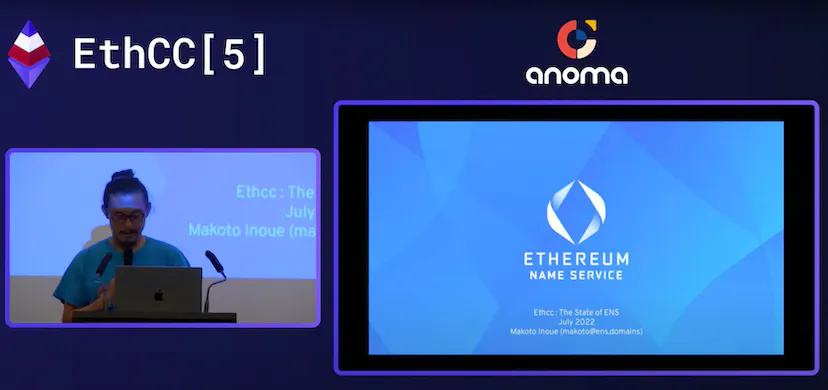
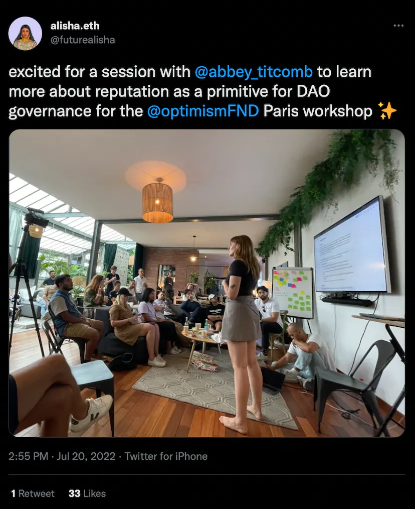
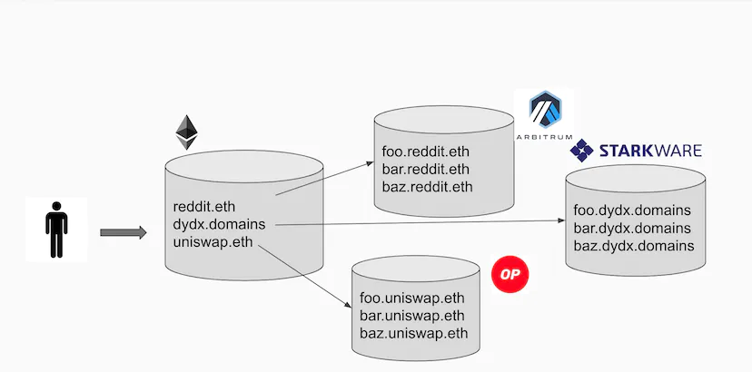
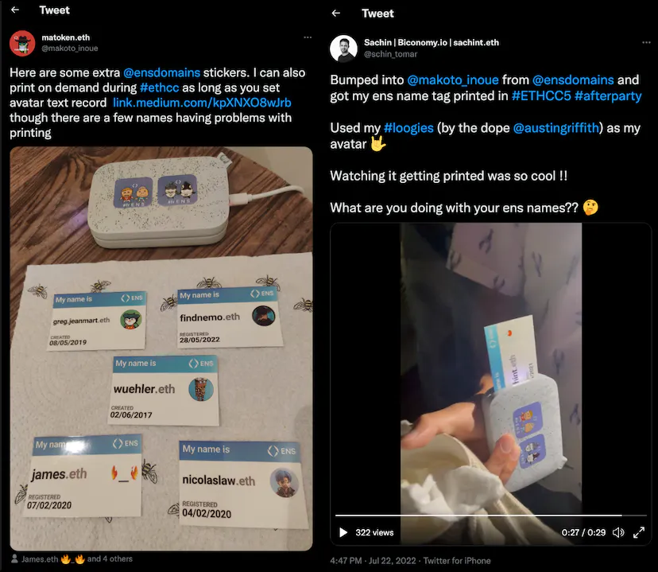
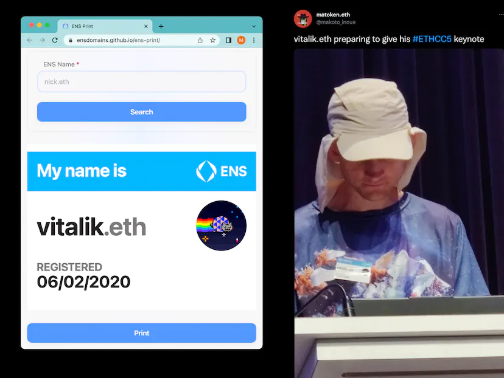
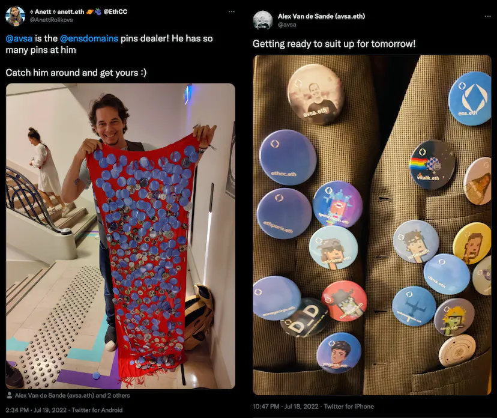

I have attended ETHcc every year since 2017 (when it was still called EDCON) and I am glad to be able to come back to Paris again with alisha.eth and lucemans.eth.

Here's a recap of how ENS participated at Ethcc5 and Ethcc week in Paris.

## ENS talk sessions

I gave a quick recap of the growth ENS had over the last year as well as introduced our new features [alpha.ens.domains](https://alpha.ens.domains) site and an upcoming feature called NameWrapper — it turns any ENS subdomain into an NFT with a more flexible access control feature called a "fuse".

It was also great to showcase not only what our team worked on but also other sites our ecosystem members have built such as [ethleaderboard.xyz](https://ethleaderboard.xyz) and [ens.vision](https://ens.vision). The full video and the slides are as follows.

- [video](https://www.youtube.com/watch?v=UPWYoJnmCUo)
- [slide](https://speakerdeck.com/makoto_inoue/ethcc-the-state-of-ens-2022)

alisha.eth was also in town joining the DAO governance workshop hosted by Optimism.

## L2

One thing I didn't cover in my "State of ENS talk" is our plan for L2 integration. I actually gave a whole talk about our ENS L2 strategy last year ([talk video](https://www.youtube.com/watch?v=fTgNVu1Y720&t=1s)). Our overall approach hasn't changed since last year but we now have [a complete specification](https://docs.ens.domains/dapp-developer-guide/ens-l2-offchain) and library support such as ethers.js  

I spent most of my time at ETHcc talking to various chain and bridge providers, exploring the possibilities of bringing the integrations to their chains. As our integration relies on roll-up mechanism of the L2 chains, it was great to see many zk rollup providers (zkSync, Polygon Hermez, Scroll) announce their own version of zkEVM, which was a hot topic during Ethcc. Here is my ETHcc5 watch list, all related to cross-chain bridge and interoperability (yes, I didn't have time to attend all the talks because I was too busy meeting people). 

- [Trustless bridges in the Ethereum Beaconverse](https://www.youtube.com/watch?v=Vyd1Wcqrs54) = Gnosis trustless bridge
- [State tree - Hermez zkEVM ](https://www.youtube.com/watch?v=FJWCJ5s_PiY)
- [Polygon-Hermez zkEVM BridgeL1-L2](https://www.youtube.com/watch?v=z44yN5ApOE8)
- [Beamer - an optimistic bridge ](https://www.youtube.com/watch?v=zXhuFsUOYQM)
- [Optimism Bedrock: Upgraded optimistic rollups architecture](https://www.youtube.com/watch?v=vXuRJgyISI0)
- [Nicolas Laurent : The Soul of a New Machine: Next-Generation Optimistic Rollups with Cannon](https://www.youtube.com/watch?v=2RjkkoGUTx0)
- [The Age of Rollups = Arbitrum](https://www.youtube.com/watch?v=L4DJ28I5EnI)
- [Celestiums: Scaling Ethereum Rollups by using Celestia for Data Availability](https://www.youtube.com/watch?v=6uLlTLE7qrQ)
- [StarkNet - Next steps](https://www.youtube.com/watch?v=4asIQyWwGko)

One thing I was asked repeatedly is "which chain is ENS picking". The short answer is "we don't pick one, your Dapp/Wallet/Exchange does".

This is the diagram I often show when I explain our architecture.

Our extensible ENS architecture allows each domain (eg: uniswap.eth, mirror.xyz) to select a "resolver" contract that can proxy their data access layer to the chain of their choice through so-called "gateway" service.  The ideal use case is a dapp/wallet/exchange for picking the chain they already support and issue subdomains on the chain, which anyone can look up through our CCIP Read framework. If you want ENS to be supported on your favourite chain, it is important to understand that we need to work on both the chain and dapps that live on the chain. If you know any dapps/wallets/exchanges which could potentially issue subdomains to their users, please do let us know so that we can work with them, alongside the chains they support.

## IRL merch

Since EthBarcelona we bought a few small inkless printers and printed name tags with your .eth names and avatars to those who set the avatar text record. Even though many participants now have their own ENS name, it's still a minority of people who actually know how to set up their PFP as an ENS avatar. However, many people came back to me the following day so I print name tags for them. Two people even set up an ENS avatar record in the middle of the side events (it was at a Wallet Connect side event so the ratio of participants who can interact with Ethereum from mobile was high).

For those of you who want to set the avatar text record can follow this guide Setting the Avatar record & text Make sure you Connect with, fine the avatar record. You can find all of, your NFT on OpenSea.). Our ENS manager is still difficult to set NFT as an avatar text record. Our dev taytems.eth created a small utility site https://avatars.taytems.xyz/ to generate the text record for NFTs. 

If you missed us at Ethcc but want to have ENS name tag, you can go to [ensdomains.github.io/ens-print](https://ensdomains.github.io/ens-print) and generate one on your own. The example below is how vitalik.eth looks and I managed to stick it into Vitalik himself right before his keynote.

I was not the only one with ENS merch. Our ENS DAO delegate/steward avsa.eth brought tons of ENS badges and placed them everywhere possible, even on his own vest!

Hope you enjoyed the little tour of our ENS team activity at Ethcc5 in Paris. Some of our team members will be at other IRL events so make sure to set your avatar text record in advance to get your ENS sticker!
