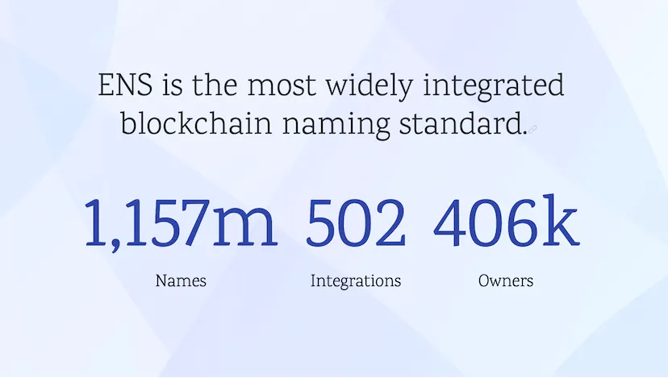
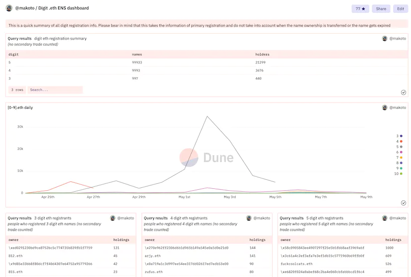
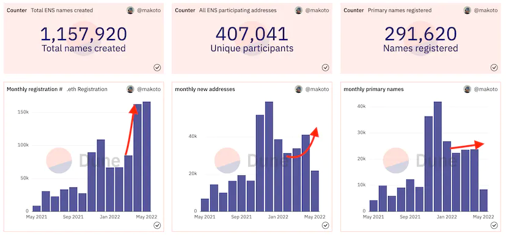
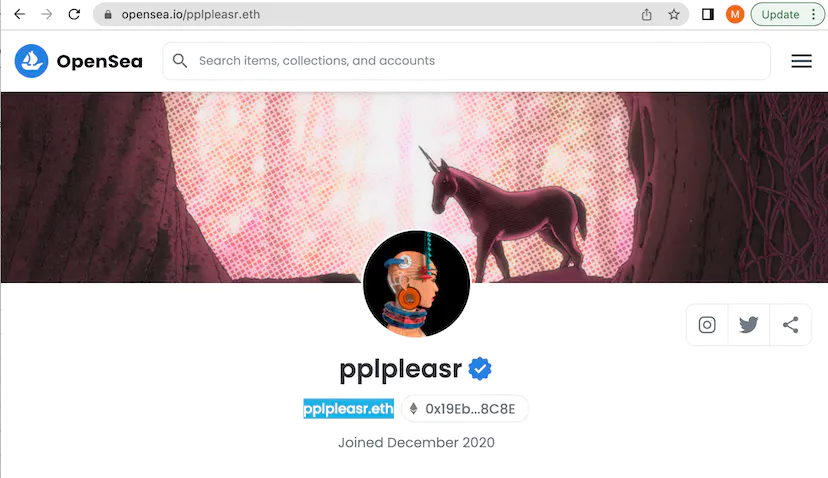
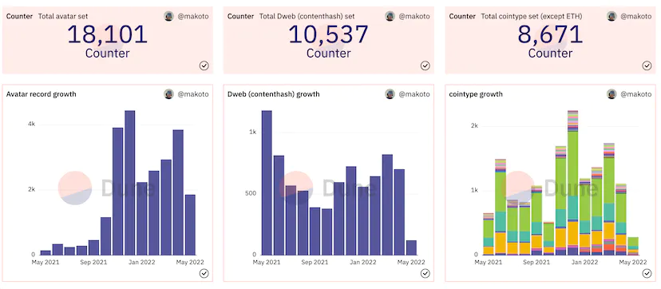
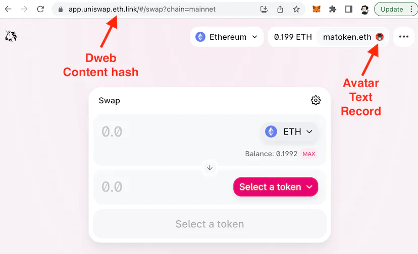
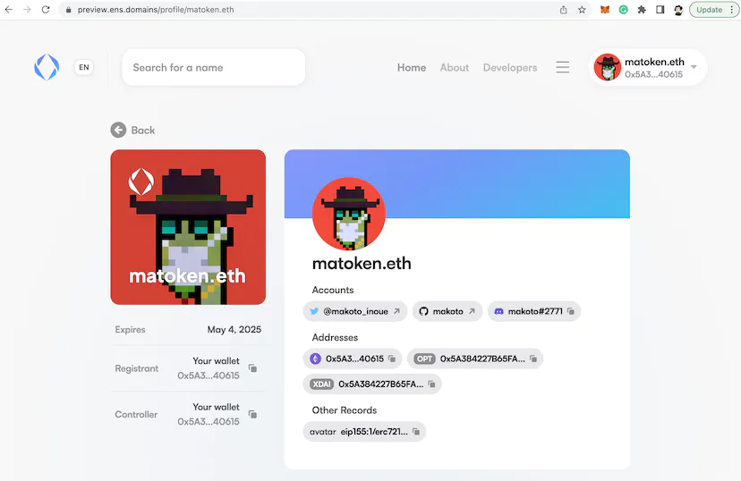
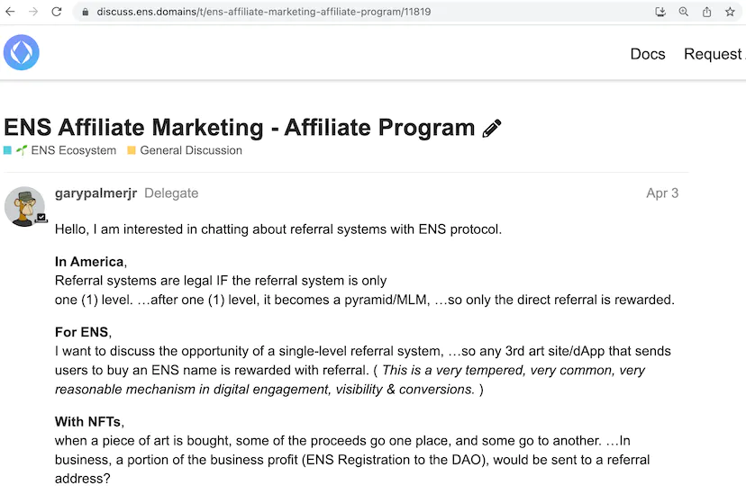
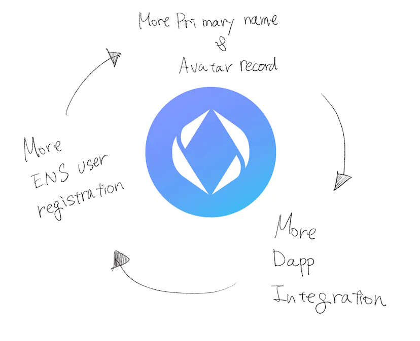

During ENS Twitter spaces celebrating the ENS 5th anniversary and reaching 1 million registered names, a couple of people asked "What's the next big milestone?"

The next big milestones will be 1000 integrations and 1 million owners. I would like to address how we achieve that and what key metrics we should keep an eye on.

## Names > Address > Primary Names

.eth registration exploded when people started buying 3-5 digits names and the 10k Club was quickly formed.

This brought huge revenue to ENS DAO (we had $7 million .eth registration revenue in April, and already have over $5 million within the first week of May). The news about the 10k club was spread across CT and that also brought the number of unique participants (unique Ethereum addresses that hold ENS names) where it grew monthly new users from 33k to 41k.

However, the most important metric is the total number of primary names set and this number growth hasn't shown as much increase as other metrics.

1.157 million names are owned by 407k addresses, meaning each address has an average of 2.8 ENS names, which seems fair (I also have matoken.eth and makoto.eth owned by 2 different addresses). Of the 407k addresses, 70% of addresses set a primary name which isn't too bad either. It is likely that the real unique ENS users are still somewhere around 300k-400k.

The primary name is what allows ENS to be "Web 3 user name".

By associating your ETH address to your ENS name, dapps and marketplaces can recognise your ENS user name.

I personally think that the primary name registration number is the real indicator of ENS as a web3 user name. The more people set their primary name, the more people see in various places and it has the maximum marketing effect as well. Our next release should allow users to set their primary name at the registration point so we hope the primary name number will go up faster.

## Avatar record, decentralised web, and other cryptocurrencies

The original use case of ENS was to lookup Ethereum addresses and it still remains as the majority of use cases.

In comparison to ETH addresses which are automatically set at registration, the number of other record sets still has lots of space to grow. Avatar record in particular has grown a lot in April, almost similar growth ratio to the last November whereas decentralised web (aka Dweb) and other cryptocurrencies have decreased slightly.

Dweb provides decentralized hosting via IPFS and Avatar text record shows up on Dapps such as Uniswap to show the avatar record you associated with your ENS name set as your primary name.

Even though these new fields make your ENS names a lot more productive, the uptake number is still low. Part of the reason is that our current site is a bit difficult to set dweb address and avatar record. We are working hard for the new UI (you can see the preview version [here](https://preview.ens.domains/)) that makes setting more records easier.

Once the new version is released, I would like to see the Avatar fields to be set for more than 10% of all the addresses with primary names set.

## The number of Integrations

Unlike the metrics I have already covered, the number of integration can only be tracked manually. We keep adding the integration partners to our [website](https://ens.domains/), but if you find any dapps not listed on the site, please contribute by raising PR like [this](https://github.com/ensdomains/ensdomains-v2/pull/450/files).

If you notice that the site you use doesn't support ENS, please pledge to the dapps!

There is also [a discussion](https://discuss.ens.domains/t/ens-affiliate-marketing-affiliate-program/11819) about creating an affiliate program targeted for content creators but the program can be also useful for Dapp integrations. It not only incentivise Dapps to integrate with us but also it will give good data insight about which projects bring more users to ENS (either offchain data like google analytics, or onchain data if we decide to handle it on chain).

The increase in the number of integration makes ENS names not only more useful but also gives natural exposure of ENS brand to the rest of the users who are new to Web3.

I can see the positive cycle that the increase of Primary Name & Avatar record leading to more Integration leading to more ENS user name registration.

## Summary

Our 1M name registration brought large revenue and community awareness. To transition from the short term hype to the continuous growth, this is a great opportunity to improve other key metrics

- Unique owner names = from 400k to 1M (x2.5)
- Primary names = from 291k to 900K (x3)
- Avatar text record = from 18k to 180K (x10)
- Dapp integration = from 502 to 1000(x2)

The increase of the number in each metric will have a positive effect on other numbers and we need the support from ENS community to achieve the target
