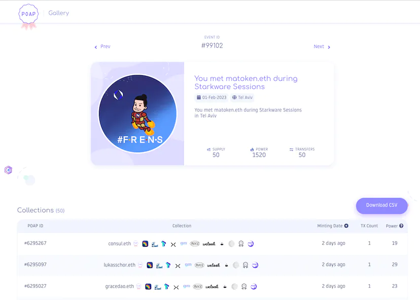
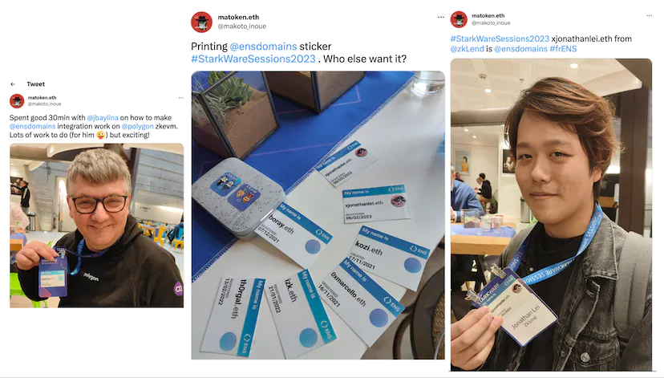

StarkNet is one of the so-called "Layer 2" chains that depend on the network's security to Ethereum Layer 1 using the technology called "ZK Rollup". StarkWare is the development company behind the chain and I was honoured to be invited to their annual event [StarkWare Sessions](https://starkwaresessions.co/) and another event [Building Blocks](https://www.buildingblockstlv.com/) in Tel Aviv. In this blog post, I would like to cover the vibe of the event and how ENS fits into this new upcoming community.

## Why StarkNet?

Despite being in the Ethereum ecosystem, StarkNet is very unique. Most layer 2 chains are so-called "Ethereum Virtual Machine (EVM for short) compatible" where developers can use the same tools to develop smart contracts and end users can use the same wallet such as Metamask. Even though there are multiple projects to make StarkNet compatible with the EVM, they have their own unique programming language called [Cairo](https://www.cairo-lang.org/docs/hello_starknet/). StarkNet also has so-called "account abstraction" built in that allows users to manage their wallets in more flexible ways. To use their system, you have to install special wallets such as [Argent X](https://www.argent.xyz/) and [Braavos](https://braavos.app/).

Before I came to the event, I have been thinking about why people build on StarkNet with all the extra work of learning new languages and getting used to new software. This trip was to find out the answer to this question. One of the key answers is "Zero Knowledge Proof", which is lately the hottest topic within the Blockchain ecosystem.

---

Zero Knowledge proof (ZKP for short) is a method by which one party (the prover) can prove to another party (the verifier) that a given statement is true while the prover avoids conveying any additional information apart from the fact that the statement is indeed true.  Even though the primary use case of ZKP is for privacy, ZKP provides another trait called "Verifiable computation" that allows us to outsource computation to another entity while maintaining verifiable results. Verifiable computation is critical to improving processing speeds on blockchains without reducing security.

Because StarkNet is one of the first projects built on ZKP, it managed to attract lots of people interested in the topic into the ecosystem. In their "ZKVM OGs" session (ZKVM or ZKEVM is an attempt to convert ZK code into EVM), there were speakers from other chains such as Polygon, Aztec and ZKSync and that created the vibe of "Festival of all things ZKP", rather than an event only focused on their own chain.

Many participants are very passionate about the technology around ZKP and StarkNet. Many people seem more interested in building "something cool and innovative" rather than building clones of something already built on Ethereum, even if it costs them to rebuild all the toolings from scratch. There are fewer speculators and more builders.  It reminded me of the passion and enthusiasm of 2016 when I first joined the Ethereum ecosystem.

## ENS #FRENS

The majority of people in the event seemed already in the Ethereum ecosystem.

When I asked how many people have ENS names to the audience during my panel session, probably more than 80% of people raised their hands. I have been asking this since I joined the ENS team back in 2018 and that was one of the highest ratios.

---

Zero Knowledge is a very advanced topic even within the Ethereum ecosystem. I guess that people interested in such topics are fairly advanced users within the ecosystem hence the high ENS ownership rate.

I have been giving away my personal POAP event badges (with my jpeg drawings) using the ENS card we distributed at the last Devcon. 50 people collected my POAP during my visit to Tel Aviv, and 70% of the recipients set their primary names. Again it shows the high ENS and crypto literacy among the participants.

And yes, the ENS sticker was popular again among the participants.

## ENS on StarkNet

When I spoke to dapps, wallets, and builders that we are working on ENS integration within StarkNet, many people welcomed the initiative and they said they would support ENS on their app.

As I explained earlier, StarkNet is built on its unique language called Cairo and ENS labs team members do not have expertise in building and maintaining the codebase. This is where the enthusiasm of the StarkNet community kicks in.

Nethermind is the creator of an Ethereum client software used by over 20% of validators but is also known for building the infrastructure in the StarkNet ecosystem such as Warp (Solidity to Cairo Transpiler) and Voyager (the StarkNet block explorer). They proposed to implement the CCIP-read (our offchain data retrieval framework) on StarkNet at the end of last year, and part of my visit to Tel Aviv was to meet the team to discuss the progress of the proposal which we also provided some grants.

A week leading up to the StarkWare Sessions summit, there was a hacker house near the Tel Aviv beach organized by "Only Dust" where people spent a week together to contribute to StarkNet ecosystem projects and get rewards from the prize pool.

Even though the beach looked amazing from the building, it was one of the windiest times of the year and it was almost impossible to even walk outside so participants couldn't do much apart from hacking at the venue for the whole week.

Nethermind, ENS, and starknet.id (Name service on StarkNet) spent significant time at the hacker house discussing the details of how ENS can integrate with StarkNet. You may wonder why we are discussing with competing name service providers. Thanks to the flexible approach of CCIP-read, it is possible for StarNet to integrate with ENS so that matoken.stark on starknet.id can also become a subdomain in Ethereum as matoken.starknet.id

It is great that community members are actively contributing to the implementation of the standard to the point that they can give the master class on how CCIP-read works to the hacker house participants.

It is great that community members are actively contributing to the implementation of the standard to the point that they can give the master class on how CCIP-read works to the hacker house participants.

---

On the second day of the hacker house, we had a workshop with partners who are interested in issuing subdomains on StarkNet with the implementation we are working on. You can read the full meeting notes here.

## Talks and Panels

In addition to my talk "ENS on StarkNet" talk (slide), I was invited to two panes both focusing on Identity. The first panel (Identity and Social) was with other decentralised ID providers (Lens, Starknet.id) and Privacy solution provider (Sismo), while the second panel was with projects built on top of ENS (Nimi profile, Esteroid dweb search).

While both panels made some comparisons between web2 and web3 identities and agree that web3 can provide more transparency and interoperability, they also showed worries about privacy and how ZK technology would fit into the distributed identities. Both talks were recorded so hope the videos get published soon.

This is it from me. Many thanks to the StarkWare Sessions, BuildingBlocks, OnlyDust event organisers, all the people I met, and Eli Ben-Sasson and Uri Kolodny (the founders of StarkWare) for building such a fantastic technology and community.

---
