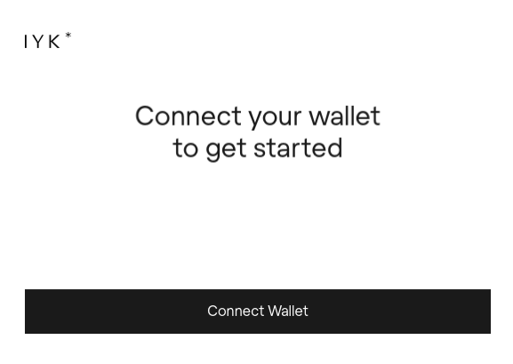
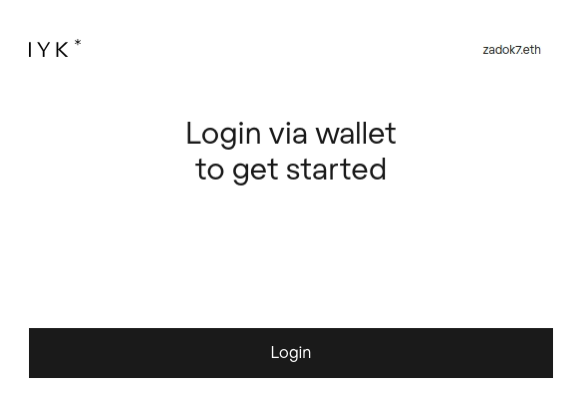

At some conferences, attendees are gifted an ENS physical badge equipped with an NFC chip. NFC stands for Near Field Communication. This technology makes it easy to share a [POAP](https://poap.xyz/about-the-protocol) with others you meet at real-life events. By simply holding an NFC enabled mobile device near the ENS Badge, a POAP can automatically be issued. You can also showcase your online and onchain persona in a single tap of the card. 

Have you received an ENS Badge and want to know how to re-use them? Then this guide is for you!

[size="normal"]

## Step 1: Connect your wallet to the IYK site

First, head over to the IYK admin dashboard. You can find it here: [iyk.app/admin](https://iyk.app/admin)

[size="normal"]

Connect to the IYK site using the wallet that was assigned ownership of the IYK card. If you received this from an ENS event, then the wallet you registered with to receive your card should be used to connect with. Ownership of the cards can also be transfered to a different wallet right in the IYK dashboard.

## Step 2: Login to the IYK Dashboard

Once you are connected to the site with your wallet, click `Login`. You will be asked to sign a gasless transaction on your wallet to allow you to access the administrator dashboard of IYK.

[size="normal"]

## Step 3: Choose the IYK card you want to manage

Any IYK cards your wallet is the owner of will appear now for you to manage. You might own multiple cards if you've gone to multiple events where ENS has given these cards away.

[size="normal"]

## Step 4: Create a POAP

The Proof of Attendance Protocol, or POAP, turns a moment like meeting frENS or attending an event into a collectible. To share a POAP collectible, first, you'll first need to create one. Do this by heading over to the POAP drop admin panel. Here is the link: [drops.poap.xyz](https://drops.poap.xyz)

Enter an email address and you'll be sent a code to enter the site.

[size="normal"]

Give your POAP a title, description, and pick a beginning and end date for the event. Also, fill in any other details like the event type, a website, or social platform links. Mark the visibility as `private` if you are just doing a test. Don't forget to upload your artwork! When you're done, click `Create Drop`.

[size="normal"]

## Step 5: Setup your mint links

You will need these to input into the IYK admin panel later.

[size="normal"]

## Step 6: Pick the number of mint links

Set the total amount of POAPs you think you might use at the event and submit your request.

[size="normal"]

Your request will be reviewed by POAP, and you should soon receive an email with a text file attachment.

[size="normal"]

If you don't receive the email, you can always log back into [drops.poap.xyz](https://drops.poap.xyz) and check the status of your POAP. Your links.txt file will be available for download once approved.

[size="normal"]

## Step 7: Upload your links.txt file into IYK

Once your POAP has been approved and you receive your links.txt, you will need to upload these into the [IYK admin panel](https://iyk.app/admin/items). Click on the IYK card you want to associate the POAP with. Then click `Edit`.

[size="normal"]

On the next screen click `Upload codes to add selectable events`.

[size="normal"]

Confirm the upload of your links file.

[size="normal"]

In IYK go back to your list of cards. Click the one you want to associate with the newly created POAP. Change the event to the one you just created and click `Save`.

[size="normal"]

Congratulations! You've successfully set up a new POAP for distribution using your IYK ENS name badge.
