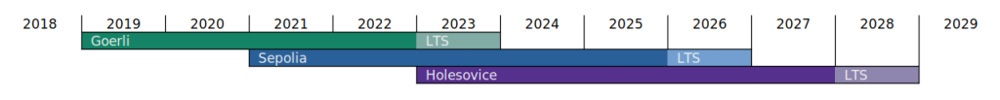
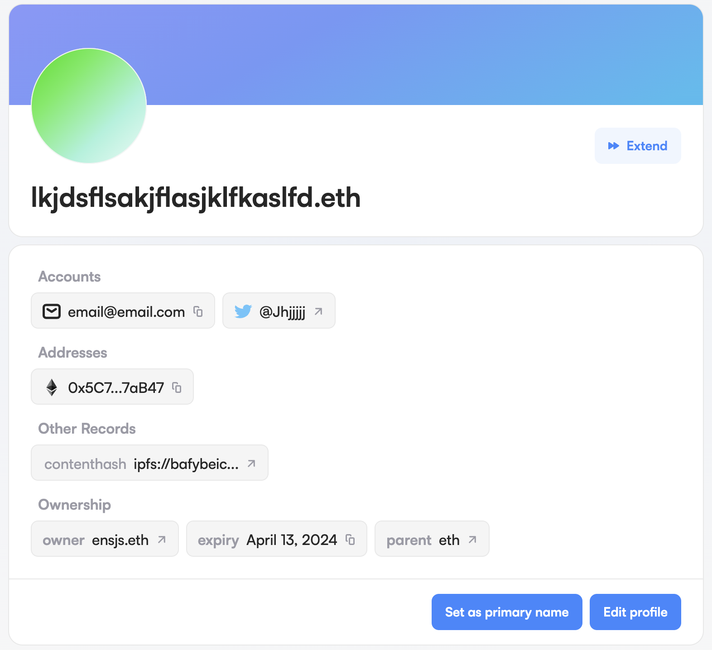

## ENS Public Testnet Update

Ethereum's focus on its actively maintained public testnets, Sepolia and Goerli, is shifting. Sepolia is a network for contract and application developers to test their applications while Goerli as a network enables protocol developers to test network upgrades, infrastructure and let stakers test running validators.

However Goerli has been deprecated and its responsibilities will transition to [Holesovice](https://github.com/eth-clients/holesky). In preperation for these changes, we've deployed the ENS contracts to Sepolia, while also adding support for Sepolia to the [Manager App](https://app.ens.domains/). We look forward to deploying onto Holesovice as well to make sure ENS developers always have the best experience.

Credit: https://github.com/eth-clients/holesky/blob/main/assets/holesovice.png

_Holesovice will launch September 15, 2023, 14:00 UTC, Epoch time: 1694786400._

## Web3 Starter Kit: Next.js

Have you ever wanted to quickly build and deploy a new Web3 project? Well we've created a web3 [starter kit](https://github.com/ensdomains/frontend-template) just for that which uses the same technology stack as the Manager App.

You can see an example of what a project looke like [here](https://ens-frontend-template.vercel.app/).

## Revamped Profile Page: We've Added Contenthash & Email Records

## Evolving Our End to End Testing Infrastructure

End to End (E2E) testing is probably the biggest pain point in front-end development, given that this involves spinning up a browser which is a relatively heavy piece of software, as well as the need to spin up any other required supporting infrastructure (ex. databases). This is complicated even further in web3 as we have wallet interactions and their interactions with the blockchain to add into the mix. They tend to be notoriously flaky and it can be hard to keep tests isolated as to achieve this you need to spin up a completely new environment for every test run. All of these things and more add up and severly slow down the time between the code being ready and it getting deployed into production.

So we decided to take a step back, and investigate our approach to how we write our tests. From this research we decided to transition from using Cypress to Playwright. This has led to a huge improvement in many aspects of our testing process, from reducing the time it takes for the tests to run, to making it easier for our developers to write and maintain them. This should lead to us being able to safely release more features, or at the very least it will save us some grey hairs!

If you'd like a separate write-up on our testing infrastructure (or have any other feedback), please let us know on [canny.io](https://ens.canny.io/)!

## Smaller Updates

- ETH is now selected as the default payment method during registration
- Default toggle off owner and manager during send flow
- Updated to the latest version of The Graph
- All multi-step transactions will no longer rely on localStorage, this is useful for users who use private browsing sessions or otherwise disable localStorage
- Replace links to medium with links to mirror on ens.domains and app.ens.domains
- content-hash rewrite in typescript

## Bug Fixes

- "Extending this name will not give you ownership of it" message was shown in the wrong situation.
- Fixed bug preventing Gnosis Safe users from making transactions
- Prevent subnames from being extended from the 'My Names' list as it is not supported yet
