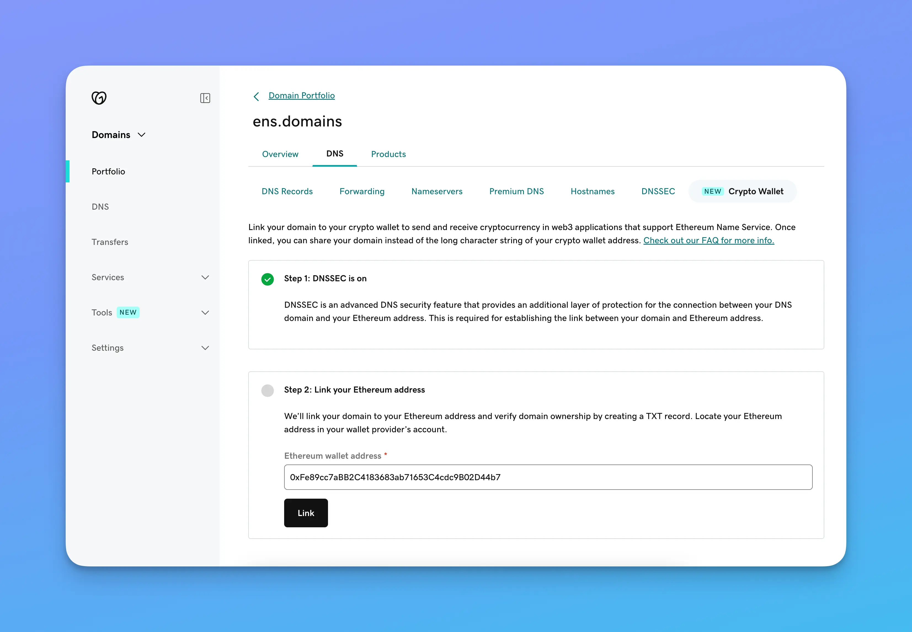

We've partnered with GoDaddy to make it easier for their customers to use DNS domains in the ENS ecosystem.

As the world's largest domain registrar, GoDaddy constantly seeks innovative ways to enhance its services. Today that means bringing the power of web3 to their millions of customers, and we're thrilled to be a part of it.

## How It Works

To ensure a streamlined experience for its users, GoDaddy has added a new section within its domain management interface. Here, customers can easily associate an Ethereum address with their domain names, allowing seamless integration with hundreds of applications across the web3 ecosystem. The process is simple and user-friendly, requiring no additional costs or technical expertise.

Once it is configured, the domain name can be used in place of an Ethereum address in a range of web3 applications including wallets, block explorers, NFT marketplaces, etc.

## History

ENS has always been complementary to existing internet infrastructure. For years, DNS names could be imported into ENS, but incurred hefty transaction fees.

On January 29 with [ENS DAO's approval of EP5.1](https://www.tally.xyz/gov/ens/proposal/4208408830555077285685632645423534041634535116286721240943655761928631543220), we [launched Gasless DNSSEC](/post/gasless-dnssec), a new feature that allows DNS domains to be used in ENS without incurring any transaction fees. GoDaddy is the first registrar to integrate with this new feature.

## Conclusion

For ENS to succeed, it must integrate with existing infrastructure. Today's announcement aims to be a step in that direction.

This partnership between GoDaddy and ENS marks a significant milestone in the domain name industry and we're excited to continue pushing forward.
