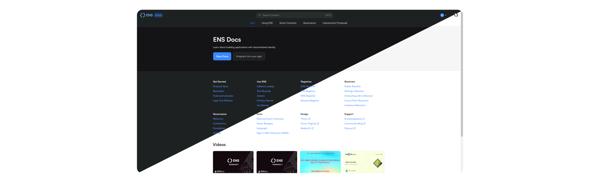
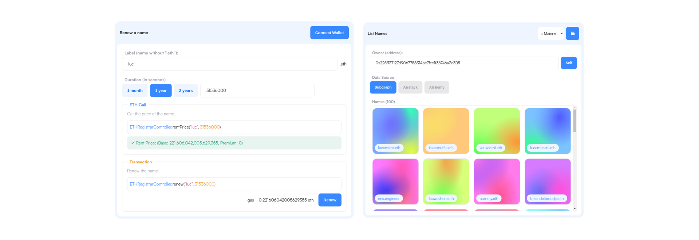
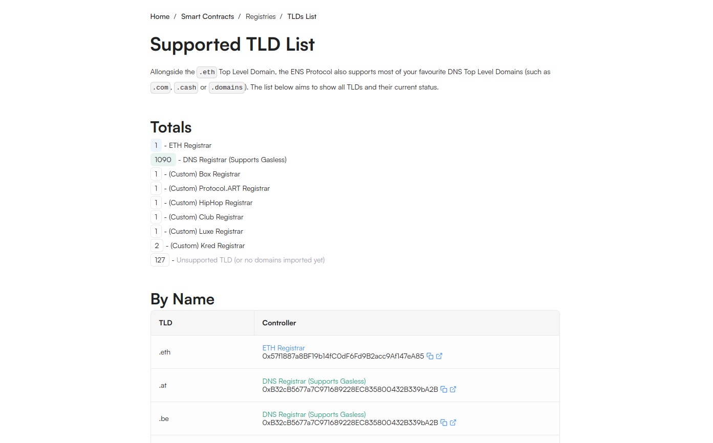
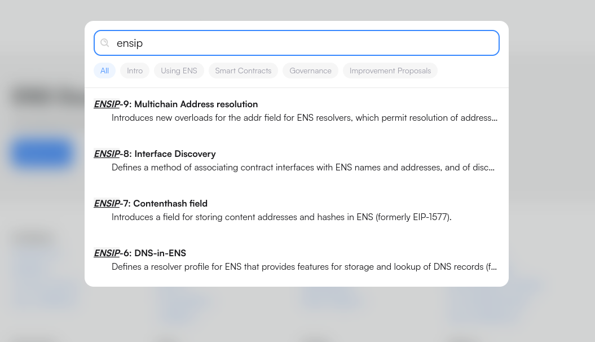

After months of hard work, we are proud to announce the release of the new ENS documentation!
When taking on this journey when I first joined the team, I had no idea what I was getting myself into.
But **luc**kily with great minds, some croissants, and a writers retreat later, we have finally made it!

## Thorin Design

With new docs comes a new look and feel!
The Thorin design system, that was introduced in the Manager App with v3 has made its way to the docs!

### Dark Theme

We all love light theme... or well, I do (luc.eth writing this).
But for those of us trying to save our eyes at night, the docs now have a dark theme!
Meaning you can switch between light and dark theme at any time.

## Interactive Components

Building with ENS means standards, specs, and on-chain shenanigans. To help you understand it all, we have built interactive sections that walk you through procedures, such as registering a name, renewing, transferring, and more.

All of this means you can now easily debug your resolver, fix your name records, and learn how ENS resolution works.

## Name Wrapper

Since our [release of the Name Wrapper](https://www.youtube.com/watch?v=njb7jp5_Qoo) we have seen an increasing demand in users interested in understanding how it works.
So to satisfy your curiosity, we have created a section dedicated to the Name Wrapper, where you can learn more about how it works,
particular behaviours, and how to use it.

Checkout the Name Wrapper section [here](https://docs.ens.domains/namewrapper).

## TLD List

Furthering our commitment to improve the DNS namespace, we have created a TLD list page, where you can see all the TLDs and the state per TLD regarding DNS support, ENS support, and registry behaviour.
You can find the TLD list page [here](https://docs.ens.domains/dns/tlds).

If you spot a TLD that is not listed, or has incorrect information, please let us know by creating an issue on the [ENS documentation GitHub repository](https://github.com/ensdomains/docs).

## Improved Search

We have improved the search functionality, now with section-based filtering, it is easier then ever to find the content you're after.
Wether its ENSIPs, Governance Proposals, or anything else.

## What's Next?

We are not done yet! We are already working on a whole list of few more features & edits to make the documentation even better.
There is much more to look forward to, and we welcome any and all contributions to [the documentation](https://github.com/ensdomains/docs).

Does this sound like **the** _challenge for you?_ We are looking for a technical writer to join the team and help us make the documentation even better.
Checkout the job posting [here](https://enslabs.breezy.hr/p/0967c0d8ab73-technical-content-writer).
