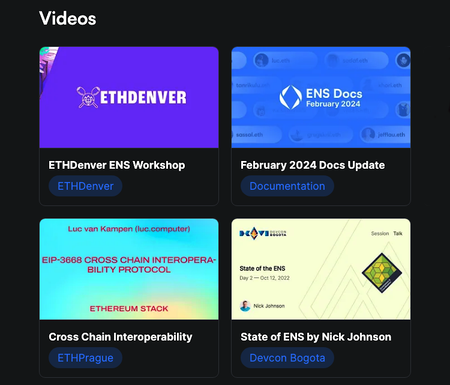
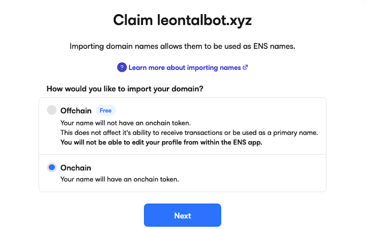
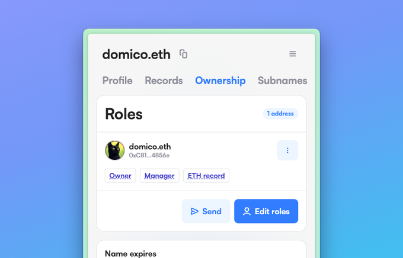
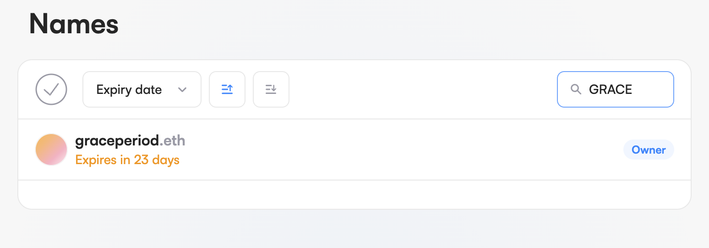
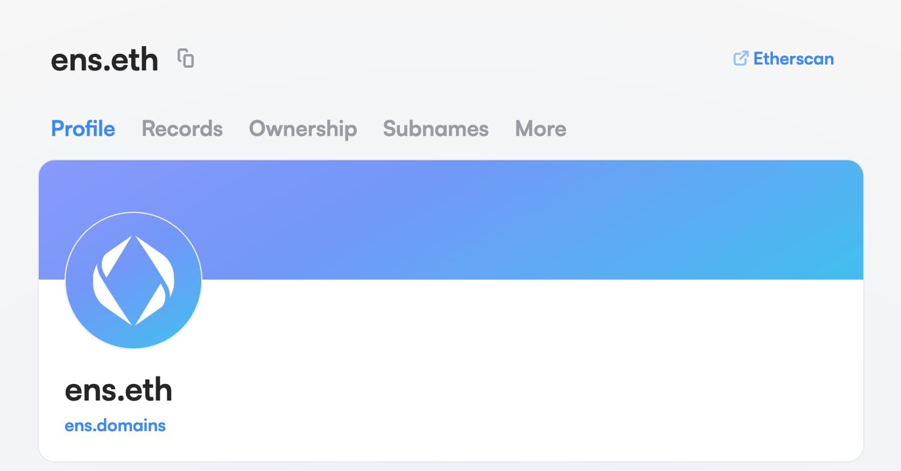
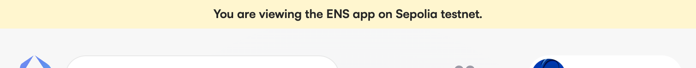
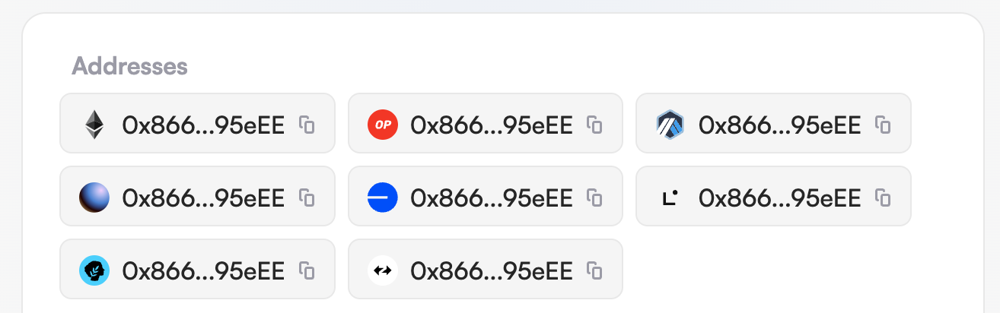
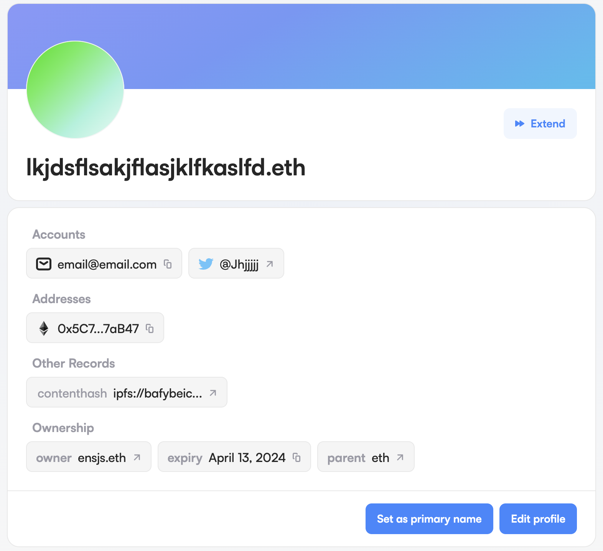
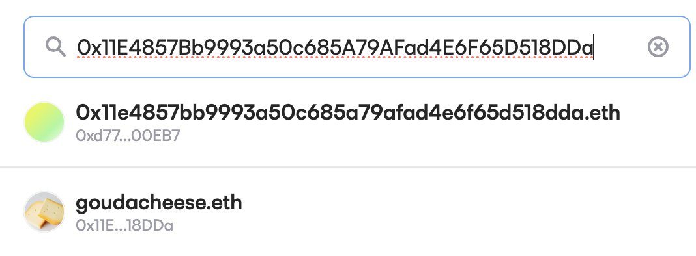

Web Update August 2023 - April 2024

It's been a while since we published a blog update. Did you miss us?

We've been hard at work since our last update in August 2023. Our blog may have taken a hiatus, but the new features kept coming so this will be a long post. Grab your favorite caffeinated beverage and get comfortable.

## New Blog

Some of our community members asked for a central place to get the latest news about ENS. Message received. 

View our new blog at [blog.ens.domains](https://blog.ens.domains/).

## New Documentation Site

The ENS Labs team has finally put the finishing touches on our new documentation site. Take some time and review it. We've even included some of our recent video workshops.

View our new [documentation site](https://docs.ens.domains/), and [read our last post](https://blog.ens.domains/post/documentation-update-1) about all the features and enhancements.

[size="normal"]

## Gasless DNSSEC Support

We added support for gasless DNS names, and built a new flow for importing them. This means they'll show up through the search bar in the homepage with the "imported" tag, and they're also viewable as profiles.

- The old way of importing is still around, and may still be desirable for some users.
- The main difference is that the old method involved issuing a name onchain, whereas gasless DNS names rely on offchain gateways for resolution.

In the new flow, you're presented with two options for importing: Offchain or Onchain. The app provides instructions for each option based on your selection. See example screenshot below.

[size="normal"]

## New Facelift for ens.domains

We added a lot of subtle changes to the font, icons, copy, and even included a new vibrant offchain diagram.

View our new [ens.domains](https://ens.domains/) site.

## Ownership Tab

The new ownership tab has been designed to make it as clear as possible to see the different accounts involved in the ownership of a name, along with registration/expiration dates.

## Quality of Life Improvements

### Search

The search functionality is now case-insensitive. See screenshot below.

[size="normal"]

### Etherscan

The Etherscan link in the upper right-hand corner on the name/address page has been added.

[size="normal"]

### Testnet

A Testnet indication banner has been added.

[size="normal"]

### Address Records

Profile icons for the Ethereum L2 address records have been added and offer a splash of eye candy. Icons added are below:

- Arbitrum
- Base
- Linea
- Optimism
- Starknet
- zkSync
- Zora

[size="normal"]

### More Record Data

We added contenthash & email records to the profile page.

[size="normal"]

## Security Issue - Search Autocomplete

We had previously been adding ".ETH" on the end of names typed into the search bar in the ENS app. This was a very mild form of autocomplete that was a quality of life improvement for the user. However, this turned into a potential security risk.

If someone registers a target's ETH address as an ENS name (for example "**0xb794f5ea0ba39494ce839613fffba74279579268.eth**"), and enters their address into a search bar, the top result displays their hex address with ".eth" on the end. This can potentially lead someone to sending crypto to a scammer's ENS name.

This feature was promptly removed within a couple of hours of ENS testing and finding the bug.

[size="normal"]

## Web3 Starter Kit: Next.js

Have you ever wanted to quickly build and deploy a new Web3 project?
Well, we've created a web3 [starter kit](https://github.com/ensdomains/frontend-template) just for that which uses the same technology stack as the Manager App.
View an example project [here](https://ens-frontend-template.vercel.app/).

## Evolving Our End-to-End Testing Infrastructure

End-to-End (E2E) testing is probably the biggest pain point in front-end development, given that it involves spinning up a browser which is a relatively heavy piece of software.
Don't forget the need to spin up other required supporting infrastructure such as databases.

This is complicated even further in Web3 as we have wallet interactions with the blockchain to add into the mix.
They tend to be notoriously flaky and it can be hard to keep tests isolated. To achieve this, you must spin-up a new environment for every test run. All of these things add up and slow down the time between the code being ready and it getting deployed into production.

So we decided to take a step back, and investigate our approach to how we write our tests.

Based on our research, we chose to transition from Cypress to Playwright. This has resulted in huge improvement in many aspects of our testing process, from reducing the time it takes for the tests to run, to making it easier for our developers to write and maintain them. This should lead to us being able to safely release more features, or at the very least it will save us some gray hairs!

# Minor Updates

| Topic          | Update                                                                                                                                                          |
| -------------- | --------------------------------------------------------------------------------------------------------------------------------------------------------------- |
| Avatar image   | Improved avatar image load times.                                                                                                                               |
| Browser wallet | We enhanced handling of users with multiple browser wallets installed. We also added support for Phantom wallet.                                                |
| Earni.fi       | [Earni.fi](http://earni.fi/) has become Bankless with copy and link updates made.                                                                               |
| Language       | Chinese translation has been updated (thank you liubb:-)).                                                                                                      |
| Links          | We replaced links to medium with links to mirror on ens.domains and app.ens.domains.                                                                            |
| Load time      | Upgraded faster subname list view load time. We also reduced the ENS app bundle size.                                                                           |
| Name expiry    | We created better warnings around extending the expiration date of a name the user does not own.                                                                |
| Payment        | ETH is now the default payment method during the registration process.                                                                                          |
| Records        | More records are being loaded, by default, on the profile page.                                                                                                 |
| Testnets       | Goerli is deprecated. ENS contracts have been deployed to Sepolia and Holesky, and are supported in the manager app with faucets.                               |
| Transactions   | All multi-step transactions will no longer rely on localStorage. This is helpful for users who use private browsing sessions or otherwise disable localStorage. |
| Twitter        | We replaced the bird icon with 'X'.                                                                                                                             |

## Bug Fixes

| Topic              | Update                                                                                                                         |
| ------------------ | ------------------------------------------------------------------------------------------------------------------------------ |
| Avatar image       | Fixed issues with avatars uploading and displaying correctly. Avatar upload was failing for subnames and we corrected the bug. |
| Browser            | Resolved issue preventing NFT avatar images displaying on Firefox.                                                             |
| Coins              | Some coins were not being validated and this bug has been fixed.                                                               |
| Expirations        | The expiration on 'My Names' list was displayed as `NaN` and has been resolved.                                                |
| Failures           | Identified failures from transactions have been corrected.                                                                     |
| GitHub             | Fixed validation on GitHub record text input.                                                                                  |
| Gnosis Safe        | Resolved bug preventing Gnosis Safe users from making transactions.                                                            |
| Labels             | We no longer show the expiration label for names that don't have an expiration date during the send name flow.                 |
| Unspported network | An unsupported network page now navigates back to Mainnet.                                                                     |
| Message            | "Extending this name will not give you ownership of it" message displayed in the wrong screen. We've corrected this bug.       |
| Name expiry        | Removed the extend and reminder buttons on the Ownership tab of expired names.                                                 |
| Names              | Support for names with "#" in them was added.                                                                                  |
| Registration       | We've ensured registration steps respond to a change in chainId correctly.                                                     |
| Search             | We made the search function case-insensitive.                                                                                  |
| TLDs               | We fixed the ENS app displaying some supported TLDs as unsupported.                                                            |
| Wallet connect     | The Wallet connect on delegate.ens.domains was not working. All fixed.                                                         |
| Wallets            | ChainId was not being cleared on disconnect and has been improved.                                                             |

## Small Dev Updates

- Viem, Wagmi, React Query and RainbowKit have been updated to the latest versions.
- Migrated from Jest to Vitest.
- Subgraph label validation.
- Updated to the latest version of The Graph.
- [content-hash](https://www.npmjs.com/package/@ensdomains/content-hash) rewrite in typescript.
