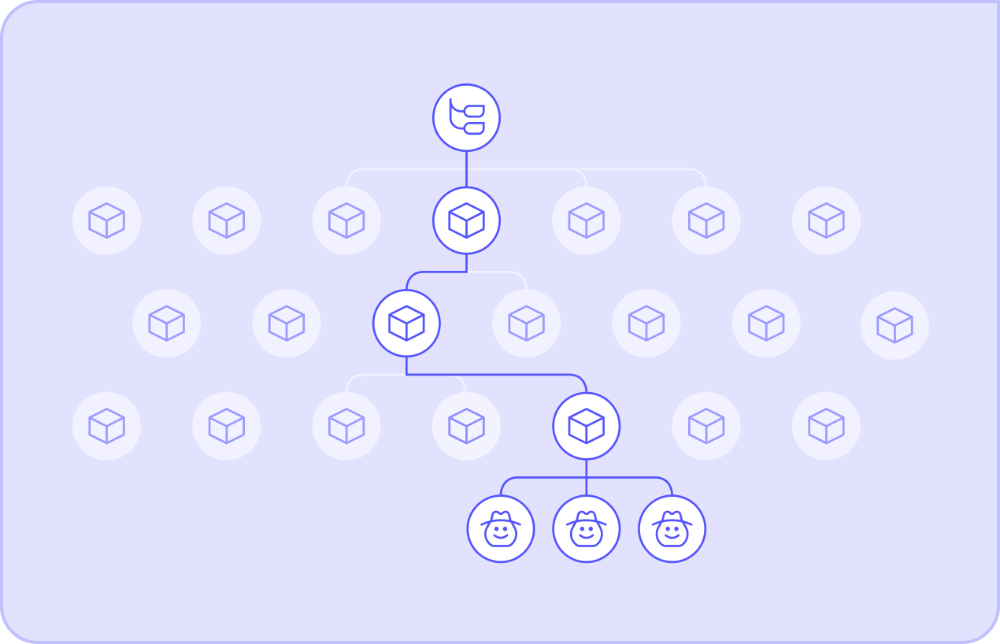
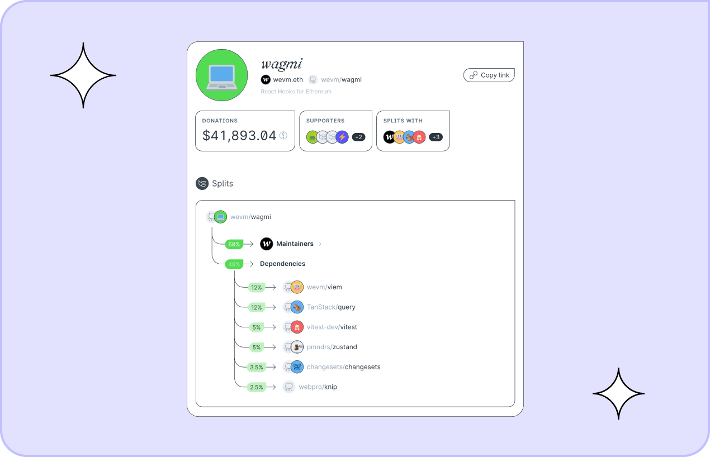
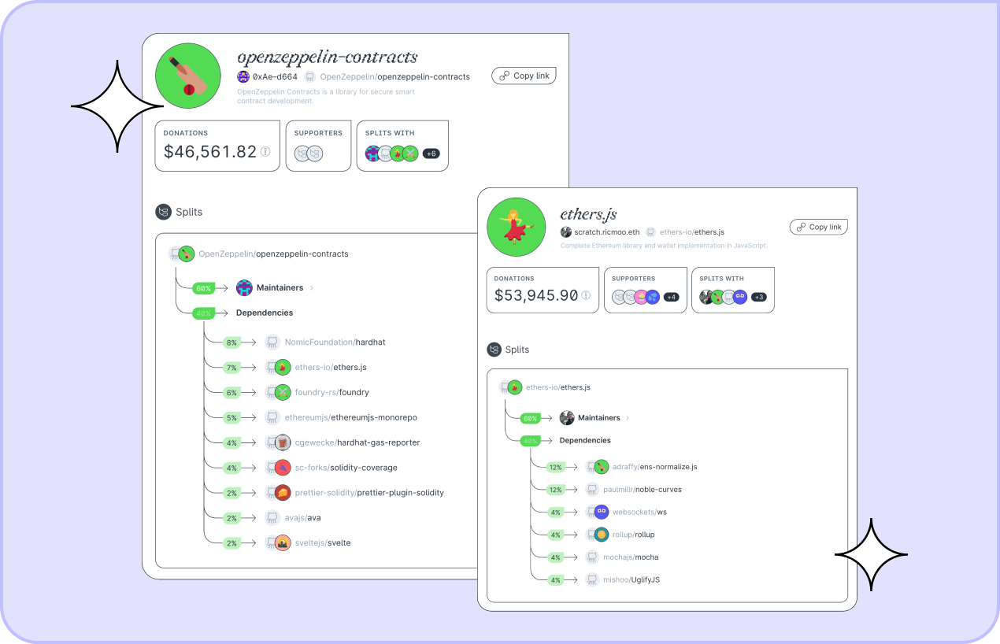

The ENS Ecosystem Working Group is streaming $50,000 USDC over the next six months to seven essential projects through its [Drip List](https://www.drips.network/app/drip-lists/31017209032870028068280040871339261037749177808773684797297972107972): **Wagmi**, **ethers.js**, **graphql-request**, **openzeppelin-contracts**, **noble-hashes**, **scure-base**, and **dns-packet**. This initiative highlights ENS' commitment to reward the open-source projects that underpin its infrastructure.

[Drips](https://www.drips.network/) facilitates continuous and transparent funding, allowing organizations like ENS to ensure their software dependencies receive necessary financial support. By utilizing Drips, ENS not only supports these direct software dependencies, but also creates a broader impact as funds cascade down to the secondary dependencies that enable them.

Zooming in on the direct recipients, we can see the cascading effect of Drips funding in action. While the initial funds are split amongst seven core projects, the impact goes far beyond that, with funds flowing to **at least 40 projects** just two degrees out from ENS.

For example, 40% of funds sent to [Wagmi](https://drips.network/app/projects/github/wevm/wagmi) on Drips are automatically shared with its dependencies.

Similarly, [ethers.js](https://drips.network/app/projects/github/ethers-io/ethers.js) splits funds to six of its own dependencies, while [openzeppelin-contracts](https://drips.network/app/projects/github/OpenZeppelin/openzeppelin-contracts) spreads the love to nine. Just by looking at these initial connections and the projects they support, we can see a positive impact on at least 40 projects.

Eleftherios Diakomichalis, founder of Drips, commented "ENS is leading the way in establishing a new cultural norm where on-chain organizations continuously fund the vital public infrastructure they depend on. No ifs and unnecessary complications—just simple and transparent support for the infrastructure that makes their work possible. This is what the future of public goods funding looks like."

Slobo.eth, ENS ecosystem steward, added: "Drips is a great way to support open source developers who do important work for the ENS Ecosystem."

This is the true magic of Drips: **Funds flow beyond core dependencies**, reaching the essential building blocks that make them function. This fosters a healthier and more sustainable open-source ecosystem — **one where everyone benefits**.
