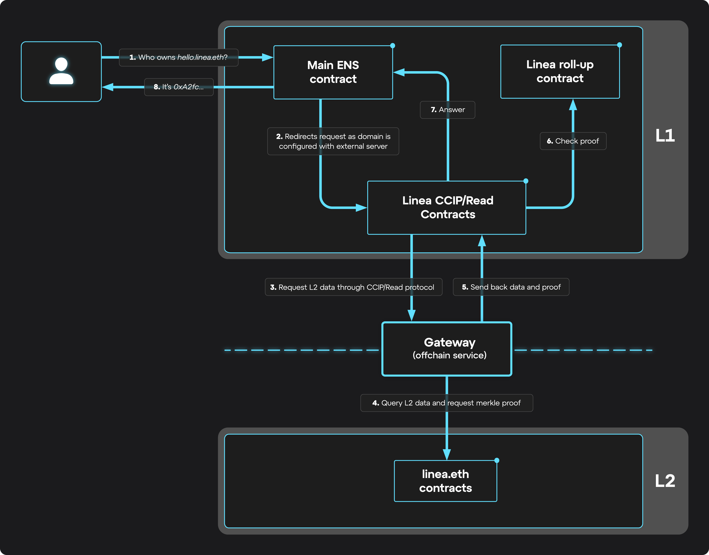

Ethereum addresses and their 42 characters are a staple of the web3 ecosystem. But remembering these addresses is next to impossible, save for those with photographic memories. [Ethereum Name Service (ENS)](https://support.ens.domains/en/articles/7900404-what-is-ens#h_0957054bdf) offers a solution to this as a decentralized naming protocol built on the Ethereum blockchain. As of July 30th, ENS domains are available on Linea, the fastest-growing zkEVM on Ethereum.

Much like the Domain Name System (DNS) changed the face of the internet, translating human-readable domain names into machine-readable IP addresses, ENS translates blockchain addresses to human-readable labels. A truly decentralized protocol, ENS is governed by the [ENS DAO](https://docs.ens.domains/dao) and relies on immutable and transparent smart contracts to resolve records and translate names to addresses.

The first ENS names were minted in 2017 and founded by engineer Nick Johnson. In the years since, the importance of ENS within the Ethereum ecosystem has been evident. ENS improves user experience, reduces the likelihood of transaction errors, increases accessibility, and establishes a new forum for decentralized digital identities.

This progress parallels the growth of the Ethereum ecosystem, which has accelerated thanks to the introduction of Layer 2 (L2) blockchains like Linea, reducing fees and increasing transaction speed, thus facilitating broader adoption of dapps. As Vitalik Buterin, co-founder of Ethereum, [shared early in 2024](https://x.com/vitalikbuterin/status/1742540651797823948), L2s will also be integral to maintaining affordability for ENS.

Now, Linea has become the first zkEVM Layer 2 to adopt the EIP-3668 standard in production, fulfilling the vision of operating ENS with lower gas costs and improved interoperability. Users can switch their wallet address to a human-readable domain, while developers can use CCIP Read (ERC-3668) for cross-chain data retrieval.

As always, security is a priority. To make the network a safe place to transact, Linea has audited all of the relevant smart contracts to meet security standards.

Below are all the details you need to know about ENS on Linea, and its impact on consumers, developers, and the ecosystem.

## Consumer Benefits

With the introduction of ENS on Linea, users with [Proof of Humanity (PoH)](https://poh.linea.build/) can now replace their wallet address with a free and easy-to-remember domain name. This ensures:

- **Cost Efficiency**: Managing ENS on Ethereum's mainnet typically incurs higher gas fees, especially during peak network usage. In contrast, Linea can significantly reduce these costs due to its L2 efficiency, making ENS management more affordable for users.
- **Interoperability**: ENS on Linea can be resolved on every dapp and network compatible with ENS.

## Developer Benefits

[CCIP Read (ERC-3668)](https://eips.ethereum.org/EIPS/eip-3668#abstract) allows for transparent offchain data lookup, offering a universal solution to the challenge of accessing and validating external data efficiently. This means developers can now query Linea data from L1 using CCIP Read (ERC-3668). Here are the benefits:

- **Cost Reduction**: By offering direct access to primary source data, CCIP Read reduces costs and eliminates intermediaries, streamlining the data retrieval process and broadening Linea's applicability to high-bandwidth use cases.
- **Enhanced Security**: CCIP Read improves security by removing the need to trust intermediaries, ensuring direct access to offchain or crosschain data, and reducing points of vulnerability.
- **Innovative Design Possibilities**: CCIP Read opens up new design possibilities, such as executing an action like onchain voting on Layer 2 and using the results back on Layer 1.

## Ecosystem Benefits

In addition to enhancing the consumer and developer experience, the ongoing adoption of ENS will push the entire web3 ecosystem forward.

- **Enhanced User Experience**: Lower fees and faster transaction speed propel onchain user experiences closer to the web2 benchmark that web3 needs to reach for mass adoption.
- **Increased Participation Opportunities**: Affordability makes L2 more accessible, which opens the door for greater participation in ENS from a broader audience.
- **Innovation and Ecosystem Growth**: L2 deployment could catalyze innovation within the ENS ecosystem, potentially unlocking new use cases by enhancing scalability and enabling more complex interactions.

As Linea progresses from testnet to decentralization and continues to grow, recently [surpassing $1 billion total value locked (TVL)](https://linea.mirror.xyz/atPtcNQWJg02G-Za-nOB5A5OQKcZn_t1Blq05PO-17I), the launch of ENS adds another layer of innovation to the ecosystem. Achieving an industry-first as the first zkEVM Layer 2 to adopt the EIP-3668 standard, this advancement brings cost reductions, data accessibility, and enhanced interoperability, all contributing to an enhanced end-user experience.

---

Head to our ENS [user guide](https://support.linea.build/hc/en-us/articles/27439122478107) for more information and [names.linea.build](http://names.linea.build/) to begin setting up your new address.
