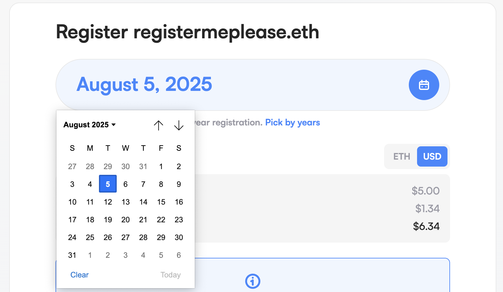

## [ens.domains](https://ens.domains) revamp

We recently announced our rebrand, which features updates to every part of how ENS looks and feels, with the goal of onboarding the next billion users into web3. The fruits of this labour will slowly reveal themselves over the coming months, however, its first major impact is live [right now!](https://ens.domains)

The site has been completely rebuilt from the ground up. The previous one was 4 years old and was starting to show its age a bit both visually and in the codebase.

The delight is in the detail. As well as the overall beautiful design pay attention to the subtle animations as you navigate the site. 

## Security 

As part of our commitment to securing the ENS protocol as well as the web infrastructure built up around it, our [Immunefi bug bounty program](https://immunefi.com/bug-bounty/ens/information/) went live on May 10th. Since then we've paid out $95,000 (incl. 10% platform fees) in rewards for various issues. The good news is that no issues were found in the protocol itself or the manager app and main homepage, and even the most serious issues found would have required some phishing/social engineering to execute successfully.

- 39 Reports were marked invalid
- 5 reports resulted in a payout, most of the 95k went to one issue that could have resulted in a loss of user funds if the user fell for the attacker's social engineering.
- While we take the potential loss of user funds very seriously, we have to balance our budget too. We have since lowered the reward amount for this kind of indirect attack on user funds. 

### A sample of our security efforts: The metadata service

The [metadata](https://metadata.ens.domains) service is an attractive target for attackers since part of its job is to display user content. An attacker can set a malicious avatar image on their ENS name and have it displayed under metadata.ens.domains, potentially fooling the user into thinking the image is from an official source. 

We had considered moving the service off of the ens.domains website altogether to lower the chances that a user would mistake an attacker's avatar image as something from an official ENS website. However, since many sites that use the metadata service access it from their backend servers, it's difficult to know who to contact about the domain change. Unlike browsers, the server-side libraries we tested do not automatically follow 301 redirects. 

Lucky for us, [since March 2023](https://developer.mozilla.org/en-US/docs/Web/HTTP/Headers/Sec-Fetch-Site) browsers have begun to report information to the server that allows us to figure out if the user is visiting the metadata service directly in their browser or if the avatar image is being loaded from another domain or is being used normally as an avatar image as part of a larger website. This means if a user visits the service directly they will see [this](https://metadata.ens.domains/mainnet/avatar/nick.eth): 

Which will deny an attacker the opportunity to style the whole page as they like. This also indicates to the user that they are on some kind of developer page.

However, that same link visited indirectly will display [normally](https://codepen.io/mhmdt/pen/xxoRZyM):

Sometimes there is more to a UI update than meets the eye!

### Other security fixes 

Note we will not discuss every security fix here for... security reasons.

- On certain devices, the NFT avatar image was not displaying emojis correctly, so someone could register `{emoji}vitalik.eth` and have it be displayed as vitalik.eth in the app (the correct name was still displayed in other places on the same page).
- Manager app CSP Firefox fix. This was previously preventing wallets on Firefox from working properly due to a long-standing bug in Firefox's CSP implementation. All dApps should implement a CSP policy, primarily because it prevents javascript from unknown sources being executed, which is the main way an attacker can directly steal user funds.

## [legacy.ens.domains](https://legacy.ens.domains) no longer supported

It's the end of an era, the old ENS manager app will no longer be receiving security updates from us. You can continue to use it entirely at *your own risk*. 

## Note on bankless email reminders

Up until recently, we had been offering users the ability to set email reminders via a service provided by [Bankless](https://www.bankless.com/). This service is not currently available and we've been asked to remove the feature from the manager app for the time being. Bankless has assured us that you will still receive an email reminder before your name expires.

## UI/UX

### Allow users to register names with greater granularity 

A long-requested feature, you can now choose the exact date that you wish to register/extend up to.

### [ENSv2 Roadmap](https://ens.domains/roadmap)

Not just a static image, this will be kept up to date in the run-up to the launch of ENSv2.

### Added block explorer support for evm chains and others on profile page

The addresses on your profile will now include a link to the relevant block explorer.

### Improve ownership records on profile page

Clicking on an owner now produces a dropdown with various helpful options.

### Add name confirmation step to fuse burning

An extra safety step given the permanency of fuse burning.

[size="normal"]

## Show warning that off-chain names will not appear in the 'My Names' list

We can gather information about your on-chain names and list them (including DNS names imported on-chain) because all the information about them is available on the blockchain. For off-chain names such as gasless DNS names, their information is stored on servers run by various entities so gathering ownership info becomes extremely difficult.

- Added blue info box to profile tab, only when viewing as the owner/manager
- Added blue box to confirmation step of off-chain importing
- Added banner to the bottom of the Names page

[size="normal"]
[size="normal"]
[size="normal"]

### Disabled 'Edit Profile' button when owner but not manager 

A disabled button with a tooltip is much more helpful than a missing button.

[size="normal"]

### Deal with long-running transactions: 

Long-running transactions will now link to a helpful support page.

[size="normal"]

### Eth record is now permanently visible in the profile editor

Due to the particular importance of the eth address record in terms of user expectations about how their name will work, the eth address record will now always be visible in the UI when editing, even if it doesn't have a value.

[size="normal"]

### Added 24 hour warning to registration

Let the user know that the second step of the registration process must be completed within 24 hours of the first.

## Other improvements 

- Refactored modals to ensure they are working consistently across the app on all screen sizes
- Reduced ensjs bundle size by 11%
- Smart contract account signature support for avatar uploader
- Support for non-checksummed addresses
- Dropped support for goerli 🫡
- Removed unneeded CSS polyfills, shrinking the manager app bundle size by 80kb
- Added ability to search for coins by network name and coinName
- Added support for coinbase's smart contract wallet 
- Completed migration to the decentralised graph network

## Bugfixes

- Thanks to github user [o-az](https://github.com/o-az) for fixing an issue with github username validation
- Switched to IndexedDB from localStorage for react-query cache as react-query can fill up a user's localStorage if they use the manager app heavily, leading to a variety of issues.
- Names owned by connected users will no longer show ownership warning when renewing.
- Fixed redirect loop on unsupportedNetwork page.
- The manager app can now continue the registration process from an existing commit hash. It will now actively search for a successful commit on-chain outside of what the user's wallet is reporting.
- Entering [root] in search input will now work
- Fixed z-index issue with rainbowkit popover
- Fixed issue where entering 'undefined' into the search bar would not result in an autocompleted result for it in the dropdown 
- Fixed issue where choosing a date on the date picker would give a slightly incorrect date for users in certain timezones
- The manager app will no longer show the primary name in the list inside the "Select a primary name" dialog
- Fixed issue where the manager app was flashing 'Error syncing data' when loading the profile page
