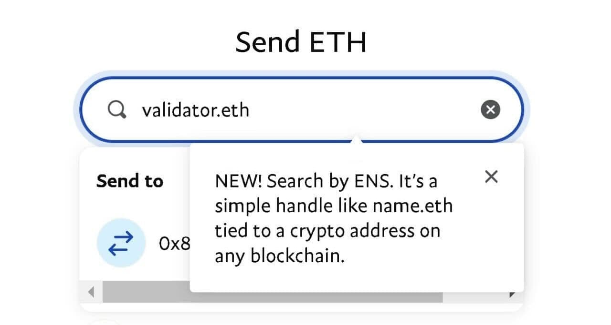

[Ethereum Name Service (ENS)](https://support.ens.domains/en/articles/7900404-what-is-ens#h_0957054bdf) is thrilled to announce a significant milestone in the world of cryptocurrency, enabling users to send and receive crypto across Venmo, PayPal Mobile, and PayPal Web.

## Simplifying Crypto Transactions with ENS

At the core of this feature is a shared vision: simplifying crypto transactions for everyone. With ENS now integrated into PayPal and Venmo, users can leverage their ENS names when transferring crypto, making it easier to manage wallet addresses and reducing the risk of errors.

Here's how it works: When initiating a crypto transfer, users can simply enter their ENS name in the search field. PayPal's system will automatically resolve the ENS name to the corresponding wallet address, specific to the blockchain being used. This streamlined process ensures that users can confidently select the correct address and proceed with the transaction. Throughout the transfer flow, the ENS name and associated address are visible, providing clarity and assurance.

## Introducing the Address Book Feature

In addition to the ENS integration, PayPal and Venmo users will now have access to a new Address Book feature designed to enhance the crypto transfer experience. Traditionally, transferring crypto required manually entering or pasting a wallet address or scanning a QR code. With the Address Book, users can save and recall recently used addresses, and store wallet addresses they frequently interact with, all in one place.

This feature also integrates ENS, allowing users to save ENS names alongside traditional wallet addresses. Whether you're sending crypto to a friend or paying a business, the Address Book will remember your previous transactions, enabling quicker and more efficient transfers. Just as you've relied on your PayPal or Venmo contacts for internal transfers, you can now enjoy the same convenience when sending crypto externally.

## A New Era of User-Friendly Crypto

The integration of ENS into PayPal and Venmo is a significant step towards making cryptocurrency more accessible to the masses. By relieving reliance on complex wallet addresses, ENS empowers users to focus on what truly matters—seamless and secure transactions.

As we continue to build a decentralized web, collaborations like this are crucial in driving mainstream adoption. Whether you're a seasoned crypto enthusiast or a newcomer to the space, the new feature between ENS, PayPal, and Venmo is designed to make your crypto experience as smooth as possible.

Stay tuned for more updates as we roll out this exciting feature across PayPal and Venmo platforms. The future of crypto is here, and it's more connected than ever.
