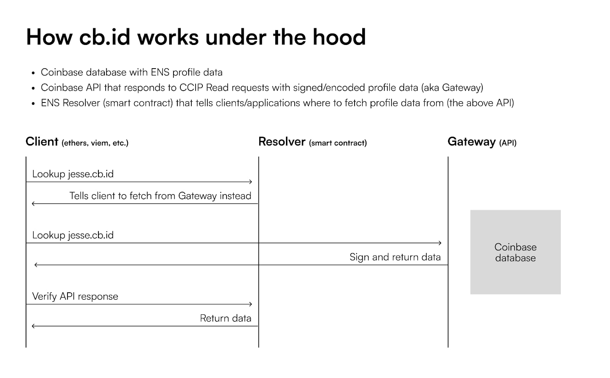

## Executive Summary

In September 2022, Coinbase, a leading cryptocurrency exchange with over 100 million users, implemented a strategic initiative to simplify the complexity of blockchain addresses—a significant hurdle in cryptocurrency adoption. Leveraging Ethereum, ENS (Ethereum Name Service), and EIP-3668 (also known as CCIP-Read), Coinbase developed "cb.id", an ENS-powered namespace service that converts 42-character Ethereum addresses into human-readable usernames like "jesse.cb.id". This significantly enhanced user experience and reduced transaction errors and other risks.

Key features of the cb.id implementation include:

- Free registration for Coinbase customers
- Multi-chain compatibility by default
- Seamless interoperability with the ENS ecosystem
- Enhanced security through the CCIP-Read protocol for signed and encoded data

**The resounding success of cb.id, with over 11 million registrations surpassing traditional .eth domains by fivefold**, prompted Coinbase to accelerate the decentralization of its name service, leading to the recent launch of base.eth subnames—a major transition from offchain cb.id usernames to onchain base.eth usernames.

This paper provides a comprehensive overview of Coinbase's ENS integration journey, from the initial cb.id implementation to the development of base.eth subnames. We explore the motivations, technology, and outcomes of this strategic initiative, offering insights into its impact on user adoption, ecosystem development, and the broader implications for the cryptocurrency industry. This case study serves as a compelling example for businesses considering ENS as a foundational identity management solution in the onchain economy.

## Background

### The Evolution of Blockchain Identity Solutions

The blockchain revolution, initiated by Bitcoin in 2009, promised a new era of coordination technology with unprecedented transparency, security, and censorship resistance. However, as the industry evolved, a significant challenge emerged: the complexity of cryptocurrency addresses. These long strings of alphanumeric characters, while secure, posed a substantial barrier to mainstream adoption.

Coinbase, founded in 2012, quickly established itself as a leading cryptocurrency exchange. With a commitment to user-friendly services and regulatory compliance, Coinbase became a trusted gateway into the onchain economy, amassing over 100 million registered users and defined itself as an industry leader via its historic NASDAQ listing in 2021. Despite these successes, Coinbase recognized that the complexity of blockchain addresses not only complicated user onboarding but also increased the risk of transaction errors.

### Approaches to Address Complexity

In response to these challenges, the broader industry developed several approaches throughout multiple market cycles, listed below in the order they occurred:

- **Address books and contact lists** within wallets and exchanges improved usability but lacked interoperability.
- **Centralized username systems** offered user-friendliness but introduced security risks and contradicted blockchain's decentralized nature.
- **Blockchain-based naming systems**, like the Ethereum Name Service (ENS), emerged as a promising decentralized solution.

### The Emergence of ENS

Launched in 2017, ENS introduced a decentralized system for mapping complex Ethereum addresses to human-readable names like "nick.eth." ENS operates on the Ethereum blockchain, ensuring that name ownership is as secure, decentralized, and permissionless as any other onchain asset.

Now in 2024, ENS has become the leading blockchain naming standard, with nearly 2 million registered names and over 800,000 unique owners. It has gained support across various decentralized applications (dApps), wallets, top-level domains (TLDs), and browsers, with notable integrations including Coinbase, GoDaddy, Uniswap, XMTP, and Farcaster.

### Coinbase's Challenge and Motivation

Coinbase, with its diverse range of crypto services, faced the challenge of creating a unified user experience and brand identity across its ecosystem. The company needed a solution that could simplify user interactions, enhance onboarding, and foster a stronger sense of user identity—all while maintaining the security and decentralization principles of blockchain technology.

In September 2022, motivated by these factors, Coinbase launched a strategic initiative to integrate ENS into its product suite. This initiative, known as the cb.id project, aimed to provide a more user-friendly interface for Coinbase's customers while addressing the longstanding issues of blockchain address complexity. The following sections will address the user experience, technical implementation of cb.id, its impact on Coinbase's ecosystem, and how the success of the offchain cb.id system led to the development of the onchain base.eth system.

### Simplified Onboarding with cb.id Usernames

Coinbase Wallet provides a seamless onboarding experience. Upon downloading it from the App Store or Google Play, users can effortlessly claim a username.cb.id during the initial setup. This username serves as both a convenient way to send and receive cryptocurrency and as an onchain identity that users can carry with them across various dApps in the ecosystem.

Users can search for Wallet profiles by entering the cb.id username, which directs them to the respective profile at profile.coinbase.com/username.eth. Additionally, profiles can be searched using .eth usernames, which are decentralized profiles indexed from the ENS ecosystem.

This demonstrates Coinbase's commitment to simplifying the user experience, making the offering more compelling to broader retail markets. By enhancing user experience and reducing transaction errors, cb.id usernames play a crucial role in achieving these goals.

### High-Level Description of CCIP-Read

ENS-powered domain names, like cb.id, can access data stored outside the blockchain in a decentralized way. This works through a system that lets smart contracts gather this offchain data by coordinating between three key actors: the user (client), the system that finds the data (resolver), and the service that provides access to it (gateway).

The process involves retrieving and validating information that is not stored directly on the Ethereum blockchain, where ENS L1 contracts are housed. Instead, this data is stored offchain, typically on a traditional centralized database like an Amazon Web Services (AWS) server for instance, and can be accessed as needed through interactions with smart contracts.

### Key Components and Their Roles

1. **Client:** Refers to the user interface, such as a website or cryptocurrency wallet, that enables interaction with the Ethereum blockchain. This interaction occurs through smart contracts, which are made more accessible and user-friendly by being represented as ENS names.
2. **Resolver**: A smart contract on the Ethereum Mainnet responsible for finding data associated with an ENS name. It guides the client on where to look or what data to fetch.
3. **Gateway**: An API server operated by a trusted entity, such as Coinbase. It fetches and provides the offchain data requested by the resolver.

### Detailed Workflow

1. **Lookup Request**: The client looks up the cb.id username and attempts to resolve the name using the resolver.
2. **Resolver Interaction:** The resolver informs the client to fetch the necessary data from the gateway, returning a "revert error" indicating the need to query for offchain data.
3. **Gateway Query:** The client sends a query to the gateway API with the call data provided by the resolver. The gateway accesses the Coinbase database with ENS profile data and prepares the required information.
4. **Signed Data Response:** The gateway returns the requested data in a signed and encoded format, ensuring data integrity and authenticity.
5. **Final Call to Resolver:** The client sends the signed data back to the resolver smart contract. The resolver processes this data and completes the name resolution.
6. **Data Validation:** The resolver validates the data received from the gateway. Upon successful validation, the resolver returns the resolved information to the client.

### Get started with CCIP-Read

Developers can utilize this system by referring to the comprehensive CCIP-read documentation, exploring a demo, and forking an existing repository for implementation guidance. By following this process, anyone may set up a decentralized namespace for their onchain app, powered by the ENS Protocol.

### Initiating cb.id: Permissionless Innovation

The implementation strategy behind cb.id by Coinbase underscores the nature of the ENS Protocol's permissionless, open-source environment. This allowed Coinbase to autonomously harness the potential of CCIP-Read (EIP-3668) and Wildcard Resolution (ENSIP 10) to simplify wallet naming for its users.

Coinbase, recognized as a leader and innovative member of the Ethereum community, implemented this technology on their own, showing how easily developer teams can adopt it for their own projects. Additionally, Coinbase has evolved its cb.id offering to onchain subdomains via base.eth subnames stored on its L2 EVM, Base.

### Distinguishing Offchain and Onchain Names and Their Underlying Technologies

Cb.id usernames represent an offchain solution where resolution and metadata are stored outside the Ethereum blockchain, typically on a centralized server, and accessed using the CCIP-Read protocol (EIP-3668). This method allows for faster data retrieval and scalability; however, it introduces a degree of centralization since the data isn't stored onchain.

In contrast, base.eth subnames provide an onchain solution, where the names and associated data are stored directly on the blockchain, specifically on Coinbase's Layer 2 Ethereum network, Base. This is made possible by the EVMGateway, which acts like an onchain API, allowing the resolver to instruct the client to fetch data for resolving names on Base, as illustrated in the previous CCIP-Read workflow example. Specifically, when a resolver on a Layer 2 network needs to verify or retrieve offchain data, the CCIP-Read protocol utilizes the EVMGateway to interact with Ethereum Mainnet.

The EVMGateway verifies the data against onchain proofs, ensuring that the resolution process remains secure, decentralized, and verifiable within the broader Ethereum ecosystem, even if the data is stored offchain. In the context of resolving names on Base L2, the resolver interacts with the EVMGateway via the CCIP-Read protocol. The EVMGateway verifies the necessary data against proofs from Ethereum Mainnet, maintaining the integrity and security of the resolution process. This onchain method aligns with blockchain's core principles of decentralization, offering enhanced security, censorship resistance, and full user control over their identities.

The transition from cb.id to base.eth underscores Coinbase's commitment to these principles, ensuring that user identities are fully integrated and securely managed within the blockchain ecosystem.

###

### Overcoming Integration Challenges

The development process of the cb.id implementation by Coinbase involved overcoming technical challenges. As one of the pioneering teams to implement this technology at scale, Coinbase faced the issue of many existing applications and wallets in the wider ecosystem lacking out-of-the-box support for the latest ENS specifications.

The primary challenge was not within Coinbase itself but with other applications that had not yet adopted CCIP Read (EIP-3668) and Wildcard Resolution (ENSIP-10). Many integrations that should have functioned did not, due to other applications not perceiving an immediate need to support these new specifications or being unaware of their existence. This demonstrates that the infrastructure for the onchain economy has yet to mature but is well under development.

Key takeaways from this process include the integration challenges faced by early adopters of new technology, the time needed for the ecosystem to catch up with the latest specifications, and the dependence of such innovations on widespread adoption and support from other players in the ecosystem.

### Results and Impact

Coinbase's strategic initiative to implement the decentralized identity management solution through cb.id in its Coinbase Wallet offering has significantly driven the wider adoption of onchain usernames as a core feature for onchain applications.

The broader implications include an enhanced onboarding experience for users, making identity resolution seamless and personalized through user-friendly names instead of complex alphanumeric addresses. Coinbase's initiative has played a pivotal role in accelerating the adoption and integration of ENS across Layer 2 networks. The recent introduction of subnames on Layer 2 EVMs like Linea, ZKSync, and Base, along with dApps and wallets like Uniswap and Clave, is driving the evolution of the decentralized web and establishing onchain usernames as an essential component of blockchain applications.

Notably, the release of base.eth subnames highlights a strategic pivot towards a more decentralized and scalable identity solution, addressing the limitations of cb.id, which stores data on a centralized server. This shift reflects Coinbase's broader commitment to promoting decentralization while continuing to simplify the user experience for broader adoption. This implementation was a foundational step in the transition toward base.eth, which will further enhance the onchain user experience and drive innovation across the ecosystem.

## Best Practices and Insights

The cb.id implementation demonstrated how businesses could leverage ENS to simplify onchain identity management. Now, with the introduction of onchain subnames via base.eth, it sends a strong signal that adopting ENS should be the first step for any business entering the onchain economy, whether they're considering launching their own dApp, wallet, or even their own L2 EVM.

**Key Insights Based on Successful Integrations:**

- **Utilize Permissionless Protocols:** Leverage the open and permissionless nature of protocols like ENS to encourage independent adoption and innovation. Coinbase's independent integration of CCIP-Read and Wildcard Resolution in cb.id showcases the effectiveness of this approach.
- **Simplify User Experience:** Aim to abstract hexadecimal addresses using ENS to enhance user experience and drive adoption. Coinbase's strategy to offer free onchain usernames at account creation simplifies onboarding.
- **Leverage Strategic Partnerships:** Collaborate with strong industry players to amplify adoption and strengthen the ecosystem.
- **Network Effects:** ENS Labs' partnership with and endorsement of Coinbase as a high-level adopter demonstrates the potential network effects.
- **Technical Documentation:** Make use of the comprehensive documentation and resources offered by ENS Labs to guide implementation, including CCIP-Read documentation, demos, and repositories.
- **Consider ENS for Identity Management:** ENS should be the identity management solution for businesses venturing into the onchain economy.

As onchain applications and interactions evolve, ENS provides the reliability and flexibility needed to establish a strong presence. The seamless transition from cb.id to base.eth within Coinbase's ecosystem showcases the robustness of ENS as a foundational layer for onchain identity.

### A Portrait of the Development of Onchain Identity Primitives

Onchain identity is a burgeoning field, ripe with opportunities for nuanced and innovative applications. Primitives like the cb.id initiative demonstrate how identity management in the blockchain space can offer businesses a compelling differentiation from competitors. Key advantages of incorporating the ENS protocol in onchain identity management solutions include enhanced security, which reduces phishing and fraud risks and builds user trust. The underlying CCIP-Read technology further strengthens security by ensuring secure and verifiable data retrieval, minimizing unauthorized access. A standout differentiator of onchain identity management is its simplicity—using easy-to-remember usernames and unified profiles under a single onchain identity significantly improves the user experience across the Web3 ecosystem. Users can easily link their online identities across various platforms, such as X, email, and more, by completing their onchain profile.

However, there is always room for improvement, as primitives often come with their limitations. Businesses need to consider their audience's sensitivity to trust assumptions and evaluate whether they have the developer resources required to implement onchain namespaces on their own, given the significant technical expertise involved. The challenges of achieving seamless and secure interoperability across multiple blockchains add to this complexity, requiring extensive developer resources and domain expertise, particularly in navigating ENS. One reliable approach for decision-makers is to network within the ENS DAO, the ENS Protocol's onchain governance organization. The DAO has established several independent teams, each with unique skills and expertise in developing onchain namespaces. For more information, visit the Governance forum and reach out to any of the Working Group stewards for further guidance.

### The Future of cb.id Usernames

The successful integration of ENS and the implementation of cb.id in Coinbase Wallet represent a significant advancement in making cryptocurrency transactions more user-friendly and secure. However, with the release of the onchain base.eth subname offering, cb.id is now seen as a stepping stone toward a more decentralized and scalable future. Businesses should take note of this transition and consider how adopting ENS-powered subnames across multi-chain blockchain networks can further increase their presence in the onchain economy.

Looking ahead, the base.eth subname initiative provides businesses with a robust and decentralized identity solution, aligning with Coinbase's broader goals of promoting blockchain integration and simplifying onchain access. With the success of Base, Coinbase has brilliantly pioneered a playbook that other companies with large user bases will likely follow. This playbook includes launching a branded Layer 2 EVM with an existing technology stack, issuing branded ENS subdomains on that L2 as an identity layer for all its customers, partnering with or issuing a stablecoin for payments, and onboarding users directly into this network from the existing UI.

Importantly, this approach allows companies to set the rules for their Layer 2 network however they want—making their chain as open or closed as they need while still being connected to the greater Ethereum ecosystem. The technology is already in place, and the playbook has been proven with Base. As such, businesses looking to build the future of the onchain economy should consider this model, leveraging the flexibility and power of Layer 2 solutions combined with the decentralized identity infrastructure provided by ENS. In this evolving, multichain landscape, cb.id usernames serve as both a critical lesson and a foundation for future advancements in decentralized identity management.

### Glossary

- **Blockchain**: A decentralized and distributed digital ledger that records transactions across many computers in a way that ensures security, transparency, and immutability.
- **Cryptocurrency**: Digital or virtual currency that uses cryptography for security and operates on a decentralized network, typically a blockchain.
- **Ethereum**: A decentralized platform that enables developers to create and deploy smart contracts and decentralized applications (dApps). It has its own cryptocurrency called Ether (ETH).
- **ENS (Ethereum Name Service)**: A decentralized system that allows users to map human-readable names like "myname.eth" to complex Ethereum addresses. This simplifies the process of sending and receiving cryptocurrency.
- **EIP-3668 (CCIP-Read)**: A protocol that allows Ethereum smart contracts to securely access and retrieve data from outside Ethereum Mainnet when needed.
- **cb.id**: An offchain identity solution developed by Coinbase that converts long, complex Ethereum addresses into simpler, human-readable usernames (e.g., jesse.cb.id). It is powered by ENS and EIP-3668.
- **Base.eth**: An onchain identity solution as the next step in Coinbase's effort to enhance and decentralize user identity services, transitioning from cb.id usernames to blockchain-based usernames.
- **Namespaces**: A logical grouping or category that organizes and manages unique identifiers, such as usernames or domain names, within a system. In the context of blockchain, namespaces like "cb.id" or "base.eth" help create distinct, human-readable identifiers linked to complex blockchain addresses, making interactions more user-friendly.
- **Onchain**: Refers to data or actions that are recorded directly on a blockchain, ensuring full transparency, security, and decentralization.
- **Offchain**: Refers to data or actions that are managed outside the blockchain, typically stored on centralized servers, allowing for faster data processing but with some trade-offs in decentralization and security.
- **Smart Contracts**: Self-executing contracts with the terms of the agreement directly written into code. They automatically enforce and execute actions when predefined conditions are met.
- **Layer 2 (L2) Network**: A secondary framework or protocol built on top of an existing blockchain (Layer 1) to improve scalability and speed while reducing transaction costs.
- **Interoperability**: The ability of different systems, networks, or applications to work together and exchange information seamlessly.
- **dApps (Decentralized Applications)**: Applications that run on a decentralized network, such as Ethereum, and operate without a central authority.
- **EVM (Ethereum Virtual Machine)**: The software platform that developers use to create dApps on Ethereum. It is the runtime environment for smart contracts on Ethereum.
- **L2 EVMs (Layer 2 Ethereum Virtual Machines):** Secondary networks built on top of Ethereum (Layer 1) to boost scalability, lower fees, and speed up transactions. They remain compatible with Ethereum tools, enabling developers to build faster, cost-efficient dApps.
- **Hexadecimal Address**: A long string of alphanumeric characters used in blockchain to represent a user's wallet address, which is difficult to remember and prone to errors.
- **Gateway**: In the context of EIP-3668, it is a server that helps retrieve and provide offchain data to smart contracts on the blockchain.
- **Resolver**: A smart contract on the Ethereum blockchain responsible for finding and providing the necessary data associated with an ENS name.
- **Mainnet**: The main Ethereum network where actual transactions occur, as opposed to L2s and test networks where developers can test their applications.
- **Decentralization**: The distribution of control and decision-making from a central authority to a distributed network, enhancing security, transparency, and user autonomy.
