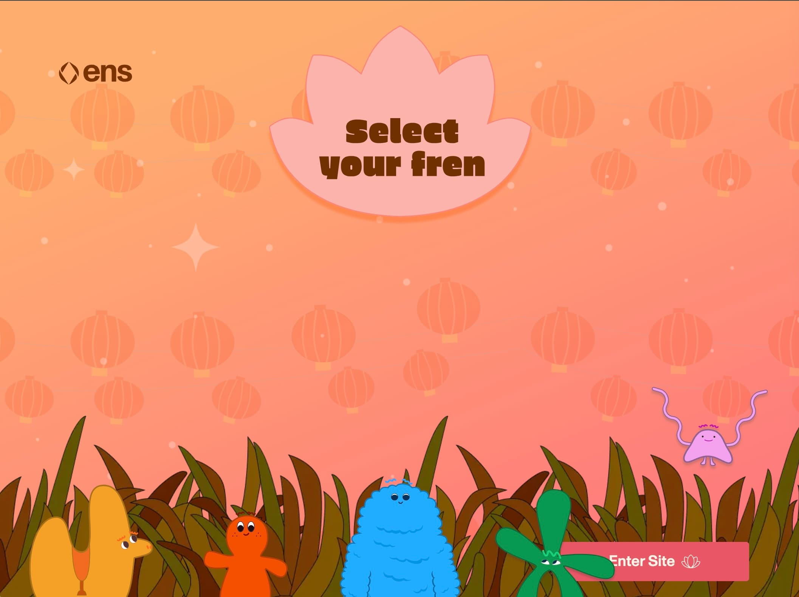
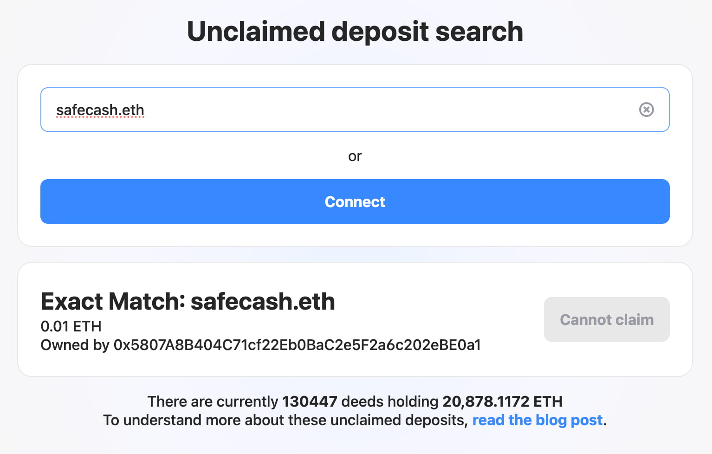
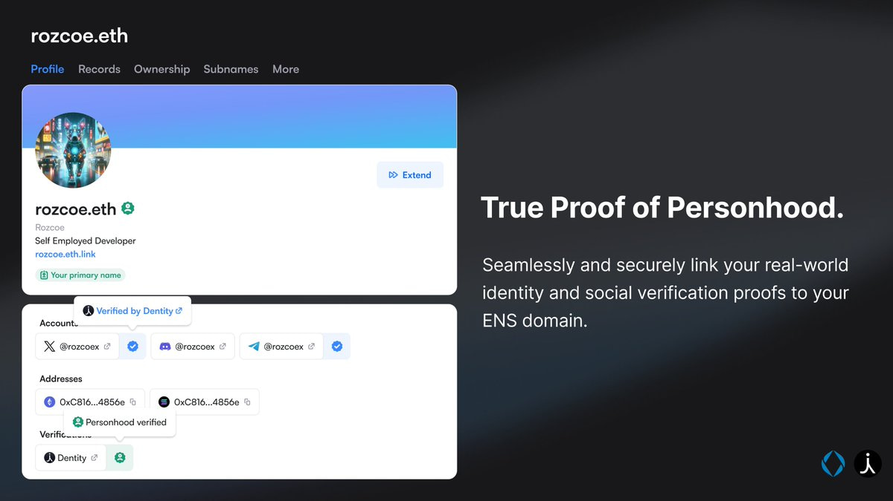
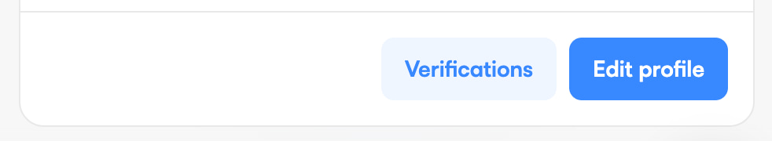
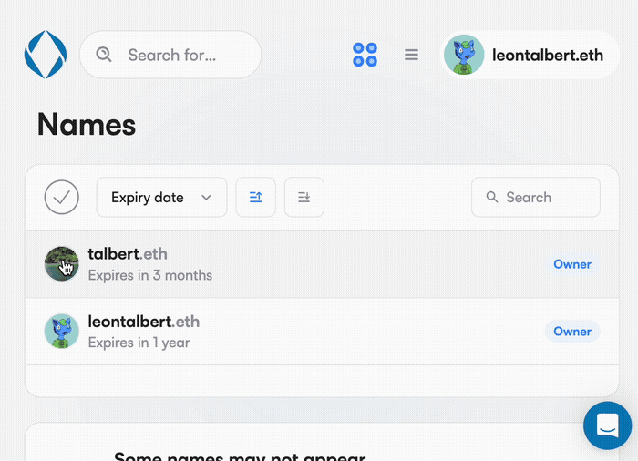
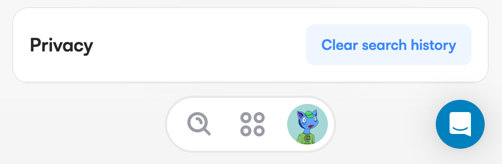

## [Frensday Site](https://frensday.ens.domains)

This month we launched the official site for our upcoming [frENSday](https://frensday.ens.domains) event. It is beautifully illustrated, and you can even choose one of five frens to accompany you as you browse the site!

## New [Reclaim Site](https://reclaim.ens.domains)

If you were part of the original ENS name auction in 2017, you may still have unclaimed ETH just sitting there. Over **20k** in ETH remains unclaimed. It is important we make it easy for people to get their ETH back, so we updated the site to match the look of our other apps and to make it easier for us to maintain. For more info, [read the blog post](https://makoto-inoue.medium.com/how-to-get-back-an-old-deposit-1e2b1767b930).

## ENS record verification via [Dentity](https://www.dentity.com/)

You now have the ability to link your real world identity to your ENS name, as well as verifying that the owner of the ENS name is the owner of the social profiles listed. Simply connect your wallet and navigate to a name that you can edit, you will find the 'Verification' button at the bottom of the page.

We expect to have other verification partners added to the app in the future!

## Missing translation keys are now printed during build

If you're interested in contributing translations we would greatly appreciate it! We now output which translation keys are missing compared to English. Adding translations is as simple as editing the relevant file [here](https://github.com/ensdomains/ens-app-v3/tree/main/public/locales).

## UI/UX

### Names table behaviour selection improvement

- Clicking profile pictures directly will now toggle selection mode
- Clicking the tick will now select all

### Ability to clear search history

This can be found in the settings section when connected. It will clear the search history that appears in the search dropdown. A reminder that this data is local to your device and we do not record it.

### Smaller UI/UX updates

- Added Ukrainian and Russian
- When extending a name, currency choice is now reflected in transaction summary
- After subname creation, redirect user to profile for that name
- Offchain names now show 'View' instead of 'Not owned' in the search dropdown
- Reload profile data more aggressively so that [fluidkey](https://www.fluidkey.com/) addresses refresh as expected.

## Developer updates

- Now have a build step that uses [knip](https://knip.dev/) to detect unused code.

## Bugfixes

- Use short month names when choosing expiry by registration date on mobile
- Prevent user from choosing a date that's in the past during registration
- Add 'launch app' button to ens.domains on mobile screen sizes.
- App was unresponsive on Android Metamask in-app browser
- Fixed CSP issue preventing users from connecting with Coinbase smart contract wallet.
- Fixed issue with premium gas price estimation
