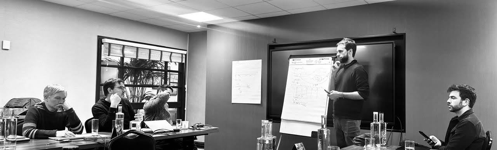
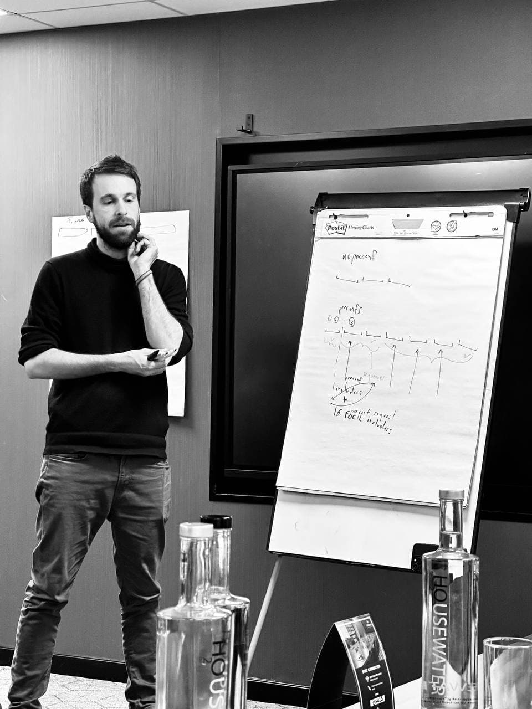

In late January, the ENS team gathered in Cambridge for a 3-day workshop alongside leading researchers and developers from [Linea](https://x.com/LineaBuild), [Status](https://status.app/), [OpenZeppelin](https://x.com/OpenZeppelin),[Titan](https://www.titanbuilder.xyz/), [Spire Labs](https://x.com/Spire_Labs) and the [Ethereum Foundation](https://x.com/ethereumfndn). This workshop was primarily about how to create scalable, decentralized infrastructure for [Namechain](https://x.com/ensdomains/status/1869020166794993702), but also to bring together various Ethereum ecosystem teams to collaboratively solve L2 interoperability with _based_ and _native_ rollups. Don't worry, if you're reading this and saying, "wtf are based rollups," we'll explain. But the point to remember is that now more than ever, teams across the Ethereum ecosystem are advancing shared standards so that L2s can inherit the security and liveness guarantees of the Ethereum mainnet. For users, this would mean a simpler experience when moving assets like ETH between L2 networks because of a shared liquidity model.

## **Why Ethereum L2s are becoming Based and Native**

It's no surprise that most transactions on Ethereum now occur on Layer 2 rollups, also known as L2s. According to [L2BEAT](https://l2beat.com/scaling/activity), recent transaction activity shows that L2 networks have consistently outpaced Ethereum's Layer 1 in transaction volume. And while many rollups teams have plans to decentralize their sequencing (the ways in which transactions get ordered) most rollups still use centralized sequencers to achieve higher transaction throughput and lower costs for users. The problem with centralized sequencers is that they can increase the potential for transaction censorship or transactions to be ordered for personal gain (also known as MEV). In other words, centralized sequencers are in conflict with the decade of hard work ensuring that Ethereum itself is the most decentralized, global, always-on smart contract platform.

### **Based Rollups: Scalable and Ready Today**

Based rollups are a practical solution for today's needs. By processing most transactions off-chain and submitting proofs to Ethereum for security, they provide a scalable and cost-effective alternative to operating solely on Layer 1\. Based rollups bundle multiple transactions together off-chain and periodically send proofs (such as zk-SNARKs or fraud proofs) to Layer 1 validators for verification. This ensures that while transaction data is stored off-chain, its validity and security are anchored to Ethereum. Based rollups employ a straightforward model of how they deal with sequencing compared to traditional rollups. Whereas traditional rollups use their own dedicated sequencer, based rollups leverage Ethereum itself as the sequencer, ensuring that transaction ordering and validation remain decentralized and secure.

### **Native Rollups: The Vision for Tomorrow**

Native rollups offer full integration directly on Ethereum, ensuring enhanced composability and sustainability, and security by inheriting Ethereum Layer 1's execution environment. Unlike based rollups, which interact with Ethereum as a base layer, native rollups derive their security and transaction ordering directly from Layer 1 execution. This approach removes the need for external sequencing systems and allows for trustless interoperability between rollups, making it easier to share assets and state across applications. However, native rollups come with challenges. The high costs and current limitations of Layer 1 make them a longer-term goal, dependent on rough consensus and a future Ethereum hard fork. As discussed in [Justin Drake's overview of native rollup superpowers](https://ethresear.ch/t/native-rollups-superpowers-from-l1-execution/21517), this future could improve latency, security, and scalability across the ecosystem. We expect that native rollups could become viable by mid-2026, dependent on Ethereum network upgrades.

Our plan is to launch Namechain as a based rollup initially and transition to native rollup functionality as the ecosystem evolves and the necessary infrastructure matures.

## **Based Rollups Are Key for Namechain**

Based rollups offer several advantages that align with our mission. Lower costs ensure subname registrations and updates remain affordable, especially when compared to expensive Layer 1 transactions. Their scalability allows thousands of transactions per second, supporting mass adoption of ENS subnames. Even though these transactions happen off-chain, they remain secure through cryptographic proofs on Ethereum.

Additionally, based rollups reduce the cost and complexity of onchain interactions by storing most data off-chain. As Ethereum evolves, based rollups provide a bridge to the future of native rollup solutions.

## **The Future of Based and Native Rollups**

One of the major discussions during the workshop revolved around composability between rollups. With Namechain and Linea working together, assets like ETH would seamlessly maintain their value and liquidity across Layer 2 networks. This means that 1 ETH on Namechain is always equivalent to 1 ETH on Linea, creating a shared liquidity model that benefits users and applications. By leveraging Ethereum Layer 1 as a trusted base, these networks could enable instantaneous asset transfers and composability across rollups. However, this vision depends on L2 chains opting into a collaborative "cluster," which is currently being explored through initiatives like FABRIC and discussions around standardizing interoperability.

Latency was another key focus during the workshop, especially for subname resolutions. Justin Drake's suggestion of off-chain proving emerged as a promising solution to reduce resolution times while keeping gas costs manageable. With this approach, subname resolutions could achieve latency as low as 1 L1 block (\~12 seconds), though \<1 hour remains an acceptable interim goal. As rollup collaborations advance, we expect further improvements in latency and user experience.

## **Workshop Outcomes**

After three days of meetings, we agreed on several shared outcomes:

**Collaborating with FABRIC**: We will join [FABRIC](https://x.com/fabric_ethereum), an initiative focused on standardizing rollup interoperability across different Layer 2s. This collaboration will play a key role in ensuring seamless scaling and integration for Namechain.

**Advancing Interoperability focused EIPs**: We will work closely with the Ethereum Foundation to advocate for new [Ethereum Improvement Proposals](https://eips.ethereum.org/) (EIPs) that enhance L2 interoperability. These proposals will help Namechain and other Layer 2 solutions interact more effectively with Layer 1\.

**Creating a Proof of Concept**: ENS and Linea will collaborate on a proof of concept to demonstrate Namechain's capabilities as a based rollup. This will be a critical step in validating its scalability and cost-efficiency. It's possible this PoC will prove too slow or expensive for the mainnet launch of Namechain, in which case we would launch with a centralized sequencer. However our intention remains to launch as a based rollup.

**Advancing Blob Sharing**: Efforts are already underway with ENS and other teams to optimize shared blob submissions. This will reduce gas costs and improve the overall economic feasibility of Namechain.

## **Next Steps: What's Ahead for Namechain**

The Cambridge workshop marked a critical milestone in ENS's mission to create scalable, decentralized infrastructure. By leveraging the strengths of based rollups today and preparing for native rollups in the future, Namechain is poised to better inherit the security and censorship resistance of L1 Ethereum, while better serving L2s and non-EVM chains as well.

We will actively contribute to FABRIC and the Ethereum Foundation's ongoing EIP initiatives, ensuring that Namechain remains aligned with evolving rollup standards. Building the proof of concept with Linea is a top priority, as it will allow us to test Namechain's capabilities and refine its architecture. As we prepare for launch, we are designing Namechain with the flexibility to evolve into a native rollup as Ethereum's infrastructure matures.

_Follow us on [X](https://x.com/ensdomains) and [Farcaster](https://warpcast.com/ensdomains/) to stay tuned for more updates as we progress through our Namechain milestones._
