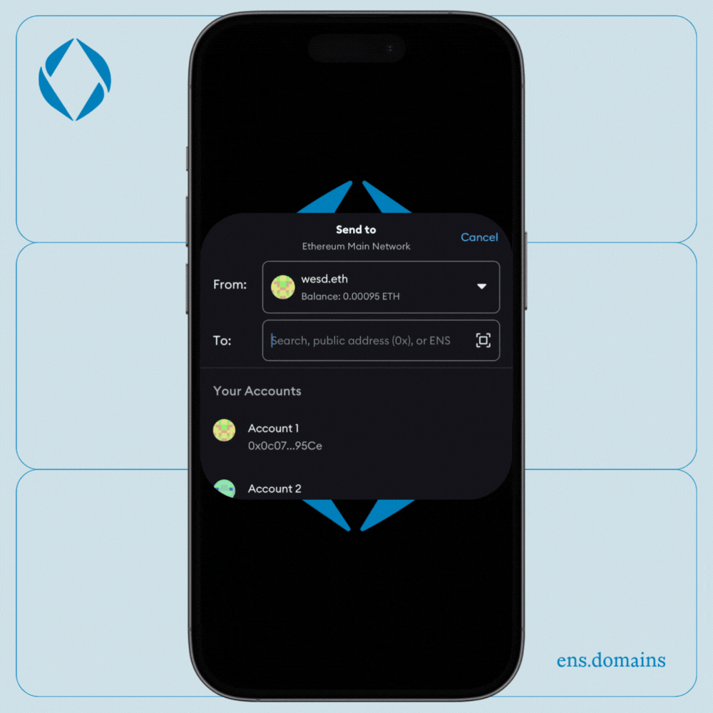
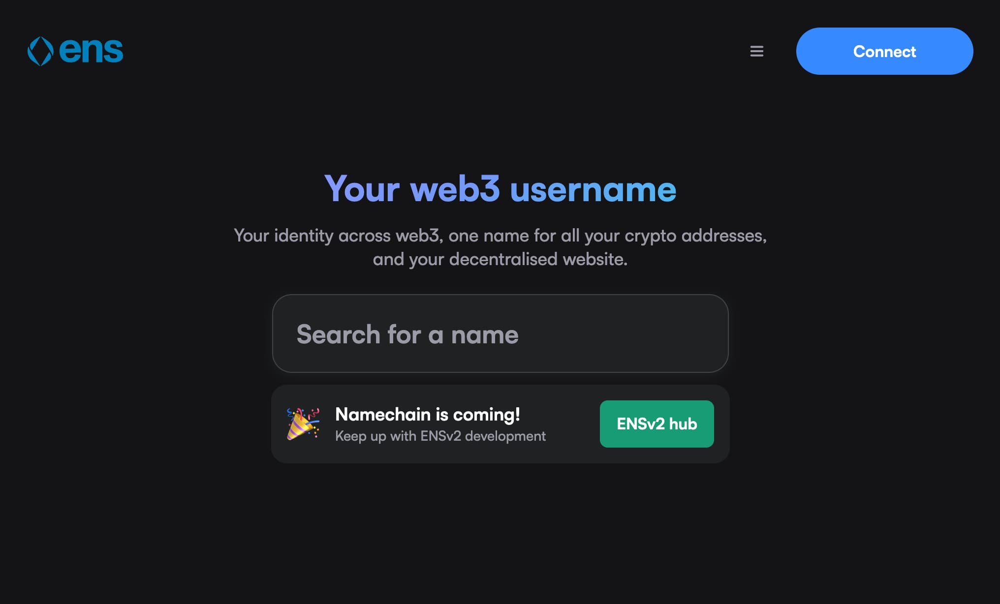

Have you ever tried to explain crypto to your friends or family and found yourself lost in confusing technical jargon? You're not alone. This is exactly why the [Ethereum Name Service](https://ens.domains/) (ENS) exists: to simplify blockchain addresses and make crypto understandable and accessible to everyone.

### So, what exactly is ENS?

Instead of long, complicated Ethereum addresses (like 0x0c077910e1dc0B5BEA1054CCE14143E0971f95Ce), ENS provides easy-to-remember human-readable names, such as yourname.eth. But ENS isn't just about Ethereum addresses – it can store records that point to multiple services, including Bitcoin addresses, email servers, social media profiles, and even avatars. This makes ENS a versatile digital identity tool.

Imagine sending crypto, accessing content, or even connecting on social media using just an ENS name, as easily as you'd send an email or a Venmo payment. That's the magic of ENS \- user-friendly, accessible, and hassle-free.

### **From DNS to ENS**

Originally, web addresses required complex IP numbers like 142.250.64.142 (Google’s IP). Domain Name Servers (DNS) were created to simplify these numeric IPs into human-readable names like google.com. Similarly, ENS simplifies long, complicated blockchain addresses into readable names.

Unlike DNS, ENS doesn’t rely on centralized root servers. Instead, it uses decentralized smart contracts stored transparently on the Ethereum blockchain. This approach makes ENS addresses globally accessible, censorship-resistant, and immune to geographical restrictions.

### **The Power of ENS Subnames**

ENS also enables organizations and projects to create their own branded subnames. For example, Coinbase's Base blockchain launched [Basenames](https://www.base.org/names) using base.eth as the root, and Uniswap introduced [uni.eth subnames](https://blog.uniswap.org/introducing-uni-eth-your-unique-web3-username). These subnames serve distinct purposes: Uniswap's implementation simplifies wallet management by allowing users to name their wallet addresses for free, improving usability. Meanwhile, Base leverages subnames for ecosystem engagement by managing grants, tracking onchain activity, and showcasing users' "onchain scores." By enabling unique, personalized digital identities, ENS subnames enhance community engagement and streamline interactions within ecosystems whether by making wallets more user-friendly or reinforcing trust and reputation.

### **A Quick History of ENS**

ENS launched in May 2017, inspired by the idea that blockchain technology should be easy and intuitive for everyone, not just tech experts. The first ENS names were minted starting with rilxxlir.eth, showcasing the potential of blockchain-based domain naming.

Built on Ethereum, ENS leverages the blockchain’s transparency and decentralization, making it secure and censorship-resistant. With no single entity in control, ENS names are genuinely owned by users.

### **Key Highlights of ENS**

-   **Ease of Use**: Translates complicated blockchain addresses into simple human-readable names.
-   **Versatility**: Supports Ethereum and other cryptocurrencies, emails, social media accounts, and more.
-   **Decentralized**: Operates independently of centralized authorities.
-   **Censorship-resistant**: Information stored securely across a globally distributed blockchain.

### **Getting Started with ENS**

Simply visit the ENS registration site [app.ens.domains](https://app.ens.domains/), search for your desired name, and follow the easy steps to register and secure your digital identity.

By simplifying blockchain technology and creating practical digital identities, ENS invites everyone \- normy or not \- to comfortably explore the world of crypto and web3.

