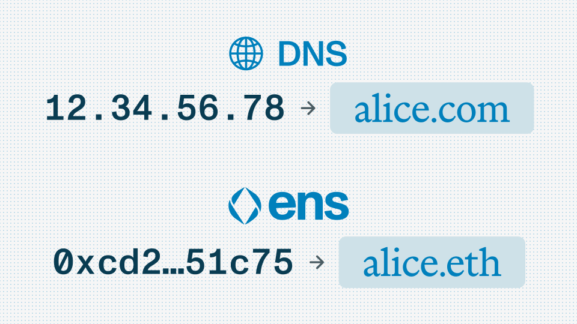

### Why DNS Matters

Back in the early days of the internet, websites didn’t have names like _google.com_ or _wikipedia.org_. Instead, you'd have to type in something like `142.250.64.142` just to visit a site. Not exactly user-friendly.

To fix that, the [**Domain Name System (DNS)**](https://www.cloudflare.com/learning/dns/what-is-dns/) was created. It turned those confusing IP numbers into simple, memorable names. Instead of memorizing numbers, people could just type in a name and get where they wanted to go. DNS became the internet’s phonebook, quietly making everything easier, every day.

It was a foundational shift. Suddenly, the internet wasn’t just for developers. It was usable by everyone.

### How ENS Applies the Same Idea to Web3

The [Ethereum Name Service](https://ens.domains/) (ENS) brings that same power to the world of crypto. Today, sending crypto or connecting your wallet often means dealing with long, confusing strings like `0x4cbe58c50480b3e...`. That’s the IP address problem all over again.

ENS fixes this.

Instead of sending funds to a full Ethereum address, you can send to a name like `yourfriend.eth`. Instead of logging in or verifying identity across different apps with raw addresses, you can just use your ENS name. Like DNS did for the web, ENS helps crypto feel less intimidating and more human.

However, ENS isn’t just for addresses \- it’s your [digital identity](https://ens.domains/blog/post/breaking-down-ens). You can attach email addresses, social profiles, websites, avatars, and more. Your ENS name becomes your onchain calling card, usable across wallets, apps, social platforms like Farcaster, and even websites.

And unlike web2 systems, your ENS name is fully owned by you. It lives on the Ethereum blockchain, controlled by your wallet, not a company. Just one name, one identity, and total ownership.

### What This Means for New Users

ENS takes something intimidating and makes it approachable. You don’t have to understand every detail about crypto to start using a name like `maria.eth`. It’s as simple as registering a domain and using it anywhere your crypto wallet goes.

Just like DNS unlocked the internet for the world, ENS is doing the same for web3 one name at a time.

### Getting Started with ENS

Simply visit the ENS registration site [app.ens.domains](https://app.ens.domains/), search for your desired name, and follow the easy steps to register and secure your digital identity.

By simplifying blockchain technology and creating practical digital identities, ENS invites everyone \- normy or not \- to comfortably explore the world of crypto and web3.
