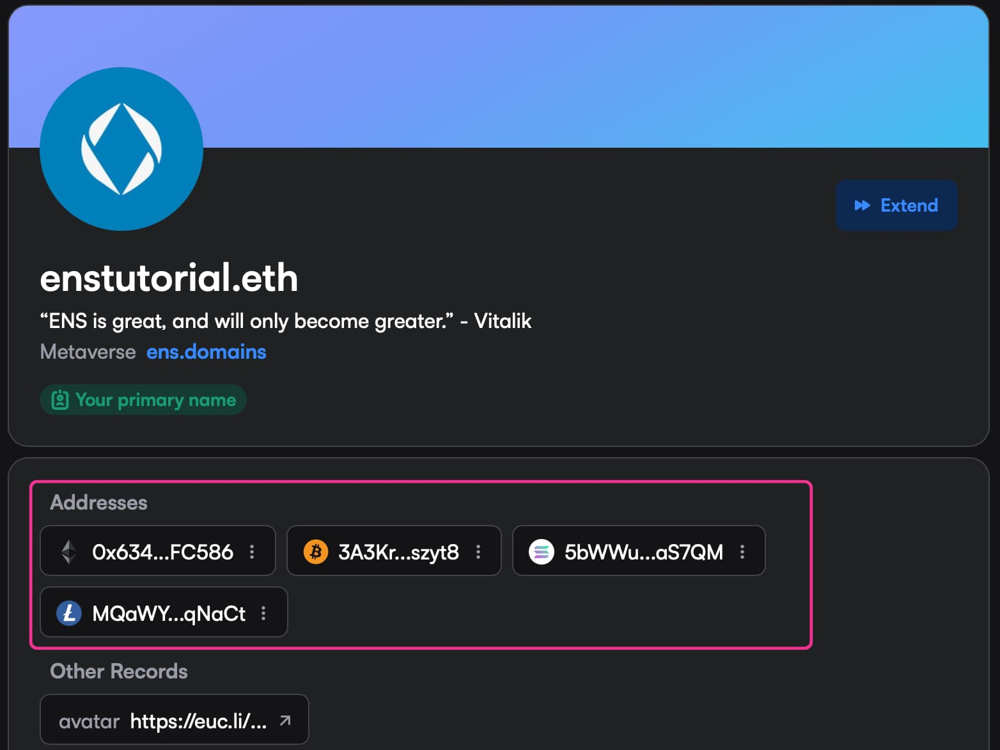

When most people think about Web3 security, they envision hardware wallets, complex protocols, or the fear of falling victim to a scam or exploit.

But some of the best safety tools in crypto are also the most overlooked. Whether you’re managing your .eth from a cold wallet (ie. Ledger, Trezor) or trying to avoid sending funds to a fake address, ENS quietly makes it easier to protect yourself.

Here are two simple ways ENS helps you stay secure every day.

---

### Renew Your ENS Name, Without Touching Your Cold Wallet

If you’ve ever registered an ENS name from your cold wallet, you might think you have to connect it again to extend your name when it’s about to expire.

Good news: you don’t.

One of the benefits of ENS is that _any_ name can be [extended by _any_ wallet](https://x.com/ensdomains/status/1913246521870696846). That means you can use a hot wallet to keep your .eth name active. There is no need to plug in your cold wallet or expose it to a web app.

This might sound small, but it’s a big win for keeping your hardware wallets isolated and secure. You stay protected while keeping your identity live and onchain.

### Address Poisoning Is Real But It’s Also Avoidable

Today alone, someone lost [$467,175](https://x.com/realScamSniffer/status/1915710745423339792) to a common scam called [address poisoning](https://coinmarketcap.com/academy/article/what-is-address-poisoning-attack-and-how-to-stay-safe). It works by inserting a fake address into your transaction history that matches the first few and last few characters of the real one. Copy, paste, send… gone.

It’s an easy mistake. And it’s one that ENS helps you completely avoid.

Instead of copying a long string like 0x4cbe58c50480b3e..., you just send it to yourfriend.eth. Even better, the ENS Manager App lets you link multichain addresses like BTC, SOL, DOGE, and more directly to your .eth name. This helps dapps that support ENS resolve your address correctly across chains, minimizing mistakes and making things easier for everyone.

Want to set yours up? [Here’s a quick guide](https://x.com/WesdEth/status/1890859531699150880) on how to add multichain addresses and build your ENS profile. It’s a safer way to send.

### The Bigger Picture: Billions Lost to Crypto Hacks

In the [first quarter of 2025](https://cointelegraph.com/news/crypto-hack-losses-q1-2025-peckshield) alone, over $2 billion was lost to cryptocurrency hacks, with access control flaws accounting for $1.63 billion of that total. The Bybit exploit alone was responsible for $1.4 billion in losses, making it one of the largest crypto thefts to date.

These staggering numbers highlight the importance of robust security measures in the crypto space. While ENS can't prevent all types of hacks, it offers practical tools to mitigate common risks, such as address poisoning and the need to expose cold wallets for routine tasks.

### Security Doesn’t Have to Be Complicated

Not every Web3 safety tool needs to be technical. Sometimes, just having a name is enough to stay a step ahead.

With ENS, you can manage your onchain identity, extend names without ever connecting your cold wallet, and protect yourself from address-related scams – all while making crypto feel a little more human.

Simply visit the ENS registration site [app.ens.domains](https://app.ens.domains/), search for your desired name, and follow the easy steps to register and secure your digital identity to make Web3 simpler \- _and safer._
