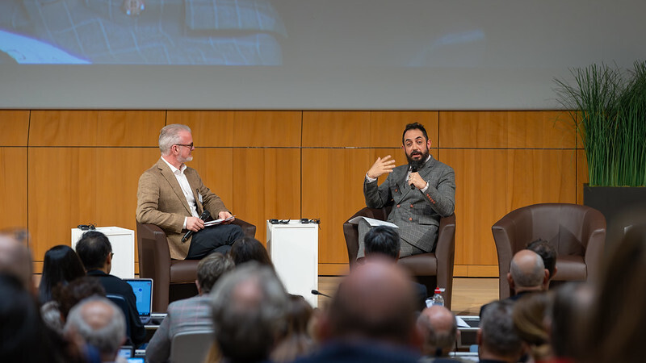
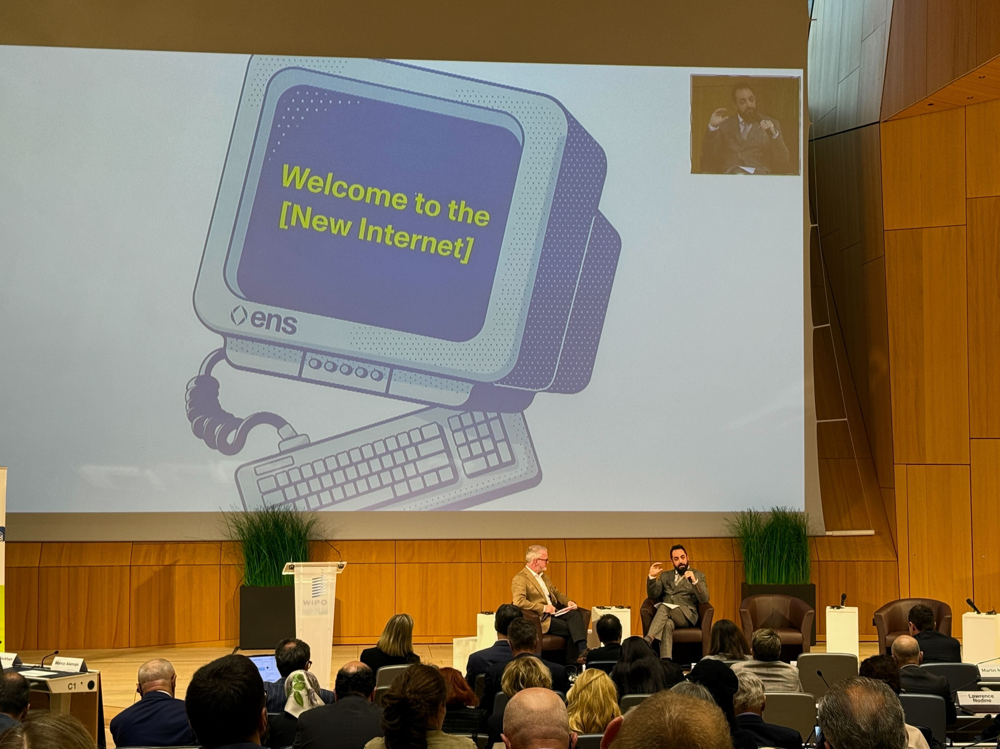

Last week, I had the privilege of representing ENS Labs at a landmark event: the [25th Anniversary](https://www.wipo.int/amc/en/events/workshops/2025/domainname/#:~:text=In%20celebration%20of%20the%2025th%20anniversary%20of%20the,Headquarters%20in%20Geneva%2C%20Switzerland%20on%20April%2023%2C%202025.) of the Uniform Domain-Name Dispute-Resolution Policy [(UDRP](https://www.icann.org/en/contracted-parties/consensus-policies/uniform-domain-name-dispute-resolution-policy/uniform-domain-name-dispute-resolution-policy-01-01-2020-en)) hosted by [WIPO](https://www.wipo.int/amc/en/domains/guide/) (World Intellectual Property Organization) in Geneva, Switzerland. WIPO, operating under the United Nations. WIPO serves as a key platform for discussions around intellectual property, domain name protections, and administers no fewer than 28 international treaties that harmonize and form the backbone of the world’s intellectual property enforcement mechanisms.

At the conference, I had the distinct pleasure of talking about my journey to ENS, the values of ENS, and I also briefed members of the United Nations and WIPO on the evolution of Web3 and ENS’ unique role in this new era of the internet. This resulted in a great discussion of the important challenges we face around name ownership, security, and stability.

## ENS' Vision: A Unified Internet Where DNS Remains the Source of Truth

ENS was built with different priorities than traditional domain name systems – emphasizing user sovereignty, decentralization, and censorship resistance. However, I firmly believe that the [Domain Name System (DNS)](https://ens.domains/blog/post/explaining-ens-using-dns) should remain the global source of truth for navigating the internet.

I recognize that irresponsible behavior by some blockchain domain projects could risk creating a fracture between Web2 and Web3. At ENS Labs, we are committed to preserving a unified internet, one where names can resolve to both traditional URLs and blockchain addresses without sacrificing the stability and security that users rely on. We are the original blockchain naming system and the only project that has not violated ICANN’s policies with respect to the creation of alternative TLDs. Indeed, Article IV of the ENS DAO Constitution specifically sets forth the aspiration to “integrate with the legacy DNS naming system to the greatest extent possible without sacrificing the decentralization of ENS.” The very next sentences of the ENS Constitution prohibit creation of new Top-Level Domains “unless those domains have been granted to ENS by a DNS authority.”

## Addressing Name Collisions and Web3 Challenges

Not surprisingly, given the many Web3 TLDs that other organizations have created outside of the auspices of ICANN, one of the major topics I discussed was [name collisions](https://www.icann.org/resources/pages/name-collision-2013-12-06-en). I emphasized to WIPO and the attendees that ENS carefully considered these risks when designing .eth, and that we fully support efforts by ICANN to prioritize security and stability as Web3 adoption grows and as ICANN delegates new TLDs into the root zone of the DNS. Accordingly, I stressed the need for ICANN and others to carefully listen to the advice of the Security and Stability Advisory Committee within ICANN and its warnings about the dangers of name collisions.

Web3 faces other challenges as well, including serious security threats. As part of my role helping steward the ENS ecosystem, I work with our team to constantly monitor the DNS for attack vectors targeting the Web3 ecosystem – defending a space with over 245,000 registered names. At Devcon in Bangkok, I [discussed](https://www.youtube.com/watch?v=ht_Szqvtx8w) our efforts to track and monitor over 2,000 malicious domains targeting Web3 projects and users, and the opportunity that the UDRP provides to disrupt and takedown that entire network.

What is more, in our experience with malicious activity in the context of ENS itself, the abuse we encounter (e.g.,phishing and credential harvesting) often arises from how ENS names resolve to content in DNS, rather than through the blockchain itself.

When we detect abuse, we act immediately, working with our partners such as Last Mile Labs (i.e., eth.limo) to sinkhole malicious URLs and protect users.

## UDRP and ENS: Supporting Brands in the Web3 Era

The UDRP (Uniform Domain-Name Dispute-Resolution Policy) has long served as a powerful tool to protect brands and domain owners on the internet. I fully support the principles behind UDRP and the goal of protecting rights-holders. However, ENS was built differently: ownership of a .eth name is governed by immutable contracts on the Ethereum blockchain, meaning we cannot simply revoke or reassign a name like a traditional domain registrar can, nor can ENS enact policies that would undermine ownership rights to a name

That said, we have built systems to help brands within the ENS ecosystem. If a company believes their name has been taken, I encourage them to reach out to us directly. Many times, names have simply been reserved (not sold or traded), and through efforts like [ENS Fairy](https://ensfairy.xyz/) (a project that preemptively registers names with the goal of returning them to rightful owners) we can assist brands in reclaiming names or finding appropriate alternatives.

As we prepare to apply for several strings in ICANN’s upcoming new gTLD program, ENS Labs is ready to fully comply with UDRP in all of its ICANN-authorized TLDs. However, I also believe that future rights protection mechanisms in Web3 should reflect the people, processes, and philosophy of Web3 systems; that is, rights protection mechanisms should evolve to be onchain, community-driven, and openly discussed within organizations like the ENS DAO.

## Looking Ahead: Building Bridges Between Web2 and Web3

My participation at WIPO’s UDRP 25th Anniversary event, and the overwhelming engagement from attendees (including an extended Q\&A session), showed that major institutions are eager to understand and support the responsible growth of Web3.

I will continue representing ENS Labs at key forums – including the upcoming [ICANN meeting in Prague](https://meetings.icann.org/en/meetings/icann83/) – to ensure that Web3 solutions are built collaboratively, respecting the stability, security, and trust that make the internet work for everyone.

I am honored and grateful to WIPO and the broader United Nations community for opening the conversation, and I look forward to working together to help Web3 and the traditional internet grow stronger together.

I have also been invited to attend the upcoming [Security Alliance](https://www.securityalliance.org/) (SEAL), an elite, invitation-only group dedicated to security in Web3 and blockchain systems. Founded by security researcher Samczsun, SEAL brings together top builders, researchers, and leaders from across the Web3 space to collaborate on critical security initiatives.

I look forward to participating in SEAL and continuing to contribute to conversations around security, stability, and the future of a safer, more resilient Web3 ecosystem.
