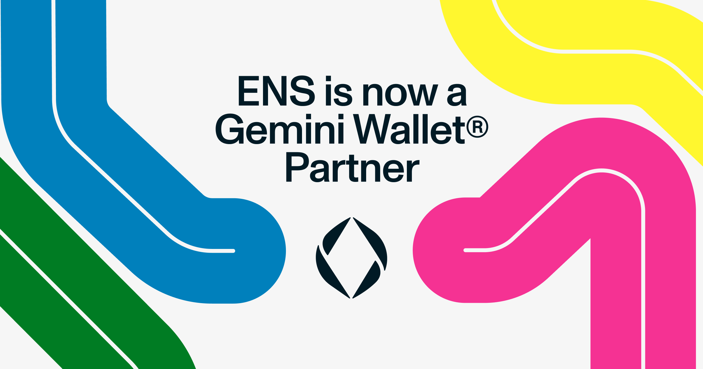
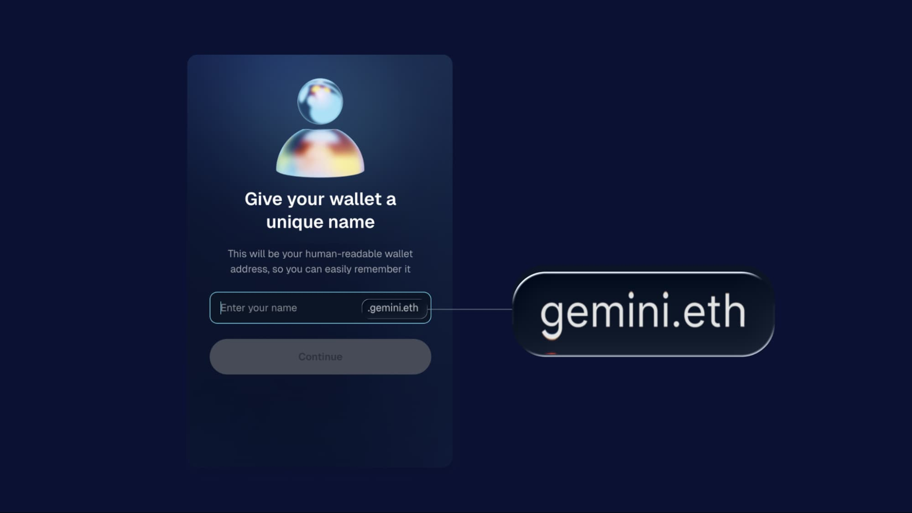

Gemini launched [Gemini Wallet](https://onchain.gemini.com/), a smart wallet with a fully integrated self-custody experience, helping people of all crypto experience levels get onchain, simply using a passkey.

Upon creation of a new wallet, users are prompted to claim a free unique ENS name to more memorably and safely send and receive crypto or use onchain applications. Built on the ENS protocol, Gemini usernames are subnames from gemini.eth. That means your unique name is fully compatible with the broader Ethereum ecosystem and its L2s, and even Bitcoin and Solana.

Open standards and a user-friendly approach are what make this partnership special and we are excited to support Gemini’s launch by providing the decentralized identity layer.

## Built on New Ethereum Smart Wallet Standards

Gemini’s wallet is one of the first implementations of [ERC-7579 modular accounts](https://erc7579.com/), which make it so that smart accounts can be used across different wallet applications. It is fully passkey-native, avoids seed phrases, and deploys smart wallets deterministically across every major EVM-compatible L2. Each wallet is created using a set of audited modules, including an ENS sub-registrar, which assigns each account a gemini.eth subname like user.gemini.eth.

Based on open standards, Gemini has built a wallet that is portable and easily embeddable into other dApps. We believe that financial and identity infrastructure should be interoperable and accessible to everyone. By relying on shared standards instead of proprietary systems, Gemini and ENS are helping move the ecosystem toward a more user-friendly and decentralized future.

<figure>
  
  <figcaption>
    Claiming a unique gemini.eth subname
  </figcaption>
</figure>

## Simplifying Wallet Recovery

As part of Gemini’s wallet launch, ENS names will serve as an additional layer of convenience during account recovery.

If a user forgets or loses their wallet address but remembers their gemini.eth subname, they can enter it into the recovery flow. Gemini wallet will resolve the ENS name and display the associated wallet address, helping the user identify the correct account.

To complete recovery, users must then authenticate via social login or provide a signature from a previously linked EOA.

## Conclusion

Gemini’s adoption of ENS for wallet naming and recovery shows how trusted institutions can embrace open infrastructure without compromising on user experience or security. We are proud to support an integration like Gemini’s and look forward to a future where web3 infrastructure is open, secure, and built for everyone and everything.
