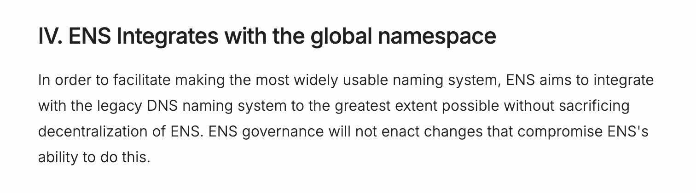

After a unanimous [vote from the ENS DAO on Aug 4](https://tally.ensdao.org/dao/proposal/51903780073989583830128732176342966426696684927524697157008519276797273489808), the *locker* node at the ENS root has been delegated to the ICANN-accredited registry operator Orange Domains LLC.

This transfer turns domains like *name.locker* into fully functional ENS names that are operated by Orange Domains and distributed through already familiar platforms like GoDaddy and Namecheap. Users who register a *.locker* domain through these ICANN-accredited registrars automatically receive ENS functionality without any additional setup necessary.

ENS has been supporting Orange Domains in a collaborative effort to develop the necessary smart contracts and gateway implementations. An increasing number of registries see value in collaborating with ENS and *.locker* is taking the lead in good company with other DNS integrations such as *.box* and *.art*. We’re excited to partner with Orange Domains and Trust Machines to welcome .locker to ENS, a partnership that reflects our ethos of maximizing DNS compatibility and improving interoperability across the global namespace. 

## DNS meets ENS

Expanding the traditional DNS TLD *.locker* to the ENS protocol distributes ENS functionalities way beyond crypto users and aligns with ENS’s long-standing efforts to integrate with existing DNS infrastructure.

<figure>
  
  <figcaption>
    Article 4, ENS DAO constitution
  </figcaption>
</figure>

As an open-source naming protocol, ENS operates as the global identity layer that uses human-readable names to resolve wallet addresses, so users can carry the same identity on different wallets, exchanges, and apps. Because ENS is chain-agnostic at the record level, *.locker* domains can now reference addresses on multiple networks while remaining the same name. The consistency of an onchain identity simplifies daily actions like app login, payments, and even messaging, and moves the global namespace toward a unified identity system.

## Domain users

From a user perspective, a *.locker* domain now works as a human-readable name across Web2 and Web3. Domain owners can set standard ENS records for their name, including addresses for multiple chains and text records for profile and social info. Users can register *.locker* domains through established registrars like GoDaddy and the registration process stays the same.

## Technical Details

Within the ENS protocol, every name is represented by a deterministic hash of its labels (namehash), with name (“ “) being the root. The label *“locker”* is hashed (labelhash) and then combined with the root to create *namehash("locker")*. To learn more about the technical details of how this works, read the ENS documentation on [Name Processing](https://docs.ens.domains/resolution/names).

**Try it yourself**

To register a .*locker* domain, simply visit your preferred registrar and follow the usual steps. After claiming your domain, you can start using it across wallets and apps that already support ENS, like The Base App and Etherscan. As a **developer**, *.locker* name resolution can be added by using standard ENS libraries. As a **registrar** that offers *.locker* domains, no changes are needed. 

**Registries** and **TLD operators** interested in offering similar functionality are invited to [contact the ENS Labs team](https://enslabs.notion.site/20d7a8b1f0ed8016a0b7dfb825aaa7b3).
