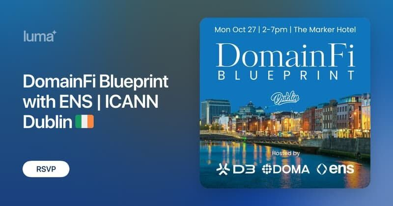

## TL;DR

* Tokenized DNS domains on Doma Protocol will seamlessly function as ENS names
* No DNSSEC setup required
* Available today on a public Ethereum testnet with mainnet and Namechain rollout on the roadmap

## ENS \+ DNS

ENS has always aimed to work with the internet as it exists today, not to replace it. The ENS DAO Constitution makes that explicit: "Integrate with the global namespace to the greatest extent possible without compromising decentralization." In practice, that means continuing to support DNSSEC import and, when domain registries choose to tokenize, meeting them there too. Throughout 2025 we have engaged across the ICANN community to advance open, interoperable naming. Our integration with Doma protocol is another step toward a single, standards-driven web, where identities travel seamlessly between systems.

As a registry-friendly approach to bringing DNS domains onchain, Doma lets domain owners tokenize their domains so that control is represented by a transferable token. D3 Global Inc. represents the operating team behind Doma and works with registries and partners across the ICANN community to enable domain tokenization where it makes sense and to ensure it fits into existing policies and workflows.

## Integration

Through this integration, traditional domains that have been tokenized on Doma can behave like first-class ENS names. Owners can set wallet addresses and other standard ENS records, and the name will resolve wherever ENS is supported. This sits alongside ENS’s DNSSEC import, which remains the native, canonical way to prove control of a DNS domain. With Doma's tokenization we are adding a second path for registries and communities that prefer onchain verification.

Domain registries or partners can use Doma to tokenize eligible DNS domains. The domain owner holds the token and connects to ENS to set addresses, text records, and other metadata. From that point on, the tokenized domain resolves like an ENS name. For DNS domains that are not tokenized, the DNSSEC import flow remains fully available.

Domain owners can use a name they already own and understand, while adding the benefits of ENS for sending and receiving tokens, login processes, profile set-up, and more. Because name records are chain-agnostic at the ENS level, a single name can reference addresses on multiple networks, like Ethereum, Layer 2 chains, Bitcoin, and Solana, while remaining consistent for users.

## Roadmap

The integration is available on Ethereum testnet today, with a mainnet rollout planned after further feedback and testing rounds, and a Namechain implementation on the roadmap once the chain is live.

Owners of DNS domains will be able to tokenize their domain on Doma with ENS features right away. If you rely on DNSSEC today, your existing path will continue to remain fully supported without any changes. Registries and registrars can reach out to D3 for a domain tokenization service that aligns perfectly with their own policies and workflows.

The next stop for ENS is the ICANN84 Annual General Meeting in Dublin, the final ICANN gathering before the next gTLD round in 2026\. D3 and ENS will host a joint session with a live demo, implementation guidance, and open office hours for registries, registrars, and partners.

If you are exploring how DNS and ENS work together in production, this is the room to be in. 

[RSVP](https://luma.com/doma-ens-icann-dublin) to meet the teams, see the integration up close, and get hands-on help\!

