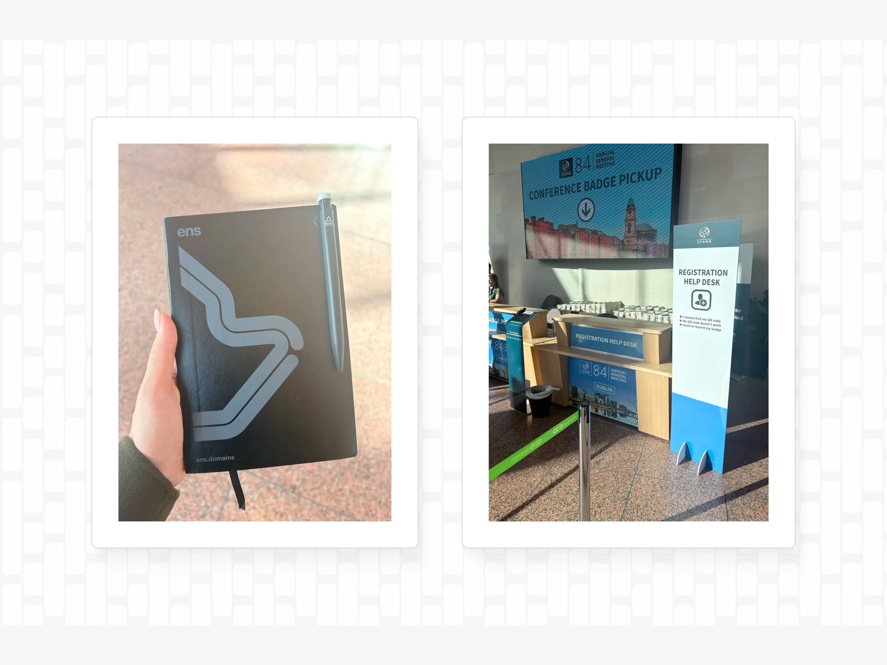
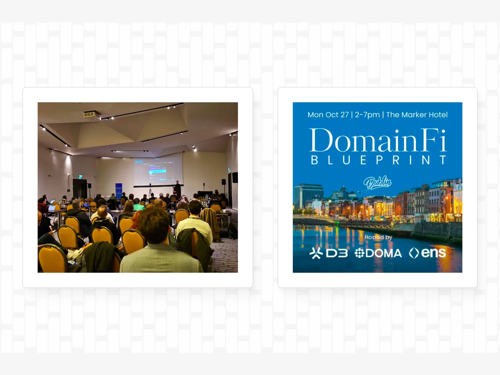

export const PreContent = () => (
  

    Participants at ICANN discuss the upcoming expansion program of generic Top-Level-Domains (gTLDs) like it's a rare comet sighting. Miss it next year, and you might be waiting another decade. After the last application round in 2012, ICANN delegated 1,200 new gTLDS, which included a mix of branded gTLDs like <code>.google</code>, and new hits like <code>.xyz</code>. Given how infrequently ICANN expands the digital real estate for domains, how should ENS be thinking about protecting its own brand and namespace? And conversely, how is the DNS industry further integrating with blockchain-based tokenization and naming? In this post, I'll share a few takeaways from ICANN 84 in Dublin as well as how we are further integrating ENS into the global DNS namespace. 
  

)

### How does the ICANN community see ENS?

One thing to know about ICANN is that like the United Nations, decisions are made through multi-stakeholder governance processes. Government representatives, civil society, lawyers, and industry players discuss topics extensively before making formal guidance. While the new gTLD round opens in April 2026, experience from the last round of DNS expansion in 2012 suggests that we will not see new TLDs go live on the internet for at least a couple more years. (Some TLDs are *still* being delegated into the root zone of the Internet from the 2012 round). Unlike the blockchain space, ICANN's stability and security rely on incremental progress.

When ENS first debuted, `.eth` represented an anomaly of sorts. The three-letter code `.eth` is an "ISO 3166-1 alpha-3 country code" reserved by ICANN as a potential future country code Top-Level Domain (ccTLD) for Ethiopia. (Ethiopia currently uses the two-letter code .et). Importantly, `.eth` doesn't collide with any other ccTLDs or gTLDs in use, in part because no country uses their three-letter code. This also means that `.eth` remains in an administrative "[no-mans-land](https://x.com/nicksdjohnson/status/1726629109160403395)" requiring policy changes at ICANN to get `.eth` added to the DNS root. Now, eight years later if you exclude ccTLDs, `.eth` is a [top 10 gTLD](https://research.domaintools.com/statistics/tld-counts/) with 1.6 million active registrations. By most estimations, ENS represents an exciting new namespace.

Importantly, ENS has always respected the primacy of the DNS. We're the only blockchain address naming protocol that has played by ICANN's rules from the outset, enshrined in the [ENS DAO constitution](https://docs.ens.domains/dao/constitution/): "In order to facilitate making the most widely usable naming system, ENS aims to integrate with the legacy DNS naming system to the greatest extent possible without sacrificing decentralization of ENS." Furthermore, "ENS governance must not create new top-level domains unless those domains have been granted to ENS by a DNS authority."

We've also increased efforts over the last few years to influence technical and legal ICANN topics. In April, Alex Urbelis, General Counsel of ENS Labs and longtime ICANN expert, represented ENS Labs the [25th Anniversary](https://www.wipo.int/amc/en/events/workshops/2025/domainname/#:~:text=In%20celebration%20of%20the%2025th%20anniversary%20of%20the,Headquarters%20in%20Geneva%2C%20Switzerland%20on%20April%2023%2C%202025.) of the Uniform Domain-Name Dispute-Resolution Policy [(UDRP](https://www.icann.org/en/contracted-parties/consensus-policies/uniform-domain-name-dispute-resolution-policy/uniform-domain-name-dispute-resolution-policy-01-01-2020-en)) hosted by [WIPO](https://www.wipo.int/amc/en/domains/guide/) (World Intellectual Property Organization) in Geneva, Switzerland. WIPO, operating under the United Nations, serves as a key platform for discussions around intellectual property and domain name protections. We've also submitted commentary to ICANN on critical issues, such as name collision, DNS abuse, and the responsible integration of the worlds of web3 and web2. This past October, Urbelis also presented at ICANN's Registry Operator's Workshop on DNS / ENS integration and at DNS-OARC in Stockholm.

Urbelis' DNS-OARC presentation entitled, "Web2 Woes / Web3 Warfare," highlighted the persistent threats posed by DNS abuse targeting ENS and the wider web3 ecosystem. This talk proposed evolving abuse-reporting mechanisms within the ICANN and registry operator communities, underscoring ENS Labs' commitment to advancing cross-community technical and security standards, consistent with ICANN's vision of "One World, One Internet."

*The ENS-branded notebooks at ICANN 84 were a big hit among participants.* 

### ENS is integrating more deeply into the DNS stack

The Ethereum Name Service has been more than just a naming system for Ethereum addresses. In 2018, with the DAO approval of [ENSIP-6](https://docs.ens.domains/ensip/6), users could import DNS names into ENS. The method involved enabling DNSSEC on your domain and setting up a TXT record. This record is then verified offchain using smart contracts on Ethereum so that DNS names such as `.com` or `.org` can leverage the benefits of the ENS resolution process.

At ICANN 84, we [unveiled a new partnership with D3](https://ens.domains/blog/post/d3-doma) to add a second path for registries and communities to more seamlessly add ENS features to their domains. The Doma protocol lets domain owners tokenize their domains so that control is represented by a transferable token. D3 is betting that the world of domains could benefit from the liquidity, distribution, and monetization of the Web3 ecosystem, and is working with registries and partners across the ICANN community.

*ENS \+ DNS tokenization presentation at DomainFi Blueprint Dublin.*

An increasing number of registries and TLD operators also see value in collaborating with ENS to bring their TLDs to Ethereum. DNS integrations like .box and .art were some of the first, with [Orange Domains' .locker as the latest example](https://ens.domains/blog/post/locker-domains). Transferring ownership at the ENS root turns domains like name.locker into fully functional ENS names operated by the parent registry and distributed through already familiar platforms like GoDaddy and Namecheap. Registries and TLD operators interested in offering ENS functionality to their domains are invited to [contact the ENS Labs team](https://enslabs.notion.site/20d7a8b1f0ed8016a0b7dfb825aaa7b3).

## What are the potential opportunities with ICANN's gTLD round

We see an opportunity for ENS to participate in the new gTLD program and run our own registry as a ".brand", meaning that ENS would control the registrations in the .ens TLD which could open up doors for enhanced security, trust, and flexibility. The goal of applying for an ENS gTLD as a .brand is not driven by revenue potential, but by the desire to protect the ENS brand and give ENS a more formal role within the ICANN ecosystem. As a .brand, the TLD would be closed to public registrations but could still support names like wallet.ens, allowing us to experiment with new functionality. Starting as a .brand also leaves the door open to transition into an open TLD in the future. With the earliest possible delegation in 2028, there is plenty of time for the ENS community to explore and design the best approach should it later see value in opening the TLD and thus allowing anyone to register names.

Based on previous experience, the earliest that people are saying that the process finishes is 2028\. It's a multi-year process involving contention sets, and everyone believes it's going to drag on - multi-stakeholder governance is not known for moving fast. By some estimates, 2012's new gTLD round included 1,900 applications, and only 1200 gTLDs were delegated by ICANN by 2014\. By December 2015, only 138 new-gTLD strings had registrations over 10K; 283 TLDs had fewer than 10K registrations. Some [industry commentators argued](https://circleid.com/posts/20160114_real_facts_stats_about_icann_gtlds_big_fail_so_far?utm_source=chatgpt.com) that it's "increasingly becoming evident that these new open gTLD registries overestimated the demand in their 2011/2012 ICANN application business models." 

It would be a category mistake to see new gTLD registries as engines for outsized profit. The record shows most have gathered more cobwebs than registrations, with the few grand experiments of the 2012 gTLD expansion serving as cautionary tales rather than case studies in digital wealth. But that is precisely why the web3 community should pay attention: not for the thinning gold rush, but for the structural benefits only a dedicated namespace can provide: security, technical resilience, and a shield against brand dilution and DNS abuse. 

We will continue working with registries, domain tokenization protocols, and other TLD operators that want to add more functionality to domains to enable their customers to participate in the onchain economy. The future of the Internet's naming layer is being written now, and it will be ENS-enabled. 