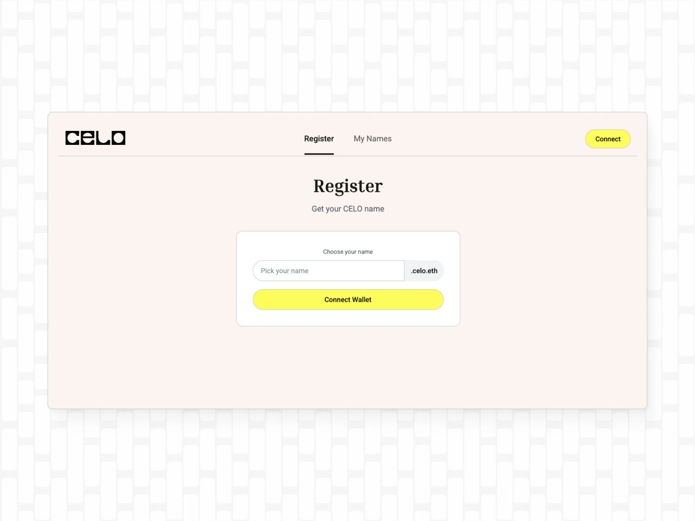
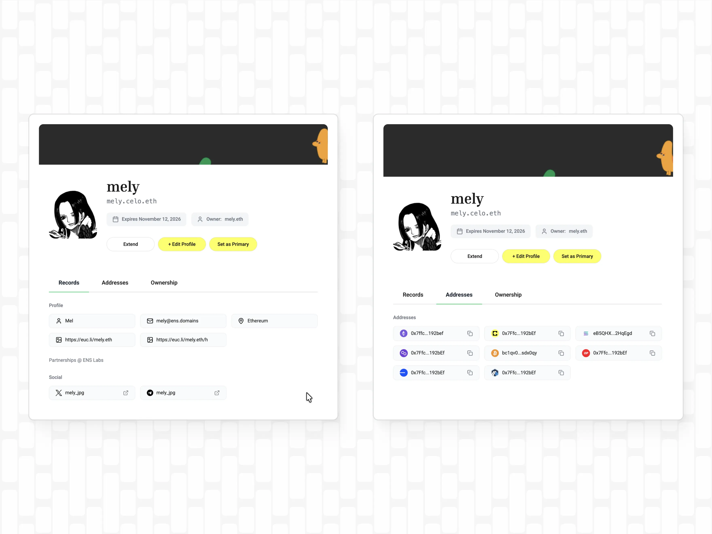
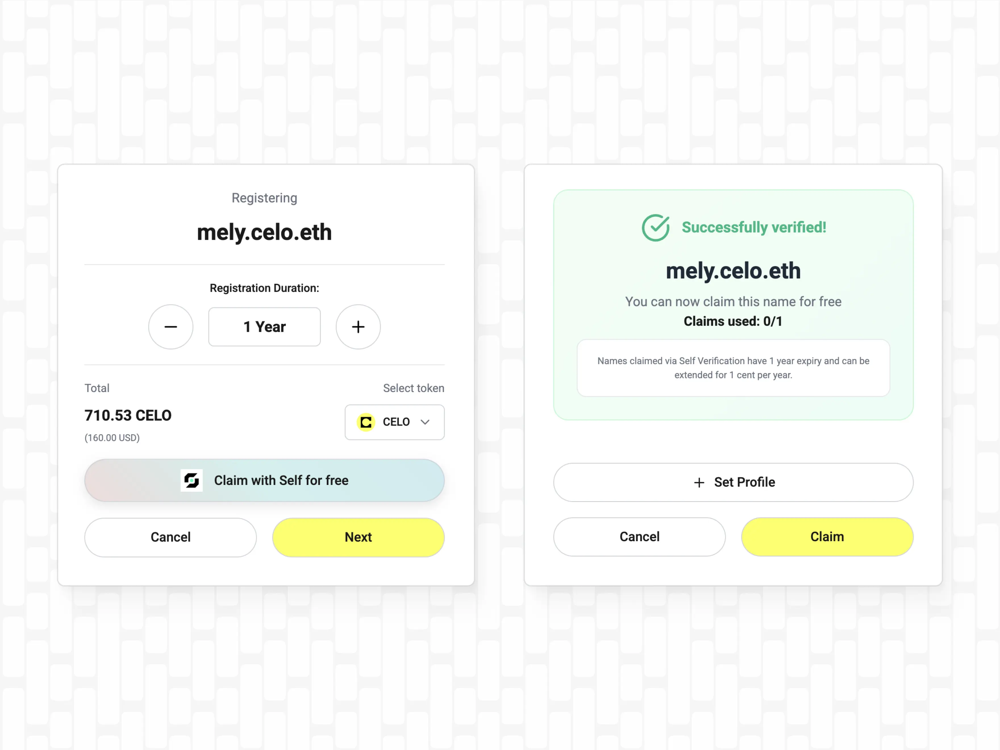

export const PreContent = () => (
  

    Celonames are a new identity layer for people to send, receive, and build on Celo. By integrating Self's privacy-preserving, users can prove they are real people, not bots, and mint a verified name that is uniquely theirs. Powered by ENS and supported by Namespace's robust subname infrastructure, they ensure compatibility across the wider Ethereum ecosystem.
  

)

Sending crypto should feel familiar and stress free. Instead of copying and pasting a long string of characters, users should be able to send to a name they can remember. In a Layer 2 environment like Celo, reduced gas fees don't necessarily remove the error rates that are associated with raw crypto addresses. Users tend to face friction during token transfers and when collaborating with each other.

As a decentralized registry that connects simple names like nick.eth to crypto addresses, content-hashes, and metadata, ENS has been revolutionizing how humans interact with crypto for almost a decade. Its open-source architecture and global adoption on Ethereum L1 make ENS a natural starting point for an ecosystem like Celo to create their own identity system..

Celo has offered simplified, accessible, and low-cost transactions since their mainnet launch in 2020, which includes enabling users to send crypto as easily as a text by linking wallet addresses to phone numbers. Celonames marks an exciting milestone in the community's years-long effort to abstract away the complexity of wallet addresses to onboard the next billion crypto users.

### Celonames

Starting today, Celo users can claim their Celonames, also known as celo.eth subnames. These names are built on the same open standard that powers .eth domains, which means a Celoname isn't just an identity within the Celo, but can also resolve in other wallets and apps that work with ENS.

Celonames are powered by ENS and supported by Namespace's robust subname infrastructure, ensuring reliability and compatibility across the wider Ethereum ecosystem. Simply choose a name on [names.celo.org](http://names.celo.org/) and start using it in any ENS aware wallet or app. Because Celo supports fee abstraction, gas fees can be paid in CELO, cUSD, USDC, or USDT.

Celonames follow a tiered pricing model based on character length of a name:

- 10+ char = $1 / year
- 6-9 char = $5 / year
- 5 char = $50 / year
- 4 char = $160 / year
- 3 char = $400 / year

For users that are verified with Self, a name registration will effectively be near‑free at $0.01/year.

With a Celoname, users can receive tokens on multiple networks by adding a preferred wallet address on Celo and additional multichain addresses. Adding further name records such as an avatar, social media links, or a profile bio turns a simple wallet address into a fully-fledged onchain profile. Celonames follow the same concept that builds the foundation of ENS: Map a wallet address to a human-readable name and combine it with profile records to create a fully functional onchain identity.

### Self, a Privacy-preserving Method to Prove Your Identity

To help real communities grow within the ecosystem and protect users against bots, an integration with [Self](https://self.xyz/) provides an optional verification path for name owners. Users with a Self verification are able to register their Celoname at near-zero-cost (0.01$/year). Self verifications use zk-tech where the user's data is encrypted on their own device. This means that neither Celo nor ENS have access to sensitive user data. All Celonames work the same with or without a verification.

### What's next?

ENS now powers more than 30 million subnames across multiple ecosystems, solidifying its role as the universal identity layer. At the same time, Celo recently led all Ethereum L2s in daily active addresses. Bringing these two worlds together combines user-friendly UI through ENS names with high activity and distribution where it already occurs. Celo and ENS share the same vision of making interacting with crypto as easy as possible and eliminating the complexities of crypto transactions. The roadmap for Celonames includes [L2 primary names](https://ens.domains/blog/post/l2-primary-names) on Celo.

### Relevant links

- Get your name here: [names.celo.org](http://names.celo.org/)
- Celonames [docs](https://celonames.mintlify.app/)
- Namespace [website](https://namespace.ninja/)
- ENS docs: [Subnames](https://docs.ens.domains/web/subdomains/)