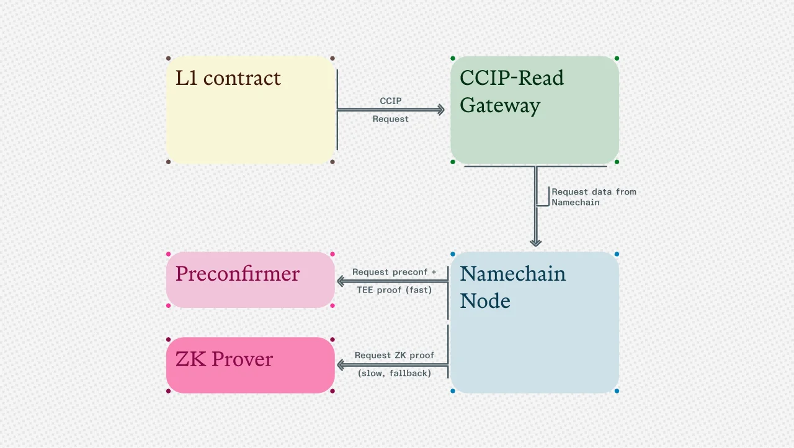

export const PreContent = () => (
  <>
    

      <a href="/ensv2">Namechain</a>, the ZK rollup built for ENS, will be deployed using <a href="https://www.surge.wtf/">Surge</a>, a based rollup framework developed by Nethermind and built on the Taiko stack. Over the past nine months, the ENS Labs protocol team has been hard at work writing new ENSv2 contracts and readying the launch of the chain. During this time, based rollup technology and Ethereum's scaling roadmap has evolved and advanced at a pace we did not anticipate. As we approached the final stages of ENSv2 development, we faced a difficult decision: should we pause and reevaluate our design decision to deploy on the Linea stack, a decision made almost a year ago that was based on the technical realities of the time?
    

  </>
)

We have [always](https://ens.domains/blog/post/namechain-workshop) believed that based sequencing and native rollups best support the core values of decentralization necessary for Namechain: fast finality, Ethereum-native settlement, and censorship resistance. We also accepted that the ultimate form factor may not happen on day 1 launch. However, over the course of the past year, massive strides have been made in accelerating the Ethereum roadmap, from the Ethereum Foundation's [renewed focus](https://x.com/tkstanczak/status/1914092488396091444) on scaling, to new breakthroughs in zkVM proving, as well as the [maturing](https://taiko.mirror.xyz/26-oMGSt5gp0jMgUBR802_EkhVmV1QFDVWYC8In1oPU) of the based rollup tech stack. When Nethermind [introduced Surge](https://www.youtube.com/watch?v=INephGDHHaE) at EthCC Cannes, the goal for Namechain to use Ethereum for L1-sequencing ('[based](https://ethresear.ch/t/based-rollups-superpowers-from-l1-sequencing/15016)') seemed to be in reach again. We now believe Surge's design would allow us to launch Namechain on a faster path to our vision of fully decentralized infrastructure.

### Why Surge Aligns with ENS's Vision

[Nethermind](https://www.nethermind.io/) is an OG Ethereum research and development team that builds and maintains core open-source infrastructure that keeps the Ethereum network running and pushes it toward greater decentralization. Their flagship product, the Nethermind client, is the second most widely used execution client for Ethereum staking. Anyone who has used Ethereum in the past few years has likely relied on infrastructure maintained by Nethermind. Needless to say, Nethermind has demonstrated over the years its commitment to keeping Ethereum secure and decentralized.

As we have [written](https://ens.domains/blog/post/namechain-workshop) about before, we believe that a based sequencer model is the right design for Namechain, as it is the best design for a rollup to inherit both the liveness and decentralization of the Ethereum L1. Our original plan was to deploy on the Linea stack—which we felt was the best way to quickly launch a ZK rollup—with the longer-term goal of migrating to a based architecture when the technology was ready. We met the Nethermind team as part of the research and discovery process of planning for turning Namechain into a based rollup, post launch. As we got deeper into technical discussions, we realized that it was in fact possible to deploy Namechain as a based rollup directly via Nethermind's [Surge](https://www.surge.wtf/) rollup framework.

What makes Surge especially compelling for ENS is not just Nethermind's credibility, but the alignment of values and timing. Like ENS, Nethermind has spent years building core Ethereum infrastructure as a public good, without compromise or capture. Surge extends that same ethos into the rollup space: Ethereum-native, open-source, and credibly neutral. Additionally, Surge is differentiated from other rollups in the space in that it is an open source rollup template, with no plans to deploy its own public chain. This means that Surge's future technical updates and alignment can be shaped by those that deploy it and not only by the needs of its own public chain, allowing it to remain a truly neutral rollup framework.

All of this means that Namechain can easily achieve a sequencing model that reflects Ethereum's liveness and decentralization, rather than delaying that vision to some future milestone. For ENS, this is both the right technical path and the only path consistent with our mission of building identity infrastructure that is as durable and neutral as Ethereum itself.

### Technical Overview

#### Improving Upon the ENS Stack with Nethermind

One of the most compelling aspects of partnering with Nethermind emerged during our technical discussions about Namechain's architecture. As longtime Ethereum core developers, the Nethermind team demonstrated deep familiarity with the existing infrastructure of ENS, from its resolution patterns to [CCIP-Read](https://docs.ens.domains/resolvers/ccip-read) mechanics. This expertise immediately surfaced opportunities to solve longstanding challenges in the ENS stack that we hadn't previously considered achievable for a day 1 launch.

The most significant breakthrough centers on CCIP-Read performance. [CCIP-Read](https://docs.ens.domains/resolvers/ccip-read/) revolutionized cross-chain data fetching by establishing a standard for Ethereum smart contracts to retrieve offchain data, enabling ENS features like L2 name resolution and DNS integration. However, it suffers from a critical limitation: waiting for "safe" state on other L2s introduces significant latency. For ENS, where near-instant updates underpin user experience, even the fastest rollup technologies today aren't enough, creating delays of an hour or more. Furthermore, this forces us into a cost/latency tradeoff: posting data more frequently is costly, but drives down latency.

Working with Nethermind, we've designed a solution that leverages the unique properties of based rollups combined with preconfirmations and trusted execution environments (TEEs). This approach delivers state updates in seconds rather than hours.

*Diagram showing our breakthrough on CCIP-Read performance.*

#### How It Works

1. **Request Flow**: When an L1 contract needs data from Namechain, it sends a CCIP-Read request to a gateway.
2. **Based Preconfirmations**: Instead of waiting for settled L2 state roots, the gateway requests a preconfirmation. These are provided by L1 validators who have opted into providing preconfirmations when they're selected to propose blocks. Initially, these preconfirmers will be whitelisted operators as currently implemented in Taiko, with a clear path to permissionless participation once they launch their decentralized preconfirmation protocol.
3. **Pre-settled Proofs:** The preconfirmer also generates a TEE proof for the preconfirmed block. This pre-settled proof can be accepted and verified directly by CCIP-Read callbacks in contracts on L1, rather than waiting for settled proofs to be available in the L1 state.

#### Why It Works

- **Security Design Space**: The system allows any L1 contract to balance latency against security, offering options from "fast but less secure" to "slow but highly secure":
- **Fast Path**: Preconfirmation signature + pre-settled TEE proof enables fast CCIP reads.
- **Fallback Path**: L1 DA + settled ZK proof acts as fallback if there were a known TEE compromise.
- **Slashable Guarantees**: Preconfirmers stake assets and face slashing if they provide false data, adding an economic security layer to the cryptographic proofs.

#### The Result

Traditional CCIP reads that depend on settled L2 state roots could experience delays up to several hours. This new solution reduces this latency down to seconds by letting CCIP callbacks accept pre-settled proofs directly, while maintaining a fallback to fully settled proofs whenever maximum security is required.

### Path Ahead for Namechain

By embracing a based rollup architecture on day 1, ENS commits to a future where decentralization and composability are not just aspirational, but foundational to Namechain. In the months ahead, we will be working full speed ahead towards a staged launch: beginning with an internal alpha release by early next year before moving into public testnet in Q2. Given the ambitious scope of a net-new chain design, redesigning and relaunching two separate apps, and the improvement we plan to make on the existing ENS stack, it is crucial to get it right each step along the way. In parallel, we will also continue to work on ENSv2 Outreach with workshops and community sessions for wallets, libraries, and apps to implement the [universal resolver](https://docs.ens.domains/resolvers/universal/) to be ready for ENSv2.

#### Choosing Based from Day 1

The decision to move Namechain to Surge came after we were presented with the rare opportunity to skip several steps in the "progressive decentralization" pathway. Most L2s take this path, deferring the hard problems of decentralized sequencing to an indefinite future. But with based rollups now production-ready, we faced a critical question: why not take advantage of this unique opportunity to be Based from day 1?

By adopting Surge's based rollup model from the start, we ensure that Namechain inherits Ethereum's decentralization, liveness, and neutrality without compromise. This means we can launch as a [Stage 1 rollup](https://l2beat.com/stages) with a clear path to Stage 2. This isn't an easier path, as it requires more complex engineering, deeper coordination with Ethereum's roadmap, and potentially accepting some initial performance tradeoffs. But all this means we will be on a faster path to our vision of fully decentralized infrastructure.

Launching Namechain on Surge pushes ENS, one of Ethereum's most widely used protocols, into the next phase of Ethereum scaling. ENS will be among the first protocols to launch as a based rollup, demonstrating that an L2 can be built without compromises on decentralization or security. ENS has always stood for openness, trustlessness, and composability, and with Surge we can deliver on those principles while advancing Ethereum's broader roadmap. As always, we appreciate the support of our community and would welcome any discussions in our [forum](https://discuss.ens.domains/).