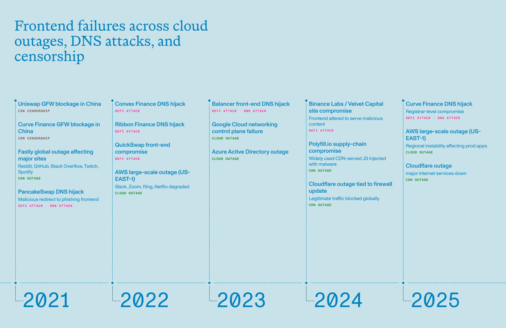
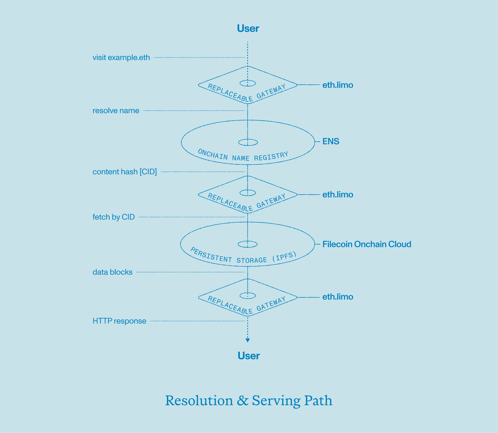
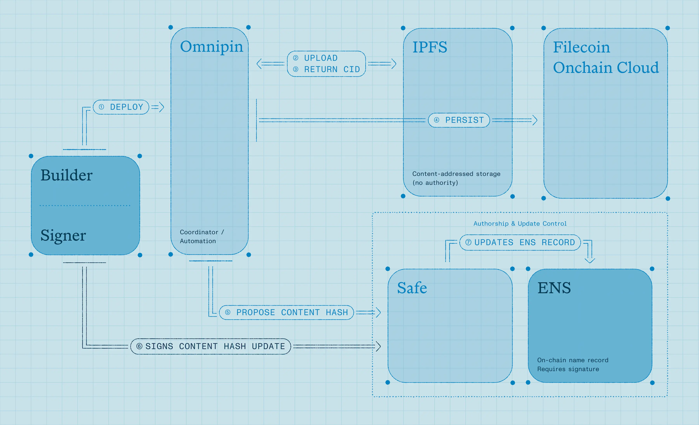

export const PreContent = () => (
	<p className="font-sans font-normal">
		Webpages that rely on centralized CDNs, cloud hosting, and even DNS can experience outages and attacks that cost companies and users millions. Learn how to deploy decentralized websites using ENS, IPFS, Filecoin and Safe.
	</p>
)

## **Outages and DNS hijacking are a billion dollar issue**

Centralized DNS, CDNs, and cloud hosting make the web fast, but they’ve also concentrated risk. A small number of providers now sit beneath a huge share of global traffic. When one of these systems misfires, unrelated sites fail together. In November and December, Cloudflare triggered two global outages affecting around 28% of all HTTP traffic. In October of this year, a DNS-resolution failure in AWS’s US-EAST-1 region caused hundreds of apps and websites to go offline.

When attackers target DNS itself, the consequences are immediate. In May, hackers took control of the curve.fi domain via its registrar, redirecting users to a malicious site. Most recently, Aerodrome Finance was compromised through a DNS hijacking attack where hackers altered DNS records and redirected users to a phishing site. (Aerodrome acted quickly and redirected their site to [https://aero.drome.eth.limo/](https://aero.drome.eth.limo/), which you’ll learn how to do in this post as well).



Survey [data](https://itic-corp.com/itic-2024-hourly-cost-of-downtime-report) puts the cost of downtime for many enterprises at more than $300,000 USD per hour, with about 48% of firms reporting losses exceeding $1 million USD per hour during serious outages. Even a 1-3 hour outage can create [billion dollar losses](https://timesofindia.indiatimes.com/technology/tech-news/how-cloudflare-outage-may-have-cost-financial-service-brokers-1-6-billion-in-trading-volume/articleshow/125437080.cms) when affecting finance and high-volume e-commerce firms. When a frontend DNS is compromised, the losses are immediate, and usually irreversible.

For companies where web uptime and reputation are critical, outages and DNS hijacking attempts are less of a theoretical risk and more a matter of *when*.

## The decentralized website stack

So what is a web team to do? The most immediate way to reduce DNS and web hosting risk is to use ENS in combination with decentralized storage. But if you’re running large-scale production sites using [Next.js](http://next.js/), for example, you’d want a framework that works automatically with your existing app or website deployment flow.

[Omnipin](https://omnipin.eth.link/) is a command-line website deployment tool that orchestrates the tools necessary for deploying a maximally resilient website. It works with [IPFS](https://ipfs.tech/) and [Filecoin](https://filecoin.io/) for decentralized storage; a decentralized content gateway like [eth.limo](https://eth.limo/); and is secured by a [Safe](https://safe.global/) multisig wallet.



### ENS (decentralized namespace)

ENS is a decentralized naming system for crypto addresses, websites, and more. ENS stores your website’s contenthash record onchain and maps yourname.eth to the decentralized content.

### Eth.limo (view decentralized websites on a browser)

[eth.limo](https://eth.limo/) is a free, open-source gateway that lets you easily access and view content linked to an ENS name (like yourname.eth) by simply adding .limo to it (e.g., yourname.eth.limo). Other services like eth.link and eth.sucks also work.

### IPFS (content addressing and distribution)

[IPFS](https://ipfs.tech/) is a decentralized, peer-to-peer protocol for storing and sharing data. It serves static site files as content-addressed objects (CIDs). Browsers and gateways request content by CID, which is resistant to tampering and easy to cache/replicate. Other decentralized data storage options include Arweave and Swarm.

### Filecoin Onchain Cloud (long-term persistence & economic guarantees)

IPFS provides distribution; [Filecoin](https://filecoin.io/) lets you make storage deals so your CID is preserved and replicated on decentralized storage providers. For stable, durable hosting you typically pin to pinning services *and* make one or more Filecoin storage deals (or use archiving services built on Filecoin) to ensure long-term persistence.

### Safe (controlled updates)

Safe is a smart contract wallet requiring multiple private key approvals (e.g., 2 out of 3 signers) for transactions, eliminating single points of failure. Use a Safe multisig to hold the ENS name or control the keys that update the ENS contenthash record. This prevents single-key compromise and by requiring multiple approvals when publishing site updates.

One often overlooked advantage of this setup is that it scales extremely well. In a theoretical attack scenario, like a DDoS attack on a website, even if eth.limo and other gateways were to go down, the site can still be accessed by running IPFS nodes locally.

## **Step-by-step: deploying a decentralized website**

<Youtube src="0-GqzANeK5M" />

We’ll be using the [Omnipin](https://omnipin.eth.link/) CLI in a GitHub Workflow to deploy our static website to IPFS and attach it to an ENS name.

### Step 1: Choose a storage provider

The first thing to do when setting up Omnipin is to choose a [storage provider](https://omnipin.eth.link/docs/ipfs.html). We’ll use Filecoin in this demo, which is an incentivization layer on top of IPFS to ensure that your content remains available for a long period of time.

To upload and persist files to IPFS via Filecoin, we need to fund a wallet with $FIL and $USDfc which you can easily acquire via [Squid](https://app.squidrouter.com/?chains=8453%2C314). It’s highly recommended to generate a fresh private key to use in this environment.

### Step 2: Create a GitHub Workflow

Now it’s time to setup our GitHub Workflow, of which Omnipin provides a [starter template](https://omnipin.eth.link/docs/ci-cd.html). Simply copy and paste that into a `.github/workflows/omnipin.yaml` file in the root of your project, and change the first few steps as needed to install dependencies and build your project. This will vary slightly for each repo.

Integrating Omnipin into the workflow requires 2 simple steps: install and deploy. To securely use your private key from earlier in the workflow, set is as a repository secret in GitHub under settings > secrets and variables > actions.

```yaml
- name: Install Omnipin
  run: bun i -g omnipin@1.7.0
	
- name: Deploy the site
  run: omnipin deploy next/out
  env:
    OMNIPIN_FILECOIN_TOKEN: ${{ secrets.OMNIPIN_FILECOIN_TOKEN }}
```

Now when you push a new commit to the `main` branch (assuming you didn’t change trigger from the Omnipin template), your website will be built and uploaded to IPFS, and your new wallet will make a payment to ensure the content stays pinned. Omnipin will display the CID of your website, which we then want to attach to an ENS name so it can be accessed more easily.

### Step 3: Automate the ENS transaction with Safe

To connect all the pieces, we need to set the contenthash of our ENS name to the IPFS CID from the previous step. This can be done manually via the [ENS manager app](https://app.ens.domains/), or automated to different degrees in Omnipin. The most secure deployment process involves designating an address that can propose transactions to a Safe multisig, leaving the execution of the transaction to a set of already-established signers (presumably senior members of a development team).

For simplicity, we’ll use the same private key that we generated earlier for proposing Safe transactions. Set the corresponding public address as a proposer by navigating to settings > members in your Safe.

Then in your Omnipin workflow, configure the ENS name you’ll be updating (`--ens` argument) along with the address of the Safe where the transaction proposal should be made (`--safe` argument). Lastly, save your private key as another secret `OMNIPIN_PK` in GitHub like before, and give your Workflow access to it.

```yaml
- name: Deploy the site
  run: omnipin deploy next/out --ens gtest.eth --safe devrel.enslabs.eth
  env:
    OMNIPIN_FILECOIN_TOKEN: ${{ secrets.OMNIPIN_FILECOIN_TOKEN }}
    OMNIPIN_PK: ${{ secrets.OMNIPIN_PK }}
```

Now the next time you run the workflow, a transaction will be waiting for you to execute in Safe to fully deploy your website to ENS in a secure and decentralized manner!



## Conclusion

What this stack ultimately provides is control under adversarial conditions. By combining ENS for naming, IPFS and Filecoin for content, Safe for controlled updates, and independent gateways for access, you replace single points of failure. Each layer can fail independently without collapsing the whole system. As outages and DNS attacks become more common, decentralized websites are a production-ready architecture that teams can consider today.