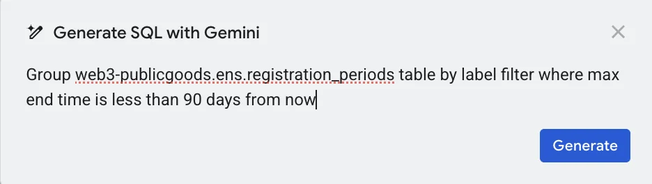
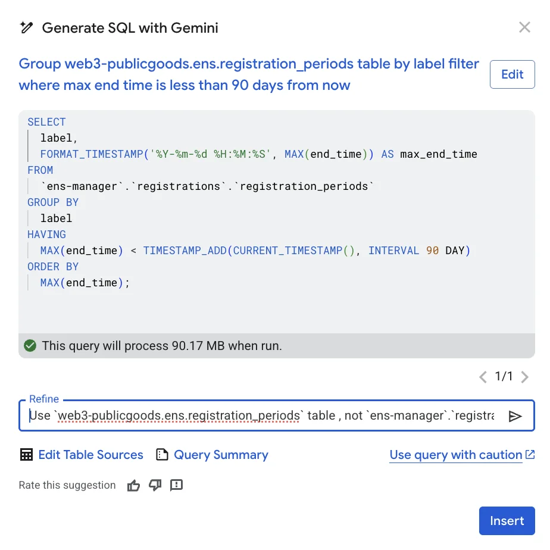
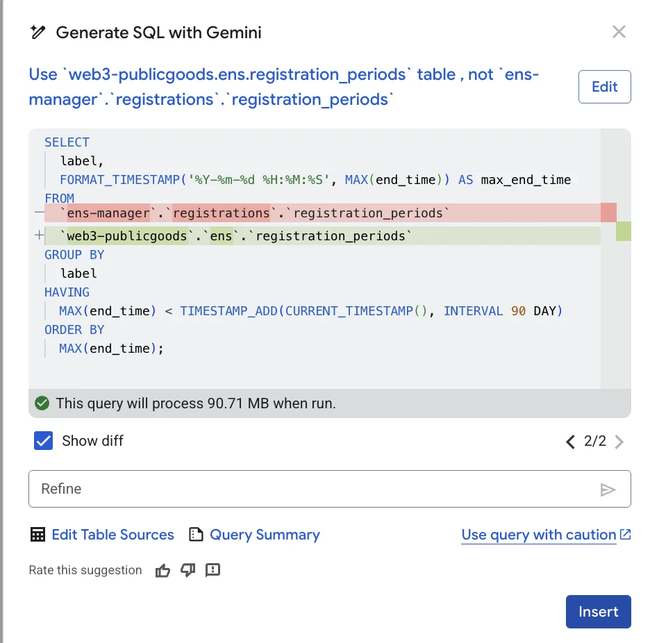
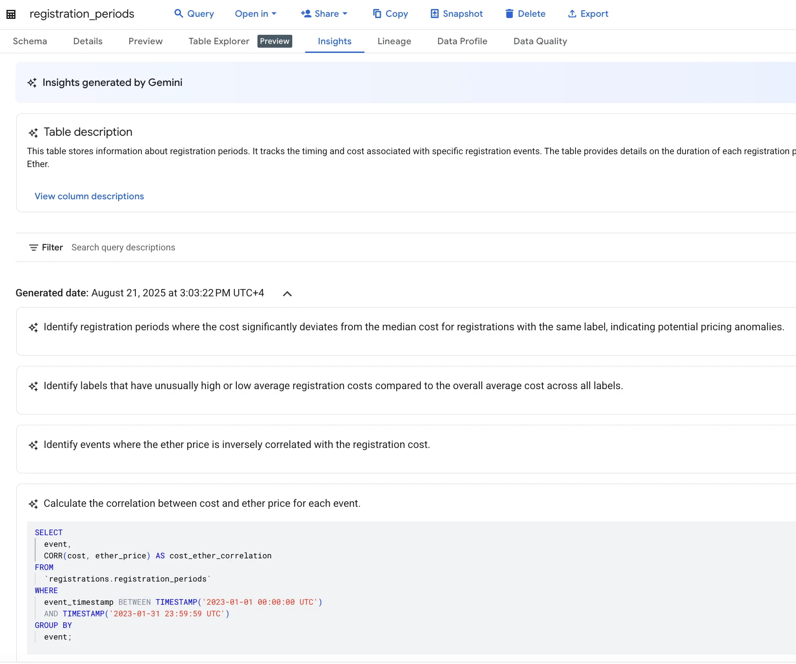
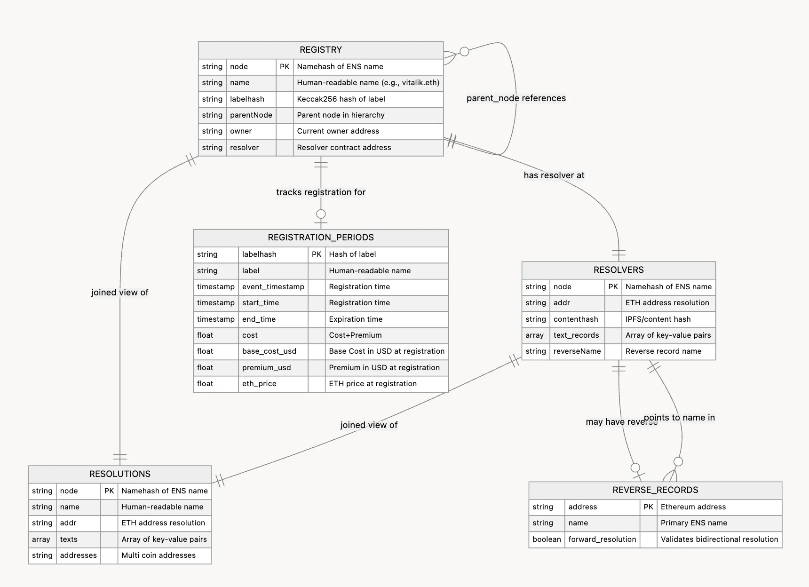
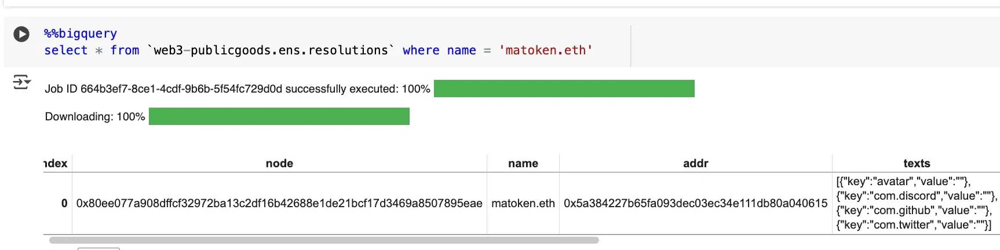
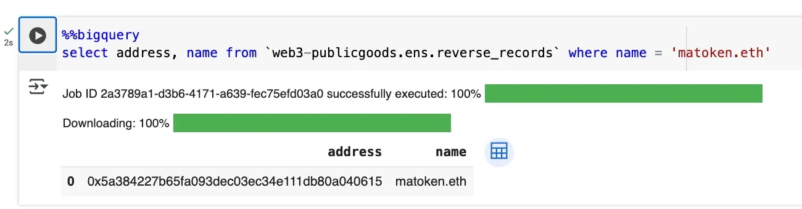
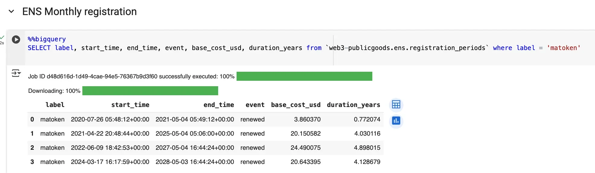
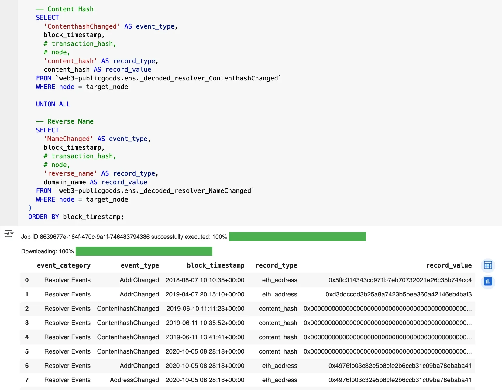
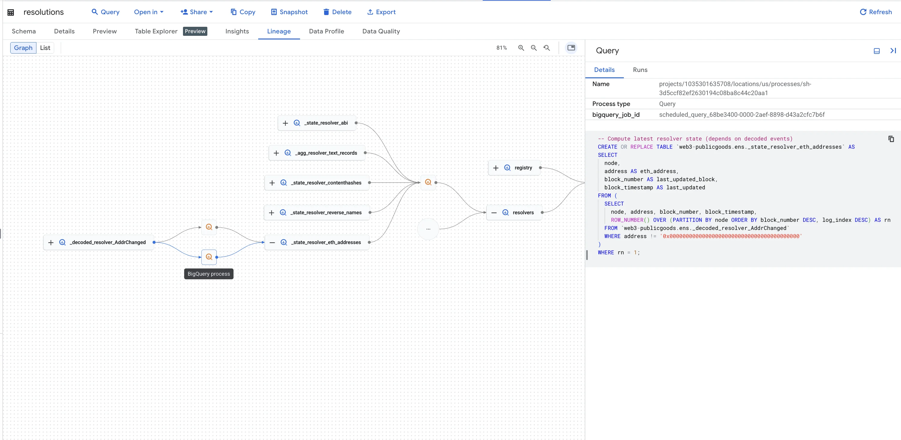

export const PreContent = () => (
  <p className="font-sans font-normal">
    ENS is launching an authoritative community <a href="https://colab.research.google.com/drive/1e5Qgswn8PQiTCiEi7U95nkCMxUM05LfS?usp=sharing" target="_blank">dataset</a> on Google Cloud's BigQuery, allowing anyone to analyze ENS activity with SQL within seconds.
  </p>
)

ENS has always been an early adopter of BigQuery. In 2022, Nick Johnson, co-founder of ENS and ex-Googler, came up with a novel technique to [decode custom ENS related events](https://mirror.xyz/nick.eth/KVal7tob7sqZSss27rrFlIpu6i91TJYJJvBzf53kwhQ) and ran BigQuery datasets that captured weekly snapshots of ENS related data, which was invaluable for our internal analysis. Today, we are happy to announce that we ported the original dataset into Google's public dataset under `web3-publicgoods.ens`.

This new dataset is now listed on the [Google Cloud Web3 Portal](https://cloud.google.com/application/web3/discover) under "Experimental." The result? Faster time to ENS insights and easy access for anyone exploring and researching ENS data. [Try it yourself](https://colab.research.google.com/drive/1e5Qgswn8PQiTCiEi7U95nkCMxUM05LfS?usp=sharing), we can't wait to see what you build!

### Why BigQuery?

BigQuery is a data warehouse which simplifies the complexities of onchain data. Users write simple SQL over massive datasets and get results quickly without the complexity of servers. It stores huge amounts of data for you and answers practical questions quickly, like: "What are the most common ENS text records?" or "Which names have valid forward and reverse resolution?"

Google BigQuery has a [free usage tier](https://cloud.google.com/bigquery/pricing#free-usage-tier) with a generous 1 TiB of free data queries per month. Chat with Gemini to [learn about BigQuery costs](https://gemini.google.com/share/cca0bcad427a).

Besides running reliable analytics, making high-quality ENS data easy to query helps teams to build better products and research names and data onchain without running their own indexing stack. Our community dataset leverages the logs table on Google's [Ethereum dataset](https://console.cloud.google.com/marketplace/product/bigquery-public-data/blockchain-analytics-ethereum-mainnet-us) and updates on a daily cadence. Fresh ENS insights with less overhead.

#### 1. Primary Name Data

A standout feature of Google Cloud's BigQuery is support for JavaScript user-defined functions (UDF). Since Javascript is one of the most widely used programming languages, ENS thereby has the most optimal support with libraries like ethers.js. 

For accurate primary name data we expose a `namehash` function backed by ethers.js, so you can correctly join reverse records to names directly in SQL. `namehash` is ENS's own hashing algorithm which is used to convert human readable names into a fixed-length and storage-efficient format for onchain storage.  

Most analytics platforms don't offer this kind of JavaScript UDF support, yet it is crucial when you need to stitch together multiple ENS events and state consistently.

```sql
CREATE OR REPLACE FUNCTION `web3-publicgoods.ens.NAMEHASH`(data STRING)
RETURNS STRING
LANGUAGE js
OPTIONS (
  library="gs://blockchain-etl-bigquery/ethers.js" )
AS """
  try {
    return ethers.utils.namehash(data);
  } catch(e) {
      return null;
  }
""";
```

Once the function is defined, call it directly from SQL:

```sql
SELECT `web3-publicgoods.ens.NAMEHASH`("vitalik.eth");
// Returns 0xee6c4522aab0003e8d14cd40a6af439055fd2577951148c14b6cea9a53475835
```

Its most valuable use is producing a complete, validated primary-name dataset.

One little known fact is that a primary name isn't a special component, but simply the reverse name record in an ENS smart contract. While most names are stored as `namehash("vitalik.eth") => 0x...` , primary names (known as "reverse record") are stored as `namehash("0x.....reverse.address") => "vitalik.eth"` .

In general the `namehash` is one-way. You can turn a name into its node, but you can't turn a node back into the name. So when you join reverse data, you compute the reverse node from the address on the fly, look up the resolver's stored `reverseName`, and can verify that forward resolution for that name points back to the same address.

```sql
all_reverse_records AS (
  SELECT DISTINCT
    awf.address,
    rr.reverseName AS name
  FROM addresses_with_forward awf
  INNER JOIN `web3-publicgoods.ens._state_resolver_reverse_names` rr
    ON rr.node = `web3-publicgoods.ens.NAMEHASH`(CONCAT(SUBSTR(awf.address, 3), ".addr.reverse"))
)
```

#### 2. AI Powered Queries with Gemini

BigQuery natively integrates with Google's AI, Gemini, to help draft or refine SQL, which works well for domain-specific queries over structured data. The "Insights" feature can also surface suggested questions with runnable queries. Simply, activate Gemini AI and use it inside BigQuery. 

Below you can view a prompt example:



Next, you will see the query Gemini AI came up with. Even if you don't understand the SQL, you can clearly see that it's not querying from `web3-publicgoods.ens.registration_periods` table, but from our old table.



The query can be easily refined using the "Refine" input field.



Not sure what query? Google BigQuery offers a feature called "Insight" which analyzes the table data and comes up with helpful questions and an actual query.



#### 3. Various ways to analyze the data

Once you draft or refine your queries, you can export results to CSV, visualize them in Looker Studio, or continue in a Google Colab notebook for a Python-based analysis.

### Available ENS Data

Even though there are various AI tools that can write queries for you, it's helpful to understand what kind of ENS data is actually available.

With Google Cloud's BigQuery dataset you can measure how many active .eth names have valid forward and reverse resolution, identify which names have the most subnames, track how text records change over time, and analyze premium cost of expiring names over any period, and more.

All examples are available in [this google collab notebook](https://console.cloud.google.com/bigquery?ws=!1m7!1m6!12m5!1m3!1sweb3-publicgoods!2sus-central1!3s671a47be-7055-400b-8cd2-63c73b65bb75!2e2) which you can try by yourself. If unsure where to start, use the `resolutions` view for state and bring in `reverse_records` when you need primary names.

The following is the entity relation diagram of ENS data that includes four core tables, `registry`, `resolver`, `resolutions`, `reverse_records`, and one historical record of `registration_periods` .



The dataset focuses on current state and history so you can answer both product and ecosystem questions. The two key tables are `registry` for names and ownership, `resolvers` for records such as addresses, content hashes, and text records. 

A `resolutions` view is also available, so you can read state in one place.



`reverse_records` captures primary names and whether forward resolution is valid.



While all the four tables represents the current state of the data, historical registrations and renewal activity for .eth lives in `registration_periods`. 



For deep dives, decoded resolver event tables (`_decoded_resolver_*` ) are available and can be stitched together for historical timelines.



To see how the underlying tables are built into the core tables, open the **Lineage** tab to explore their relationships. You can also view each object's SQL definition to examine the precise query.



### What's next?

As we head toward the launch of ENSv2, we will extend coverage to include L2 Primary Names, which will allow profile record updates to move to L2s. 

Visit this [Google Collab notebook](https://colab.research.google.com/drive/1e5Qgswn8PQiTCiEi7U95nkCMxUM05LfS?usp=sharing) and try it yourself!